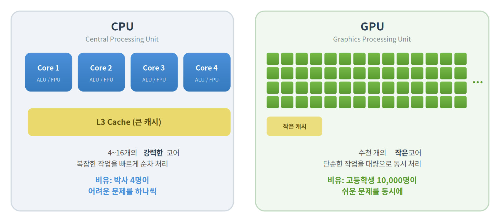
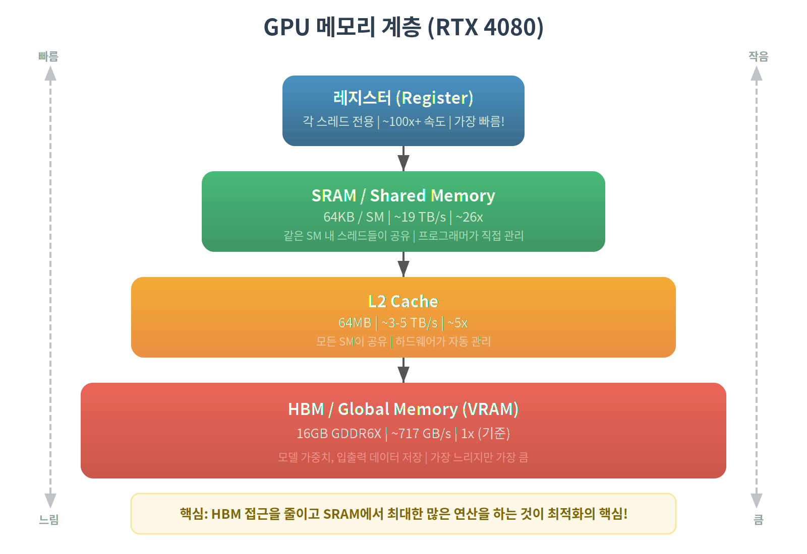
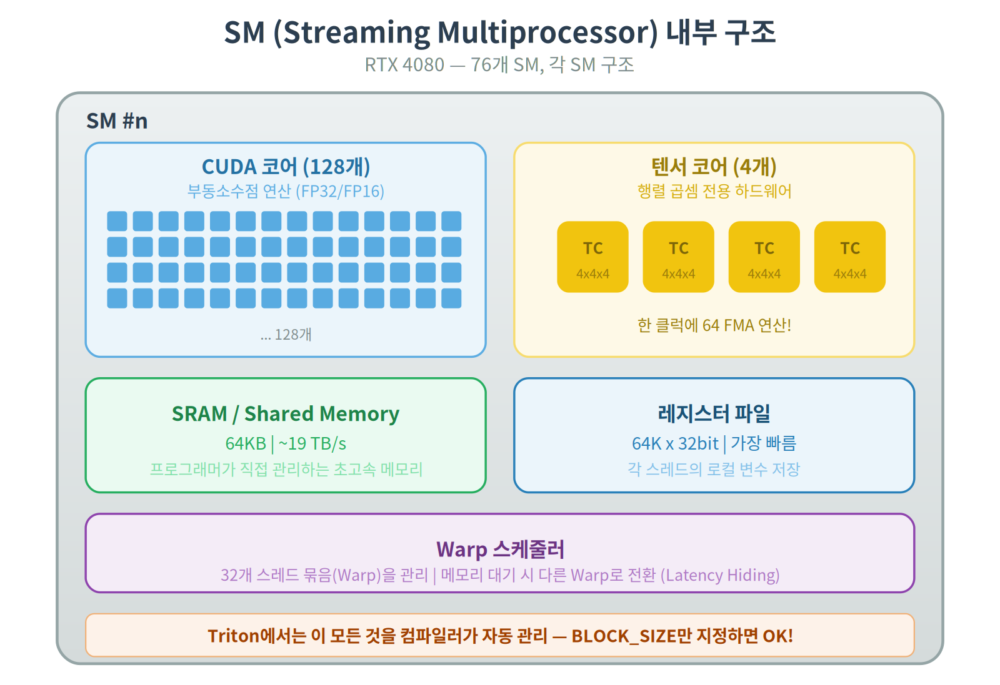
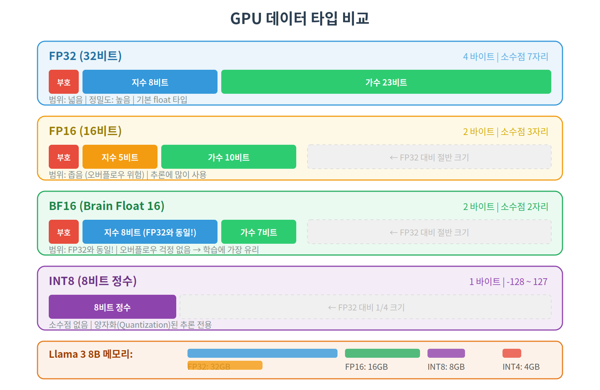
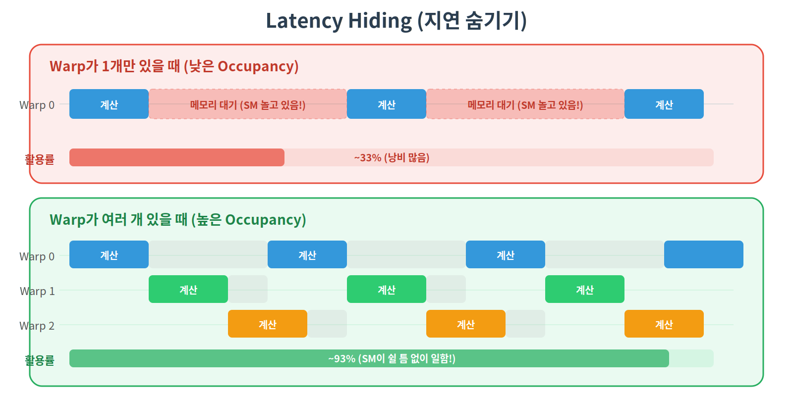
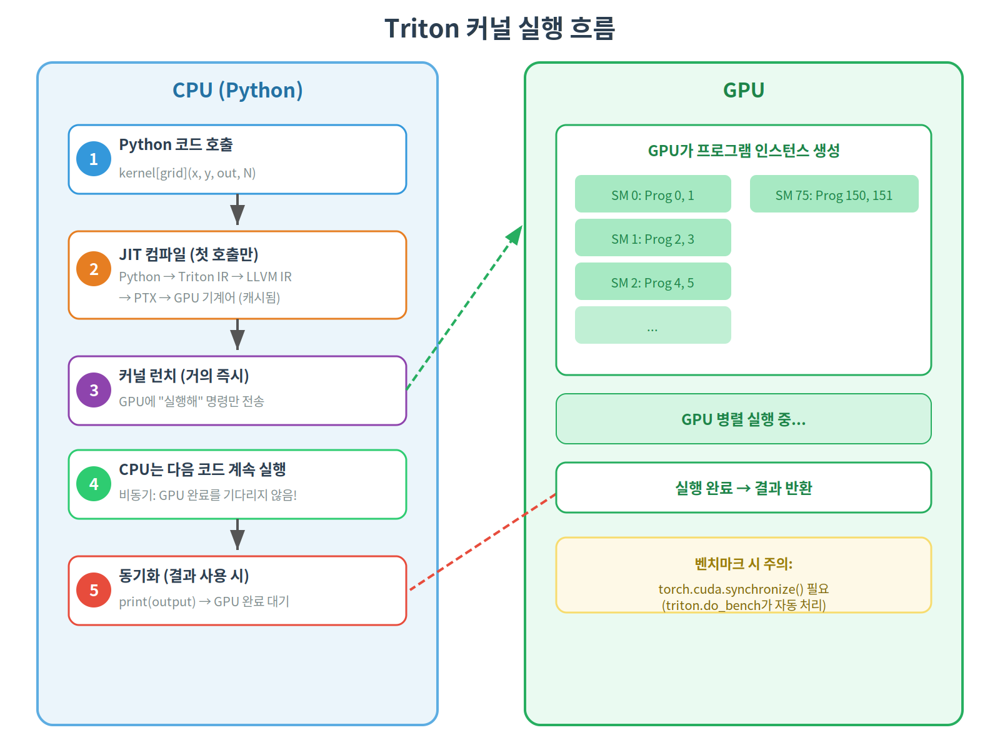
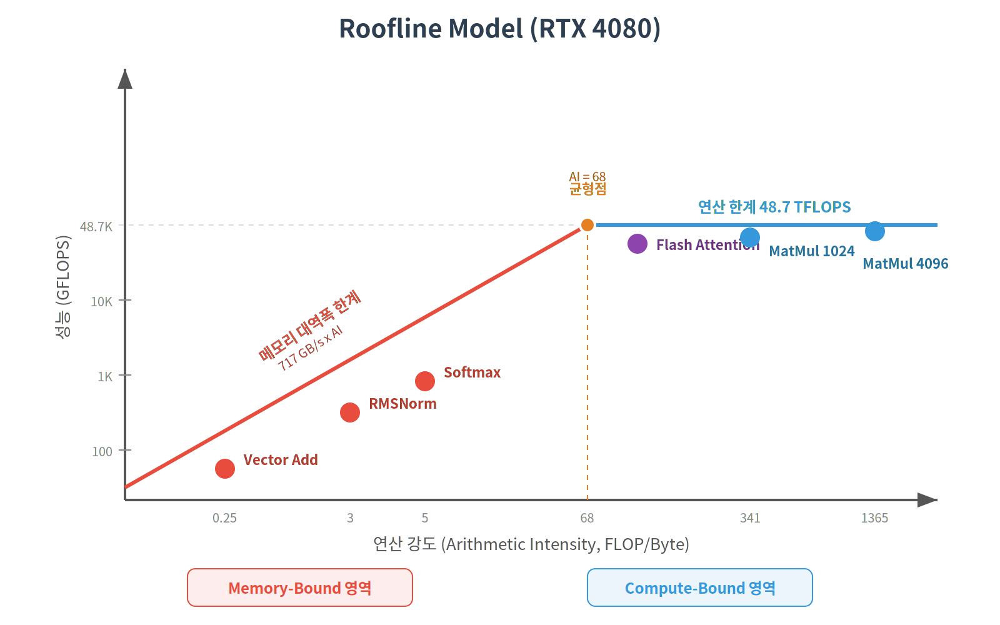

# 00. GPU 기초 — Triton을 시작하기 전에 알아야 할 것들

## GPU란 무엇인가?

GPU(Graphics Processing Unit)는 원래 그래픽 렌더링을 위해 만들어졌지만,
지금은 딥러닝과 과학 계산의 핵심 장치입니다.

### CPU vs GPU



딥러닝은 "쉬운 연산(곱하기, 더하기)을 엄청나게 많이" 하는 작업이라 GPU가 유리합니다.

## RTX 4080 스펙 이해하기

| 스펙 | 값 | 의미 |
|------|-----|------|
| CUDA 코어 | 9,728개 | 동시에 연산할 수 있는 유닛 수 |
| SM (Streaming Multiprocessor) | 76개 | CUDA 코어들을 묶은 그룹 (128코어/SM) |
| VRAM (Global Memory) | 16GB GDDR6X | GPU 전용 메모리 (모델/데이터 저장) |
| 메모리 대역폭 | ~717 GB/s | 1초에 읽을 수 있는 데이터 양 |
| L2 캐시 | 64MB | 자주 쓰는 데이터 임시 저장 |
| SRAM (Shared Memory) | 64KB / SM | 각 SM 내부의 초고속 메모리 |
| 텐서 코어 | 4세대 | 행렬 곱셈 전용 하드웨어 (매우 빠름) |
| Compute Capability | 8.9 (Ada Lovelace) | GPU 아키텍처 세대 |

## GPU 메모리 계층 (매우 중요!)

GPU 프로그래밍에서 **가장 중요한 개념**이 메모리 계층입니다.
성능 최적화의 핵심은 "느린 메모리 접근을 줄이는 것"입니다.



### 속도 비교 (대략적)

| 메모리 | 대역폭 | HBM 대비 |
|--------|--------|----------|
| HBM (Global Memory) | ~717 GB/s | 1x |
| L2 Cache | ~3-5 TB/s | ~5x |
| SRAM (Shared Memory) | ~19 TB/s | ~26x |
| 레지스터 | 훨씬 빠름 | ~100x+ |

**핵심**: HBM에서 데이터를 읽는 것이 **병목**입니다.
데이터를 한 번 SRAM으로 올리면, 그 안에서 여러 연산을 하는 게 훨씬 빠릅니다.
이것이 **커널 퓨전**의 핵심 원리입니다.

## SM (Streaming Multiprocessor) 이해하기

SM은 GPU의 "미니 프로세서"입니다. RTX 4080에는 76개의 SM이 있습니다.



### Warp란?

- **스레드(Thread)**: GPU에서 실행되는 가장 작은 실행 단위
- **Warp**: 32개 스레드의 묶음 (항상 32개가 **동시에 같은 명령** 실행)
- **Thread Block**: 여러 Warp의 묶음 (최대 1024 스레드)

```
Thread Block
├── Warp 0: [thread 0~31]   ← 32개가 동시에 같은 명령 실행
├── Warp 1: [thread 32~63]
├── Warp 2: [thread 64~95]
└── ...
```

**Triton이 좋은 이유**: CUDA에서는 이 모든 것을 직접 관리해야 하지만,
Triton에서는 **블록(프로그램) 단위**로 생각하면 됩니다. Warp 관리는 컴파일러가 처리!

## Compute-Bound vs Memory-Bound

GPU 연산은 두 가지 유형으로 나뉩니다:

### Memory-Bound (메모리 병목)

```
연산량이 적고, 데이터 이동이 대부분인 경우

예: Vector Add, RMSNorm, Softmax
    → 원소 하나당 덧셈 1번만 하면 됨
    → 대부분의 시간이 HBM에서 데이터 읽기/쓰기에 소비

최적화 전략: 커널 퓨전 (메모리 접근 횟수 줄이기)
```

### Compute-Bound (연산 병목)

```
연산량이 많고, 계산에 시간이 걸리는 경우

예: Matrix Multiplication (행렬 곱셈)
    → 원소 하나를 계산하려면 K번의 곱셈+덧셈 필요
    → 연산량이 데이터 양보다 훨씬 많음

최적화 전략: 텐서 코어 활용, 타일링으로 데이터 재사용
```

### Arithmetic Intensity (연산 강도)

```
AI = 연산 횟수 / 메모리 접근 바이트 수

Vector Add:     AI = 1 (낮음) → Memory-Bound
Matrix Multiply: AI = N (높음) → Compute-Bound
```

연산 강도가 높을수록 GPU의 계산 능력을 효과적으로 활용합니다.

## 텐서 코어 (Tensor Core)

행렬 곱셈을 위한 **전용 하드웨어**입니다.

```
일반 CUDA 코어:          텐서 코어:
한 클럭에 1번의 FMA      한 클럭에 4x4x4 행렬 곱
(a*b + c)               (64번의 FMA를 한 번에!)

속도: 1x                 속도: ~16x (fp16 기준)
```

Triton에서 `tl.dot(a, b)`를 사용하면 자동으로 텐서 코어가 활용됩니다.

## 데이터 타입 — FP32, FP16, BF16, INT8

GPU 연산에서 데이터 타입 선택은 **속도와 메모리** 모두에 영향을 줍니다.

### 부동소수점이란?

컴퓨터에서 소수점 있는 숫자를 표현하는 방식입니다.

```
3.14159를 저장하려면?

부호(sign) | 지수(exponent) | 가수(mantissa)
    ±      |   크기 범위     |   정밀도

비유: 과학적 표기법과 같습니다
3.14159 = 3.14159 × 10^0
31415.9 = 3.14159 × 10^4
         ^^^^^^^^   ^^^^
          가수       지수
```



### 왜 중요한가?

```
같은 모델을 다른 타입으로 저장하면:

Llama 3 8B (80억 파라미터):
  FP32: 80억 × 4바이트 = 32GB   → RTX 4080에 안 들어감!
  FP16: 80억 × 2바이트 = 16GB   → 빠듯하게 들어감
  INT8: 80억 × 1바이트 =  8GB   → 여유 있게 들어감
  INT4: 80억 × 0.5바이트 = 4GB  → 넉넉!
```

### 속도 영향

```
RTX 4080 이론적 연산 성능:
  FP32: 48.7 TFLOPS
  FP16: 48.7 TFLOPS (텐서코어: ~780 TFLOPS)
  INT8:              (텐서코어: ~1560 TOPS)

→ FP16 + 텐서 코어를 쓰면 FP32 대비 ~16배 빠름!
→ 그래서 딥러닝에서는 거의 항상 FP16/BF16을 사용합니다
```

### Triton에서의 데이터 타입

```python
# 커널 내에서 타입 변환
x_fp32 = x.to(tl.float32)    # 정밀한 중간 계산용
result = acc.to(tl.float16)   # 저장 시 FP16으로 변환

# tl.dot은 내부적으로 FP32로 누적 (정밀도 유지)
acc += tl.dot(a, b)  # a, b는 FP16이지만 acc는 FP32
```

## 대역폭 계산법 — 내 커널이 얼마나 효율적인지 측정하기

GPU 커널의 성능을 평가할 때 가장 중요한 지표가 **메모리 대역폭 활용률**입니다.

### 기본 공식

```
실효 대역폭 (GB/s) = (읽은 바이트 + 쓴 바이트) / 실행 시간(초) / 10^9
```

### 예제: Vector Add

```python
# 크기 N인 float32 벡터 2개를 읽고, 1개를 쓰는 경우
N = 10_000_000  # 1천만

읽기: x (N × 4바이트) + y (N × 4바이트) = 80MB
쓰기: output (N × 4바이트)               = 40MB
총 데이터 이동: 120MB

실행 시간이 0.2ms 걸렸다면:
실효 대역폭 = 120MB / 0.0002초 = 600 GB/s

RTX 4080 최대 대역폭: 717 GB/s
활용률: 600 / 717 = 83.7% ← 꽤 좋은 편!
```

### 해석 방법

```
Memory-Bound 커널의 경우:
  활용률 > 80%  → 매우 잘 최적화됨
  활용률 60~80% → 괜찮음
  활용률 < 50%  → 개선 여지 있음

활용률이 낮은 원인:
  - 비연속 메모리 접근 (coalescing 안 됨)
  - 블록 크기가 너무 작음
  - GPU를 충분히 활용하지 못하는 작은 데이터
```

## Occupancy — GPU를 얼마나 바쁘게 유지하는가

Occupancy는 SM이 실행할 수 있는 최대 warp 수 대비 실제 활성 warp의 비율입니다.

### 왜 중요한가?



이것을 **Latency Hiding (지연 숨기기)** 이라고 합니다.
Warp가 많을수록 GPU가 쉬지 않고 일할 수 있습니다.

### Occupancy를 결정하는 요소

```
SM당 리소스 한계 (RTX 4080, SM 8.9):
  - 최대 Warp 수: 48개 (= 1536 스레드)
  - 최대 Thread Block 수: 16개
  - 레지스터: 65,536개
  - SRAM: 64KB

커널이 리소스를 많이 쓸수록 → 동시 실행 Warp 수 감소 → Occupancy 하락

예시:
  커널 A: 레지스터 32개/스레드 → 2048 스레드 가능 → 64 Warp → Occupancy 100%
  커널 B: 레지스터 128개/스레드 → 512 스레드 가능 → 16 Warp → Occupancy 33%
```

### Triton에서는?

Triton 컴파일러가 자동으로 레지스터와 SRAM 사용을 최적화하므로,
대부분의 경우 Occupancy를 직접 걱정할 필요가 없습니다.
하지만 **BLOCK_SIZE를 너무 크게** 잡으면 SRAM이 부족해져 Occupancy가 떨어질 수 있습니다.

```
BLOCK_SIZE와 Occupancy의 트레이드오프:

BLOCK_SIZE 크게 → SRAM 많이 사용 → Occupancy 낮음 → 하지만 데이터 재사용 많음
BLOCK_SIZE 작게 → SRAM 적게 사용 → Occupancy 높음 → 하지만 효율 낮을 수 있음

→ 이것을 자동으로 찾아주는 것이 triton.autotune!
```

## 커널 실행의 전체 흐름

Python에서 Triton 커널을 호출하면 실제로 무슨 일이 일어나는지 봅시다.



### 비동기 실행이란?

```python
# 이 세 줄은 거의 즉시 실행됨 (GPU에 명령만 보내는 것)
a = vector_add(x, y)         # GPU에 작업 1 보냄
b = vector_add(x, z)         # GPU에 작업 2 보냄
c = vector_add(a, b)         # GPU에 작업 3 보냄 (a, b 완료 후 실행됨)

# 이 시점에서 GPU가 실제로 다 끝났을 수도, 아닐 수도 있음
print(c)  # ← 여기서 GPU 완료를 기다림 (동기화)
```

이 때문에 벤치마크할 때 `torch.cuda.synchronize()`를 호출해야 정확한 시간을 측정할 수 있습니다.
(Triton의 `do_bench`가 이것을 자동으로 해줍니다)

## Roofline Model — 내 커널의 한계를 이해하기

Roofline Model은 "이 GPU에서 이 커널이 이론적으로 얼마나 빠를 수 있는가"를 알려줍니다.



- **연산 강도(AI) < 68** → Memory-Bound (메모리가 병목) — Vector Add, Softmax, RMSNorm
- **연산 강도(AI) > 68** → Compute-Bound (연산이 병목) — MatMul, Flash Attention

Memory-Bound 커널은 대역폭 활용률로, Compute-Bound 커널은 FLOPS 달성률로 성능을 평가합니다.

## GPU 세대별 차이 (참고)

| 세대 | 아키텍처 | 대표 GPU | 텐서 코어 | 주요 특징 |
|------|----------|----------|-----------|-----------|
| 2017 | Volta | V100 | 1세대 | 첫 텐서 코어 도입 |
| 2020 | Ampere | A100, RTX 3090 | 3세대 | BF16 지원, 희소행렬 가속 |
| 2022 | Hopper | H100 | 4세대 | FP8 지원, Transformer Engine |
| 2022 | Ada Lovelace | **RTX 4080** | 4세대 | FP8, 향상된 L2 캐시 |
| 2024 | Blackwell | B200 | 5세대 | FP4, 2세대 Transformer Engine |

RTX 4080 (Ada Lovelace)은 데이터센터용 Hopper와 같은 세대 텐서 코어를 가지고 있어,
소비자용 GPU 치고는 매우 강력한 AI 성능을 제공합니다.

## GPU 프로그래밍의 핵심 원칙

### 1. 메모리 접근을 최소화하라

```
나쁜 예 (3번 읽기):              좋은 예 (1번 읽기):
① HBM → max 계산 → HBM          ① HBM → SRAM
② HBM → exp 계산 → HBM               SRAM: max → exp → sum → 나누기
③ HBM → 나누기  → HBM           ② SRAM → HBM
```

### 2. 메모리 접근 패턴을 맞춰라 (Coalescing)

```
Good (연속 접근 - Coalesced):     Bad (불연속 접근 - Strided):
Thread 0 → mem[0]                Thread 0 → mem[0]
Thread 1 → mem[1]                Thread 1 → mem[100]
Thread 2 → mem[2]                Thread 2 → mem[200]
Thread 3 → mem[3]                Thread 3 → mem[300]
→ 1번의 메모리 트랜잭션           → 4번의 메모리 트랜잭션 (느림!)
```

Triton에서는 `tl.arange`로 연속 인덱스를 생성하면 자동으로 coalesced 접근이 됩니다.

### 3. 병렬성을 최대화하라

```
76개 SM × SM당 수백 스레드 = 수만 개의 동시 실행 스레드

→ 데이터가 충분히 커야 GPU를 효과적으로 활용
→ 작은 데이터에서는 CPU가 더 빠를 수 있음
```

## Triton이 이 모든 것을 어떻게 단순화하는가

| CUDA에서 직접 해야 하는 것 | Triton에서는? |
|---------------------------|-------------|
| Shared memory 할당/관리 | 자동 (컴파일러가 처리) |
| Warp 동기화 (`__syncthreads`) | 불필요 |
| Memory coalescing 최적화 | `tl.arange` + `tl.load`로 자동 |
| 텐서 코어 호출 (WMMA API) | `tl.dot`으로 자동 |
| Thread block 크기 결정 | `BLOCK_SIZE`만 지정 |
| 레지스터 압박 관리 | 컴파일러가 최적화 |

**결론**: Triton은 "GPU의 성능은 거의 다 뽑아내면서, CUDA보다 10배 쉽게 작성"할 수 있는 도구입니다.

## 용어 정리

혼동하기 쉬운 용어들을 한곳에 정리합니다.

| 용어 | 의미 | 비유 |
|------|------|------|
| **HBM / VRAM / Global Memory** | GPU의 메인 메모리 (16GB) | 큰 창고 |
| **SRAM / Shared Memory** | SM 내부의 고속 메모리 (64KB) | 작업대 위 선반 |
| **레지스터** | 연산 유닛 바로 옆의 메모리 | 손에 들고 있는 것 |
| **SM** | 코어 묶음 + 메모리를 가진 미니 프로세서 | 공장 하나 |
| **Warp** | 32개 스레드 묶음 (항상 같이 움직임) | 32명이 한 줄로 행진 |
| **Thread Block** | 하나의 SM에서 실행되는 스레드 그룹 | 공장 한 곳의 작업조 |
| **Grid** | 전체 Thread Block의 집합 | 전체 작업 |
| **커널** | GPU에서 실행되는 함수 | 작업 지시서 |
| **프로그램 (Triton)** | Thread Block의 Triton 명칭 | 한 작업조의 업무 |
| **FLOPS** | 1초에 수행하는 부동소수점 연산 수 | 계산 속도 |
| **대역폭** | 1초에 이동하는 데이터 양 | 도로 폭 |
| **커널 퓨전** | 여러 연산을 하나의 커널로 합침 | 왕복 줄이기 |
| **타일링** | 큰 데이터를 작은 블록으로 나눠 처리 | 퍼즐 조각 |
| **Autotune** | 최적 파라미터를 자동 탐색 | 자동 튜닝 |
| **JIT** | Just-In-Time 컴파일 (실행 시 컴파일) | 주문 제작 |
| **FMA** | Fused Multiply-Add (a×b + c를 한 번에) | 곱하고 더하기 묶음 |

## 다음 단계

이 개념들을 이해했다면, [01. Vector Add](../01_vector_add/)로 진행하세요.
실제 코드를 작성하면서 이론이 어떻게 적용되는지 확인할 수 있습니다.
