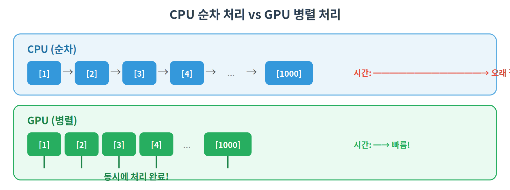
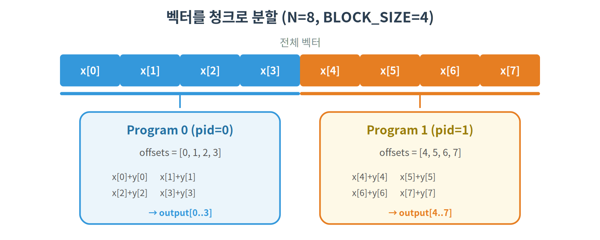
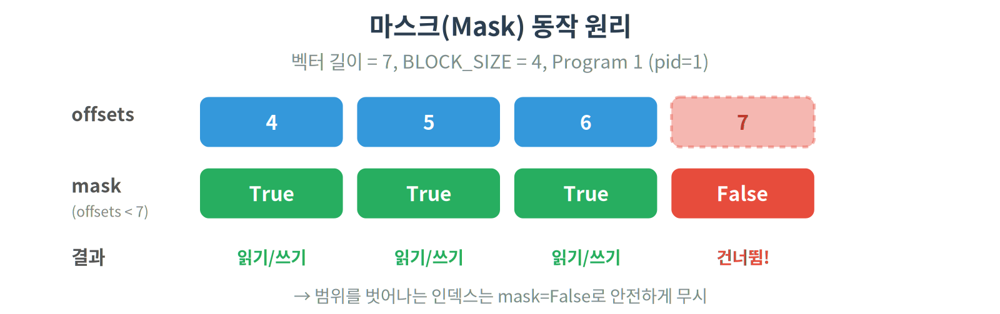
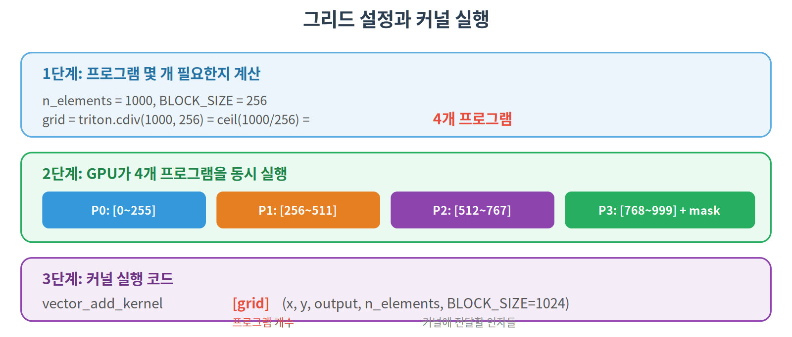
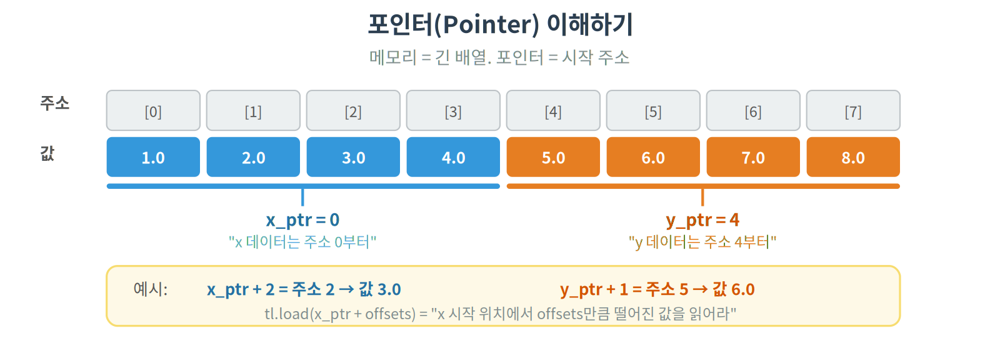

# 01. Vector Addition — Triton 커널 기초

## 개요

가장 간단한 GPU 커널인 벡터 덧셈을 구현합니다.
이 튜토리얼에서 Triton의 핵심 개념을 모두 배울 수 있습니다.

## 사전 지식

이 튜토리얼을 시작하기 전에 [00. GPU 기초](../00_gpu_basics/)를 먼저 읽어주세요.
GPU의 메모리 계층, SM 구조 등 기본 개념이 잡혀 있어야 코드가 이해됩니다.

## 핵심 개념

### GPU 병렬 프로그래밍

CPU는 순차적으로 빠르게 처리하고, GPU는 수천 개의 코어로 동시에 처리합니다.



### CUDA vs Triton

| 구분        | CUDA                           | Triton                 |
| ----------- | ------------------------------ | ---------------------- |
| 언어        | C/C++                          | Python                 |
| 메모리 관리 | 수동 (shared memory 직접 관리) | 자동 (컴파일러가 처리) |
| 스레드 관리 | warp/thread 단위               | block(프로그램) 단위   |
| 난이도      | 높음                           | 낮음                   |
| 성능        | 최고                           | CUDA의 90%+ 달성 가능  |

### Triton 핵심 용어

- **커널(Kernel)**: GPU에서 실행되는 함수
- **프로그램(Program)**: 커널의 하나의 인스턴스 (CUDA의 thread block에 해당)
- **그리드(Grid)**: 프로그램 인스턴스의 총 개수
- **BLOCK_SIZE**: 각 프로그램이 처리하는 데이터 크기

## 커널 동작 원리

길이 N인 벡터를 `BLOCK_SIZE` 크기의 청크로 나누고,
각 프로그램이 하나의 청크를 담당합니다.



### 단계별 분석

```python
@triton.jit
def vector_add_kernel(x_ptr, y_ptr, output_ptr, n_elements, BLOCK_SIZE: tl.constexpr):
    # 1. 현재 프로그램의 ID 얻기
    pid = tl.program_id(axis=0)

    # 2. 이 프로그램이 처리할 데이터의 오프셋 계산
    block_start = pid * BLOCK_SIZE
    offsets = block_start + tl.arange(0, BLOCK_SIZE)

    # 3. 경계 처리 (벡터 끝부분에서 범위 초과 방지)
    mask = offsets < n_elements

    # 4. Global Memory에서 데이터 로드
    x = tl.load(x_ptr + offsets, mask=mask)
    y = tl.load(y_ptr + offsets, mask=mask)

    # 5. 연산 수행
    output = x + y

    # 6. 결과를 Global Memory에 저장
    tl.store(output_ptr + offsets, output, mask=mask)
```

## 사용된 Triton 기능

| 기능                         | 설명                                                    |
| ---------------------------- | ------------------------------------------------------- |
| `@triton.jit`                | 함수를 Triton 커널로 컴파일                             |
| `tl.program_id(axis)`        | 현재 프로그램의 ID (어떤 청크를 처리할지 결정)          |
| `tl.arange(start, end)`      | 연속 정수 벡터 생성 (numpy의 arange와 유사)             |
| `tl.load(ptr, mask)`         | Global Memory에서 데이터 읽기                           |
| `tl.store(ptr, value, mask)` | Global Memory에 데이터 쓰기                             |
| `tl.constexpr`               | 컴파일 타임 상수 (BLOCK_SIZE처럼 컴파일 시 결정되는 값) |

## 마스크(Mask)란?

벡터 길이가 BLOCK_SIZE의 배수가 아닐 때 경계 처리가 필요합니다.



## 그리드 설정



- `triton.cdiv`: 올림 나눗셈 (ceiling division)
- `kernel[grid](...)`: grid 크기만큼 프로그램을 GPU에서 동시 실행

## 코드 라인별 설명

### 커널 함수

```python
@triton.jit   # 이 함수를 GPU 기계어로 JIT 컴파일
def vector_add_kernel(
    x_ptr,          # 입력 벡터 x의 시작 주소
    y_ptr,          # 입력 벡터 y의 시작 주소
    output_ptr,     # 출력 벡터의 시작 주소
    n_elements,     # 벡터의 총 원소 수
    BLOCK_SIZE: tl.constexpr,  # 프로그램당 처리할 원소 수 (컴파일 시 확정)
):
```

- `@triton.jit`: Python 함수를 GPU 커널로 변환하는 데코레이터
- 포인터(`x_ptr` 등)는 GPU 메모리의 주소, Python의 `id()`와 비슷한 개념
- `tl.constexpr`: 이 값은 런타임이 아니라 컴파일 시점에 확정됨 → 컴파일러가 더 최적화 가능

```python
    pid = tl.program_id(axis=0)           # "나는 몇 번째 프로그램인가?" → 0, 1, 2, ...
    block_start = pid * BLOCK_SIZE        # pid=0 → 0, pid=1 → 1024, pid=2 → 2048, ...
    offsets = block_start + tl.arange(0, BLOCK_SIZE)  # 이 프로그램이 담당할 인덱스들
```

- `tl.program_id(0)`: 1D 그리드에서 프로그램 번호 반환
- `tl.arange(0, 1024)` → `[0, 1, 2, ..., 1023]` (numpy의 arange와 동일)
- `offsets`: pid=1이면 `[1024, 1025, ..., 2047]`

```python
    mask = offsets < n_elements     # 범위 밖이면 False → 읽기/쓰기 방지
    x = tl.load(x_ptr + offsets, mask=mask)   # True인 것만 SRAM으로 로드
    y = tl.load(y_ptr + offsets, mask=mask)
    output = x + y                 # SRAM에서 덧셈 (매우 빠름)
    tl.store(output_ptr + offsets, output, mask=mask)  # 결과를 Global Memory에 저장
```

- `mask`: 마지막 프로그램에서 벡터 끝을 넘는 인덱스를 보호
- `tl.load`: Global Memory → SRAM으로 데이터 복사
- `tl.store`: SRAM → Global Memory로 결과 저장

### 래퍼 함수

```python
def vector_add(x: torch.Tensor, y: torch.Tensor) -> torch.Tensor:
    output = torch.empty_like(x)            # 결과를 담을 빈 텐서 (GPU에 할당)
    n_elements = output.numel()             # 총 원소 수

    grid = lambda meta: (triton.cdiv(n_elements, meta["BLOCK_SIZE"]),)
    # triton.cdiv(1000, 256) = ceil(1000/256) = 4 → 프로그램 4개 실행

    vector_add_kernel[grid](x, y, output, n_elements, BLOCK_SIZE=1024)
    # [grid]: "몇 개의 프로그램을 실행할지" 지정 (Triton 전용 문법)
    # CUDA의 kernel<<<grid, block>>>(...) 에 해당

    return output
```

- `torch.empty_like(x)`: x와 같은 크기/dtype/device의 빈 텐서 생성
- `grid`가 lambda인 이유: `autotune` 사용 시 `BLOCK_SIZE`가 바뀔 수 있어서
- `kernel[grid](args)`: "GPU야, grid개의 프로그램을 동시에 돌려"

## 실행 방법

```bash
python 01_vector_add/vector_add.py
```

## 기대 결과

Vector Add는 **메모리 대역폭 바운드(memory-bound)** 연산입니다.
연산량이 적고 데이터 이동이 대부분이라, Triton과 PyTorch의 성능 차이가 크지 않습니다.
하지만 이 패턴은 이후 모든 커널의 기초가 됩니다.

## 포인터(Pointer)란?

C/CUDA 경험이 없으면 포인터가 낯설 수 있습니다. 간단히 설명하면:



## 자주 묻는 질문

**Q: BLOCK_SIZE는 어떻게 정하나요?**

보통 1024를 사용합니다. 너무 작으면 프로그램이 너무 많아지고,
너무 크면 SM의 SRAM에 다 안 들어갑니다.
나중에 배울 `triton.autotune`으로 최적값을 자동 탐색할 수도 있습니다.

**Q: `tl.constexpr`은 왜 필요한가요?**

Triton 커널은 JIT(Just-In-Time) 컴파일됩니다.
`tl.constexpr`로 표시된 값은 컴파일 시점에 확정되어,
컴파일러가 더 효율적인 코드를 생성할 수 있습니다.
예를 들어 BLOCK_SIZE=1024이면, 컴파일러는 1024에 맞춰 최적화된 코드를 생성합니다.

**Q: `@triton.jit`는 뭔가요?**

Python 함수를 GPU에서 실행할 수 있는 기계어로 변환(컴파일)해주는 데코레이터입니다.
일반 Python 코드처럼 보이지만, 실제로는 GPU 전용 명령어로 변환됩니다.
