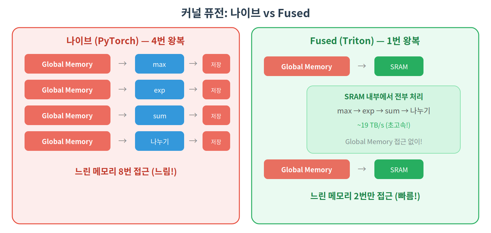
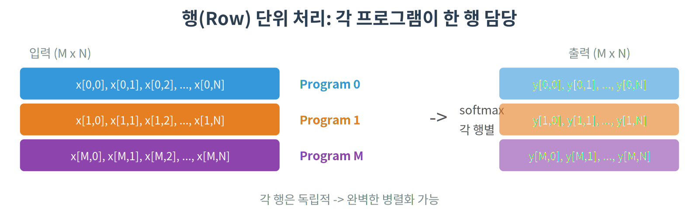

# 02. Fused Softmax — 커널 퓨전과 Reduction

## 개요

Softmax를 하나의 커널로 퓨전(fusion)하여 메모리 접근을 최소화합니다.
커널 퓨전이 왜 중요한지, reduction 연산을 어떻게 처리하는지 학습합니다.

## 핵심 개념

### Softmax 수식

```
softmax(x_i) = exp(x_i - max(x)) / Σ exp(x_j - max(x))
```

`max(x)`를 빼는 이유: `exp`는 큰 값에서 오버플로우가 발생합니다.
최대값을 빼면 모든 지수가 0 이하가 되어 안정적으로 계산됩니다.

### 왜 커널 퓨전인가?



### Reduction 연산

전체 데이터에서 하나의 값을 계산하는 연산:

- `max`: 최대값
- `sum`: 합계
- `mean`: 평균

Triton에서는 `tl.max(x, axis=0)`, `tl.sum(x, axis=0)` 으로 간단하게 수행합니다.

## 커널 동작 원리

입력 행렬의 각 **행(row)** 을 하나의 프로그램이 처리합니다.



### 제약사항

각 행 전체가 SRAM에 들어가야 합니다.
RTX 4080의 SRAM은 SM당 64KB이므로, float32 기준 최대 ~16,384개 열까지 처리 가능합니다.

## 사용된 Triton 기능

| 기능                   | 설명                                           |
| ---------------------- | ---------------------------------------------- |
| `tl.max(x, axis=0)`    | 벡터의 최대값 (reduction)                      |
| `tl.sum(x, axis=0)`    | 벡터의 합 (reduction)                          |
| `tl.exp(x)`            | element-wise 지수 함수                         |
| `tl.where(cond, a, b)` | 조건에 따라 a 또는 b 선택 (마스크 패딩에 사용) |

### `tl.where`의 역할

열 수가 BLOCK_SIZE보다 작을 때, 범위 밖 값을 `-inf`로 채웁니다:

```python
x = tl.load(input_ptr + offsets, mask=mask, other=-float('inf'))
# 또는
x = tl.where(mask, x, float('-inf'))
```

`-inf`를 사용하는 이유:

- `exp(-inf) = 0` → softmax 계산에 영향 없음
- `max(..., -inf) = 원래 max` → max 계산에 영향 없음

## 코드 라인별 설명

### 커널 함수 정의

```python
@triton.jit
def fused_softmax_kernel(
    input_ptr,            # 입력 행렬의 시작 주소
    output_ptr,           # 출력 행렬의 시작 주소
    input_row_stride,     # 행 간 간격 (다음 행까지 몇 칸 건너뛰는지)
    output_row_stride,
    n_cols,               # 실제 열 개수
    BLOCK_SIZE: tl.constexpr,  # 처리할 열 수 (2의 거듭제곱, 컴파일 타임 상수)
):
```

`input_row_stride`가 필요한 이유: 2D 행렬에서 "n번째 행의 시작 주소"를 계산하려면
`input_ptr + n * stride`로 접근해야 합니다. 보통 stride = n_cols이지만, 메모리 정렬(padding) 때문에 다를 수 있습니다.

### 행 위치 계산

```python
    row_idx = tl.program_id(axis=0)
    row_start_ptr = input_ptr + row_idx * input_row_stride
```

- `program_id(0)` → "나는 몇 번째 행을 처리하는 프로그램인가"
- `row_start_ptr` → 해당 행의 첫 번째 원소 주소

### 열 데이터 로드

```python
    col_offsets = tl.arange(0, BLOCK_SIZE)    # [0, 1, 2, ..., BLOCK_SIZE-1]
    mask = col_offsets < n_cols               # 실제 열 범위만 True

    row = tl.load(row_start_ptr + col_offsets, mask=mask, other=-float("inf"))
```

- `other=-float("inf")`: 범위 밖은 `-inf`로 채움
- 왜 `-inf`? → `exp(-inf) = 0`이므로 softmax 결과에 영향을 주지 않음
- 이 시점에서 **한 행 전체가 SRAM에 올라감** (이후 Global Memory 접근 없음!)

### Fused Softmax 계산 (전부 SRAM에서)

```python
    # 1단계: 수치 안정성 — 최대값 빼기
    row_max = tl.max(row, axis=0)       # 행 전체에서 최대값 1개 (reduction)
    row = row - row_max                 # 모든 값을 0 이하로 만듦 → exp 오버플로우 방지

    # 2단계: 지수 함수
    numerator = tl.exp(row)             # exp(x_i - max)

    # 3단계: 합계 계산
    denominator = tl.sum(numerator, axis=0)  # Σ exp(x_j - max) (reduction)

    # 4단계: 나누기 → softmax 완성
    softmax_output = numerator / denominator
```

핵심: **max → exp → sum → 나누기**를 전부 SRAM 안에서 처리.
PyTorch는 이 4단계를 각각 별도 커널로 실행하므로 매번 Global Memory를 왕복합니다.

### 결과 저장

```python
    output_row_start_ptr = output_ptr + row_idx * output_row_stride
    tl.store(output_row_start_ptr + col_offsets, softmax_output, mask=mask)
```

SRAM에서 계산한 결과를 **1번만** Global Memory에 씁니다.

### 래퍼 함수

```python
def fused_softmax(x: torch.Tensor) -> torch.Tensor:
    n_rows, n_cols = x.shape
    output = torch.empty_like(x)

    BLOCK_SIZE = triton.next_power_of_2(n_cols)  # 예: n_cols=1000 → BLOCK_SIZE=1024
    grid = (n_rows,)                              # 행 수만큼 프로그램 생성

    fused_softmax_kernel[grid](
        x, output,
        x.stride(0), output.stride(0),  # stride: 행 간 간격
        n_cols,
        BLOCK_SIZE=BLOCK_SIZE,
    )
    return output
```

- `next_power_of_2`: Triton은 BLOCK_SIZE가 2의 거듭제곱이어야 효율적
- `x.stride(0)`: PyTorch 텐서의 행 간 stride를 자동으로 가져옴
- `grid = (n_rows,)`: 1000행이면 프로그램 1000개가 동시 실행

### 01 Vector Add와의 차이점

|                 | 01 Vector Add     | 02 Fused Softmax                     |
| --------------- | ----------------- | ------------------------------------ |
| 처리 단위       | 1D 벡터의 청크    | 2D 행렬의 행                         |
| 프로그램당 연산 | 덧셈 1번          | max+exp+sum+나누기                   |
| 퓨전 효과       | 없음 (연산이 1개) | 4개 연산을 1커널로                   |
| 새로운 기능     | -                 | `tl.max`, `tl.sum`, `tl.exp`, stride |

## 실행 방법

```bash
python 02_fused_softmax/fused_softmax.py
```

## 기대 결과

커널 퓨전 덕분에 메모리 대역폭을 절약하여,
특히 열(column) 수가 클수록 PyTorch 대비 성능 향상이 눈에 띕니다.
