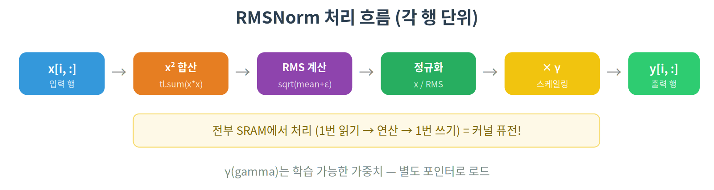

# 03. RMSNorm — LLM에서 쓰이는 실전 커널

## 개요

LLaMA, Mistral, Gemma 등 최신 LLM에서 사용하는 RMSNorm을 Triton으로 구현합니다.
Softmax와 유사한 패턴이지만, 학습 가능한 가중치(gamma)가 추가됩니다.

## 핵심 개념

### LayerNorm vs RMSNorm

```
LayerNorm:  y = (x - mean(x)) / sqrt(var(x) + ε) * γ + β
RMSNorm:    y = x / sqrt(mean(x²) + ε) * γ
```

RMSNorm이 LLM에서 선호되는 이유:
- mean 계산이 필요 없음 → 연산량 감소
- bias(β) 없음 → 파라미터 수 감소
- 실험적으로 LayerNorm과 성능이 비슷

### 수식 분해

```
1. 제곱합:    sum_sq = Σ(x_i²)
2. RMS:       rms = sqrt(sum_sq / n + ε)
3. 정규화:    x_norm = x / rms
4. 스케일링:  y = x_norm * γ
```

## 커널 동작 원리

Softmax와 동일하게 각 프로그램이 하나의 행을 처리합니다.



### Stride 기반 메모리 접근

2D 텐서에서 행의 시작 위치를 찾으려면 stride가 필요합니다:

```python
# row_idx번째 행의 시작 주소
row_ptr = input_ptr + row_idx * stride

# stride = 한 행에서 다음 행까지의 원소 간격
# 보통 n_cols와 같지만, padding이 있으면 다를 수 있음
```

## 사용된 Triton 기능

| 기능 | 설명 |
|------|------|
| `tl.sum(x * x, axis=0)` | 제곱합 계산 |
| `tl.sqrt(x)` | 제곱근 |
| 다중 포인터 | input, weight, output 각각의 포인터 |
| stride 인자 | 행 간 메모리 간격 전달 |

## 이전 튜토리얼과의 연결

- **01 Vector Add**: `tl.load`, `tl.store`, 마스크 → 동일하게 사용
- **02 Fused Softmax**: 행 단위 처리, `tl.sum` reduction → 동일한 패턴
- **새로운 점**: 학습 가능한 가중치(γ)를 별도 포인터로 로드하여 곱하기

## 코드 라인별 설명

### PyTorch 참조 구현

```python
def pytorch_rmsnorm(x, weight, eps=1e-6):
    rms = torch.sqrt(x.pow(2).mean(dim=-1, keepdim=True) + eps)
    return (x / rms) * weight
```

- `x.pow(2).mean(dim=-1)`: 각 행에서 제곱의 평균 → 이게 reduction 1번
- `keepdim=True`: 나눗셈 브로드캐스트를 위해 차원 유지
- 이 3줄이 PyTorch에서는 **여러 개의 CUDA 커널**로 실행됨 → 느림

### 커널 함수

```python
@triton.jit
def rmsnorm_kernel(
    input_ptr,      # 입력 텐서의 시작 주소
    weight_ptr,     # 가중치 γ의 시작 주소 (1D 벡터, 크기 = n_cols)
    output_ptr,     # 출력 텐서의 시작 주소
    stride,         # 행 간 메모리 간격 (보통 n_cols)
    n_cols,         # 열의 수 = hidden_size
    eps,            # epsilon (0으로 나누기 방지, 보통 1e-6)
    BLOCK_SIZE: tl.constexpr,
):
```

- `weight_ptr`: Softmax와 다른 점! 학습 가능한 가중치 γ를 별도로 받음
- `eps`: `sqrt(0)`을 방지하는 아주 작은 값 (1e-6 = 0.000001)

```python
    row_idx = tl.program_id(axis=0)               # 몇 번째 행?
    row_start = input_ptr + row_idx * stride       # 해당 행의 시작 주소
    out_start = output_ptr + row_idx * stride      # 출력 행의 시작 주소
```

- `stride`를 쓰는 이유: `x[row_idx]`의 메모리 주소 = `x_ptr + row_idx * stride`
- Softmax에서 `input_row_stride`와 같은 개념

```python
    col_offsets = tl.arange(0, BLOCK_SIZE)
    mask = col_offsets < n_cols

    row = tl.load(row_start + col_offsets, mask=mask, other=0.0)     # 입력 행 로드
    weight = tl.load(weight_ptr + col_offsets, mask=mask, other=0.0) # γ 로드
```

- `other=0.0`: 범위 밖은 0으로 채움 (Softmax의 `-inf`와 다름!)
- `weight`: 모든 행에 대해 **같은 γ**를 사용 → 매번 같은 주소에서 로드
- 이 시점에서 입력 행 + γ 둘 다 SRAM에 있음

```python
    # 1단계: 제곱합 (reduction)
    sq_sum = tl.sum(row * row, axis=0)    # Σ(x_i²) → 스칼라 1개

    # 2단계: RMS 계산
    mean_sq = sq_sum / n_cols             # mean(x²) = sum(x²) / n
    rms = tl.sqrt(mean_sq + eps)          # sqrt(mean(x²) + ε)

    # 3단계: 정규화 + 스케일링
    normed = row / rms                    # x / rms → 모든 원소를 rms로 나눔
    output = normed * weight              # × γ → 학습된 스케일 적용
```

- `tl.sum(row * row, axis=0)`: 벡터 전체의 제곱합 → reduction 1번이면 끝
- Softmax는 `max` + `sum` 2번이었지만, RMSNorm은 `sum` 1번만 → 더 빠름
- `row / rms`: rms는 스칼라, row는 벡터 → 브로드캐스트로 모든 원소를 나눔

```python
    tl.store(out_start + col_offsets, output, mask=mask)  # 결과 저장
```

### 래퍼 함수

```python
def triton_rmsnorm(x, weight, eps=1e-6):
    orig_shape = x.shape
    x_2d = x.view(-1, orig_shape[-1])    # (batch, seq, hidden) → (batch*seq, hidden)
    n_rows, n_cols = x_2d.shape
    output = torch.empty_like(x_2d)

    BLOCK_SIZE = triton.next_power_of_2(n_cols)   # hidden=4096 → 4096
    grid = (n_rows,)                               # 행 수만큼 프로그램

    rmsnorm_kernel[grid](
        x_2d, weight, output,
        x_2d.stride(0),       # 행 간 간격 (= n_cols)
        n_cols, eps,
        BLOCK_SIZE=BLOCK_SIZE,
    )
    return output.view(orig_shape)    # 원래 shape으로 복원
```

- `x.view(-1, hidden)`: 3D/4D 텐서를 2D로 펼침 (커널은 2D만 처리)
- `x_2d.stride(0)`: PyTorch가 자동으로 행 간 간격을 알려줌
- `output.view(orig_shape)`: 결과를 원래 shape으로 되돌림

### 02 Fused Softmax와의 차이점

| | 02 Softmax | 03 RMSNorm |
|---|---|---|
| reduction | `max` + `sum` (2번) | `sum` (1번) |
| 수치 안정성 | max 빼기 | eps 더하기 |
| 범위 밖 채움 | `-inf` | `0.0` |
| 추가 입력 | 없음 | 가중치 γ |
| 입력 shape | 2D만 | 3D/4D → 2D 변환 |

## 실행 방법

```bash
python 03_rmsnorm/rmsnorm.py
```

## 기대 결과

PyTorch의 수동 RMSNorm 구현 대비 커널 퓨전으로 인한 성능 향상이 나타납니다.
hidden_size가 클수록(2048, 4096 등) 차이가 명확합니다.
