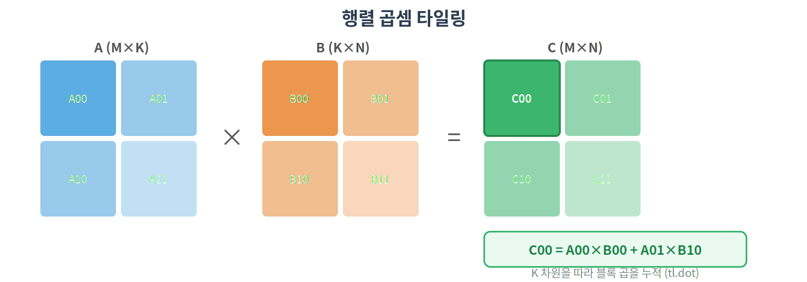
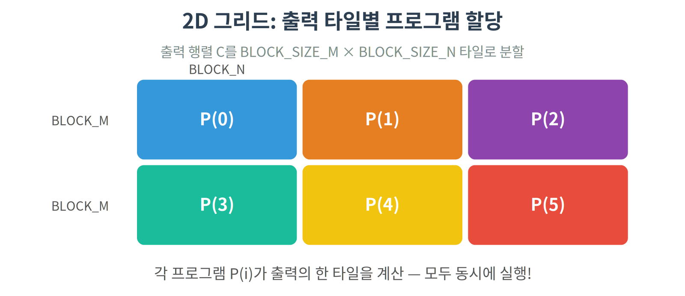
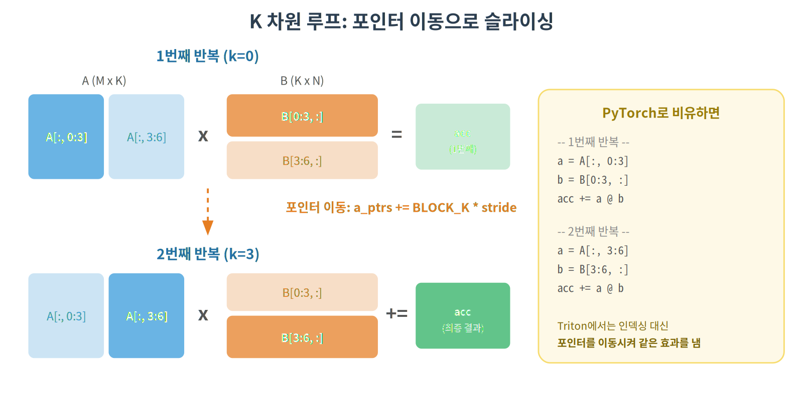
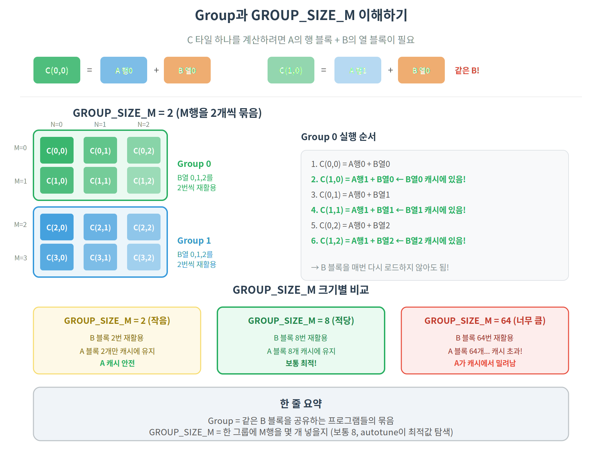
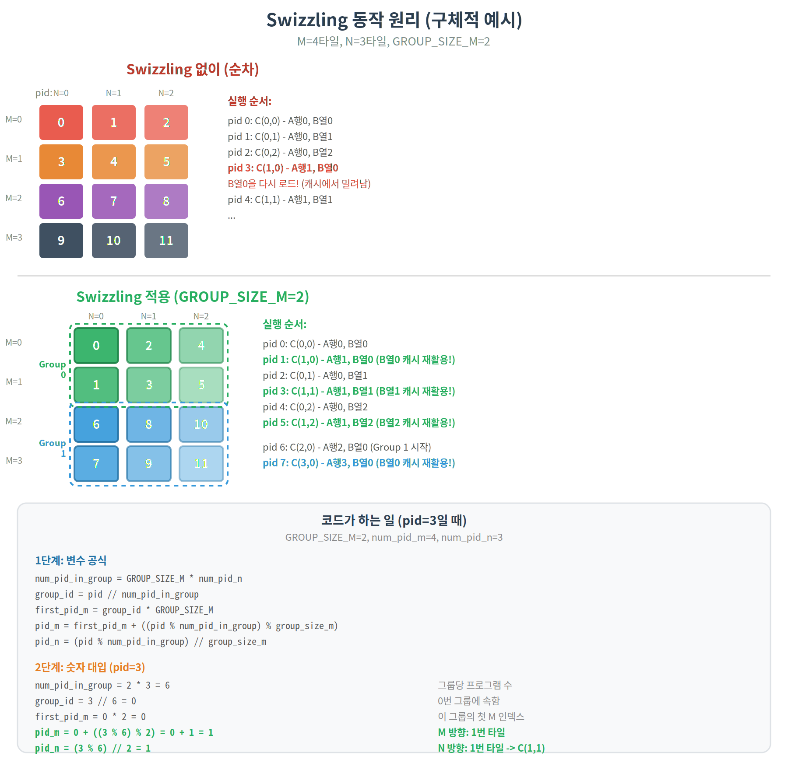
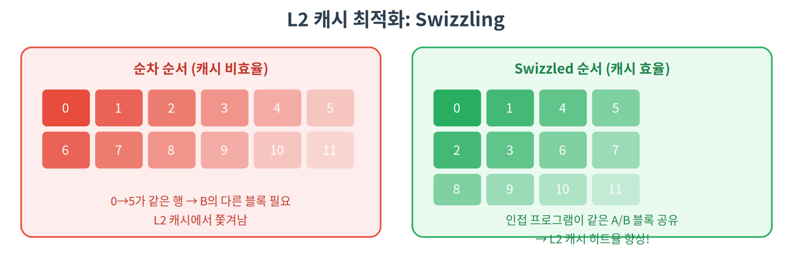

# 04. Matrix Multiplication — 2D 타일링과 Autotune

## 개요

딥러닝의 핵심 연산인 행렬 곱셈(GEMM)을 Triton으로 구현합니다.
2D 타일링, `tl.dot`, `triton.autotune` 등 고급 기능을 학습합니다.

## 핵심 개념

### 행렬 곱셈이 왜 중요한가

딥러닝의 거의 모든 연산이 행렬 곱셈:

- Linear layer: `y = xW + b`
- Attention: `QK^T`, `PV`
- MLP: 모든 Feed-Forward 블록

GPU 시간의 대부분이 행렬 곱셈에 소비됩니다.

### 나이브 vs 타일링

**나이브**: 출력의 각 원소마다 Global Memory에서 행/열 전체를 읽음 → 같은 데이터를 반복 로드

**타일링**: 행렬을 작은 블록으로 나누어 SRAM에 올리고, 블록 단위로 계산



### 데이터 재사용

타일링의 핵심은 **데이터 재사용**:

- A의 한 블록은 B의 여러 열 블록과 곱해짐
- B의 한 블록은 A의 여러 행 블록과 곱해짐
- SRAM에 올린 데이터를 최대한 재활용

## 커널 동작 원리

### 2D 그리드

이전 튜토리얼은 1D 그리드(행 단위)였지만, MatMul은 2D 그리드를 사용합니다:



### K 차원 루프

행렬 곱셈 `C = A × B`에서 A(M×K), B(K×N)일 때, K가 크면 한 번에 SRAM에 못 올립니다.
그래서 K를 `BLOCK_SIZE_K`씩 잘라서 반복하며, 부분 결과를 누적합니다.

```
A(4×6) × B(6×4) = C(4×4),  BLOCK_K = 3으로 나누면:

1회차: A의 왼쪽(4×3) × B의 위쪽(3×4) = 부분 결과1
2회차: A의 오른쪽(4×3) × B의 아래쪽(3×4) = 부분 결과2

C = 부분결과1 + 부분결과2   ← 이게 acc += tl.dot(a, b)
```

```python
# accumulator 초기화
acc = tl.zeros((BLOCK_SIZE_M, BLOCK_SIZE_N), dtype=tl.float32)

# K 차원을 BLOCK_SIZE_K 단위로 순회
for k in range(0, K, BLOCK_SIZE_K):
    a = tl.load(A_block)  # (BLOCK_SIZE_M, BLOCK_SIZE_K)
    b = tl.load(B_block)  # (BLOCK_SIZE_K, BLOCK_SIZE_N)
    acc += tl.dot(a, b)   # 블록 행렬 곱 → 텐서 코어 사용!
```

실제 코드에서는 포인터를 이동시켜 A, B의 다음 K 블록을 가리키도록 합니다 (아래 "코드 라인별 설명" 참고).



`tl.dot`은 텐서 코어를 자동 활용하여 블록 행렬 곱을 수행합니다.
일반 CUDA 코어 대비 ~16배 빠릅니다 (FP16 기준).

### L2 캐시 최적화 (Swizzling)

C 타일 하나를 계산하려면 **A의 행 블록**과 **B의 열 블록**이 필요합니다.
같은 B 열 블록을 쓰는 프로그램들을 연달아 실행하면, B가 L2 캐시에 남아서 재활용됩니다.

**Swizzling = "같은 B 블록을 쓰는 프로그램들을 묶어서 실행"**

이 묶음을 **Group**이라 하고, 한 Group에 M행을 몇 개 넣을지가 `GROUP_SIZE_M`입니다.



**문제: Swizzling 없이 순차 실행하면?**

```
순차 순서: C(0,0) → C(0,1) → C(0,2) → ... → C(0,N) → C(1,0)

C(0,0): A행0 + B열0 로드
C(0,1): A행0 + B열1 로드      ← A행0은 재활용되지만
  ...
C(0,N): A행0 + B열N 로드
C(1,0): A행1 + B열0 로드      ← B열0은 이미 캐시에서 밀려남! 다시 로드해야 함
```

열(N) 방향으로 쭉 가면 B열0이 캐시에서 밀려나 다시 Global Memory에서 로드해야 합니다.

**해결: Group 단위로 실행**

```
GROUP_SIZE_M = 2:
C(0,0) → C(1,0) → C(0,1) → C(1,1) → C(0,2) → C(1,2) → ...

C(0,0): A행0 + B열0
C(1,0): A행1 + B열0  ← B열0 캐시에서 바로 재활용!
C(0,1): A행0 + B열1
C(1,1): A행1 + B열1  ← B열1 캐시에서 바로 재활용!
```

이것이 Swizzling의 전부입니다. 코드에서 복잡해 보이는 `num_pid_in_group`, `group_id` 등은
**1D pid를 이 Group 순서에 맞게 2D (pid_m, pid_n)으로 변환**하는 계산일 뿐입니다.





## 사용된 Triton 기능

| 기능              | 설명                                     |
| ----------------- | ---------------------------------------- |
| `tl.dot(a, b)`    | 블록 행렬 곱 (텐서 코어 활용)            |
| `tl.zeros()`      | accumulator 초기화                       |
| `triton.autotune` | 최적 파라미터 자동 탐색                  |
| `triton.Config`   | autotune 탐색 공간 정의                  |
| `GROUP_SIZE_M`    | L2 캐시 최적화를 위한 swizzling 파라미터 |

### `triton.autotune` 이란?

블록 크기에 따라 성능이 크게 달라집니다. Autotune은 여러 설정을 실행해보고 가장 빠른 것을 선택합니다:

```python
@triton.autotune(
    configs=[
        triton.Config({'BLOCK_SIZE_M': 128, 'BLOCK_SIZE_N': 128, 'BLOCK_SIZE_K': 32}, num_warps=4),
        triton.Config({'BLOCK_SIZE_M': 64, 'BLOCK_SIZE_N': 128, 'BLOCK_SIZE_K': 32}, num_warps=4),
        # ... 여러 조합
    ],
    key=['M', 'N', 'K'],  # 이 값들이 바뀌면 다시 탐색
)
```

## 코드 라인별 설명

### Autotune 설정

```python
@triton.autotune(
    configs=[
        triton.Config({"BLOCK_SIZE_M": 128, "BLOCK_SIZE_N": 256, "BLOCK_SIZE_K": 64,
                        "GROUP_SIZE_M": 8}, num_stages=3, num_warps=8),
        triton.Config({"BLOCK_SIZE_M": 64,  "BLOCK_SIZE_N": 256, "BLOCK_SIZE_K": 32,
                        "GROUP_SIZE_M": 8}, num_stages=4, num_warps=4),
        # ... 여러 조합
    ],
    key=["M", "N", "K"],    # M, N, K가 바뀌면 다시 탐색
)
```

- `configs`: "이 조합들을 다 실행해보고 제일 빠른 걸 골라"
- `num_stages`: 파이프라이닝 단계 수 (메모리 로드와 계산을 겹침)
- `num_warps`: SM에서 사용할 warp 수 (많을수록 병렬성 높음)
- `key`: 행렬 크기가 바뀌면 최적 config도 바뀌므로 다시 탐색

### 커널 함수 인자

```python
@triton.jit
def matmul_kernel(
    a_ptr, b_ptr, c_ptr,                   # A, B, C 행렬 포인터
    M, N, K,                                # A(M×K) × B(K×N) = C(M×N)
    stride_am, stride_ak,                   # A의 행/열 stride
    stride_bk, stride_bn,                   # B의 행/열 stride
    stride_cm, stride_cn,                   # C의 행/열 stride
    BLOCK_SIZE_M: tl.constexpr,             # C 타일의 행 크기 (autotune)
    BLOCK_SIZE_N: tl.constexpr,             # C 타일의 열 크기 (autotune)
    BLOCK_SIZE_K: tl.constexpr,             # K 차원 블록 크기 (autotune)
    GROUP_SIZE_M: tl.constexpr,             # swizzling 그룹 크기
):
```

- 이전 튜토리얼은 stride 1개였지만, 2D 행렬이라 행 stride + 열 stride 필요
- `BLOCK_SIZE`가 3종류: M/N/K 각 차원의 타일 크기를 독립적으로 설정

### Swizzling으로 출력 타일 좌표 계산

```python
    pid = tl.program_id(axis=0)           # 1D 프로그램 ID (0 ~ num_tiles-1)
    num_pid_m = tl.cdiv(M, BLOCK_SIZE_M)  # M 방향 타일 수
    num_pid_n = tl.cdiv(N, BLOCK_SIZE_N)  # N 방향 타일 수

    # Swizzling: 인접 프로그램이 같은 A/B 데이터를 공유하도록 재배치
    num_pid_in_group = GROUP_SIZE_M * num_pid_n
    group_id = pid // num_pid_in_group
    first_pid_m = group_id * GROUP_SIZE_M
    group_size_m = min(num_pid_m - first_pid_m, GROUP_SIZE_M)
    pid_m = first_pid_m + ((pid % num_pid_in_group) % group_size_m)
    pid_n = (pid % num_pid_in_group) // group_size_m
```

아래 그림으로 순차 실행 vs Swizzling의 차이, 그리고 코드가 실제로 어떻게 좌표를 계산하는지 확인할 수 있습니다:


### A, B 블록 포인터 설정

```python
    offs_am = (pid_m * BLOCK_SIZE_M + tl.arange(0, BLOCK_SIZE_M)) % M
    offs_bn = (pid_n * BLOCK_SIZE_N + tl.arange(0, BLOCK_SIZE_N)) % N
    offs_k = tl.arange(0, BLOCK_SIZE_K)

    # 2D 포인터: 행 오프셋 × 행 stride + 열 오프셋 × 열 stride
    a_ptrs = a_ptr + (offs_am[:, None] * stride_am + offs_k[None, :] * stride_ak)
    b_ptrs = b_ptr + (offs_k[:, None] * stride_bk + offs_bn[None, :] * stride_bn)
```

- `offs_am[:, None]`: (BLOCK_M, 1) 형태 → 2D 인덱싱을 위한 브로드캐스트
- `offs_k[None, :]`: (1, BLOCK_K) 형태
- `a_ptrs`: (BLOCK_M, BLOCK_K) 크기의 2D 포인터 배열 — 이전과 다른 점!

### K 차원 루프 (핵심)

```python
    accumulator = tl.zeros((BLOCK_SIZE_M, BLOCK_SIZE_N), dtype=tl.float32)

    for k in range(0, tl.cdiv(K, BLOCK_SIZE_K)):
        k_mask = offs_k < K - k * BLOCK_SIZE_K          # K 경계 마스크

        a = tl.load(a_ptrs, mask=k_mask[None, :], other=0.0)  # (BLOCK_M, BLOCK_K)
        b = tl.load(b_ptrs, mask=k_mask[:, None], other=0.0)  # (BLOCK_K, BLOCK_N)

        accumulator += tl.dot(a, b)          # 블록 행렬 곱! 텐서 코어 사용!

        a_ptrs += BLOCK_SIZE_K * stride_ak   # 다음 K 블록으로 포인터 이동
        b_ptrs += BLOCK_SIZE_K * stride_bk
```

- `tl.zeros`: accumulator를 FP32로 초기화 (정밀도 유지)
- `tl.dot(a, b)`: **텐서 코어**를 자동 활용하는 블록 행렬 곱
- 루프 1회 = A의 (M, K) 조각 × B의 (K, N) 조각 → 누적
- 포인터를 직접 이동 (`+= BLOCK_SIZE_K * stride`) → 다음 K 조각으로

### 결과 저장

```python
    c = accumulator.to(tl.float16)     # FP32 → FP16 변환 (메모리 절약)

    offs_cm = pid_m * BLOCK_SIZE_M + tl.arange(0, BLOCK_SIZE_M)
    offs_cn = pid_n * BLOCK_SIZE_N + tl.arange(0, BLOCK_SIZE_N)
    c_ptrs = c_ptr + stride_cm * offs_cm[:, None] + stride_cn * offs_cn[None, :]
    c_mask = (offs_cm[:, None] < M) & (offs_cn[None, :] < N)   # 2D 경계 마스크
    tl.store(c_ptrs, c, mask=c_mask)
```

- `accumulator.to(tl.float16)`: 계산은 FP32로 하되, 저장은 FP16 → 정밀도와 메모리 모두 챙김
- `c_mask`: 2D 마스크 — M과 N 방향 모두 경계 처리

### 래퍼 함수

```python
def triton_matmul(a, b):
    M, K = a.shape
    K, N = b.shape
    c = torch.empty((M, N), device=a.device, dtype=torch.float16)

    grid = lambda META: (
        triton.cdiv(M, META["BLOCK_SIZE_M"]) * triton.cdiv(N, META["BLOCK_SIZE_N"]),
    )
    # 예: M=1024, N=1024, BLOCK_M=128, BLOCK_N=128
    # → 8 * 8 = 64개 프로그램 (2D 타일을 1D로 펼침)

    matmul_kernel[grid](a, b, c, M, N, K,
                        a.stride(0), a.stride(1),
                        b.stride(0), b.stride(1),
                        c.stride(0), c.stride(1))
    return c
```

- `grid`: M 타일 수 × N 타일 수 = 총 프로그램 수 (1D로 펼침)
- `META["BLOCK_SIZE_M"]`: autotune이 선택한 값이 자동으로 들어옴

### 이전 튜토리얼과의 차이점

|               | 01~03             | 04 MatMul                    |
| ------------- | ----------------- | ---------------------------- |
| 그리드        | 1D (행 수)        | 1D (M타일 × N타일)           |
| 데이터        | 1D 벡터/행        | 2D 블록 (타일)               |
| 포인터        | 1D offsets        | 2D `[:, None]` + `[None, :]` |
| 루프          | 없음              | K 차원 루프                  |
| 핵심 연산     | `+`, `exp`, `sum` | `tl.dot` (텐서 코어)         |
| 파라미터 튜닝 | 수동 BLOCK_SIZE   | `triton.autotune`            |

## 실행 방법

```bash
python 04_matmul/matmul.py
```

## 기대 결과

cuBLAS(`torch.matmul`)는 수십 년간 최적화된 라이브러리입니다.
Triton으로 cuBLAS의 **80~90%** 성능에 도달하는 것이 목표입니다.
autotune 적용 전후 성능 차이도 확인할 수 있습니다.
