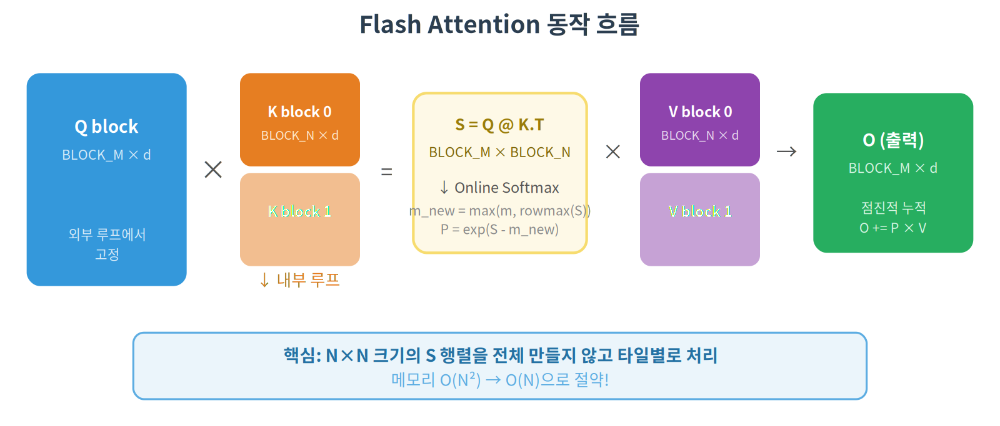
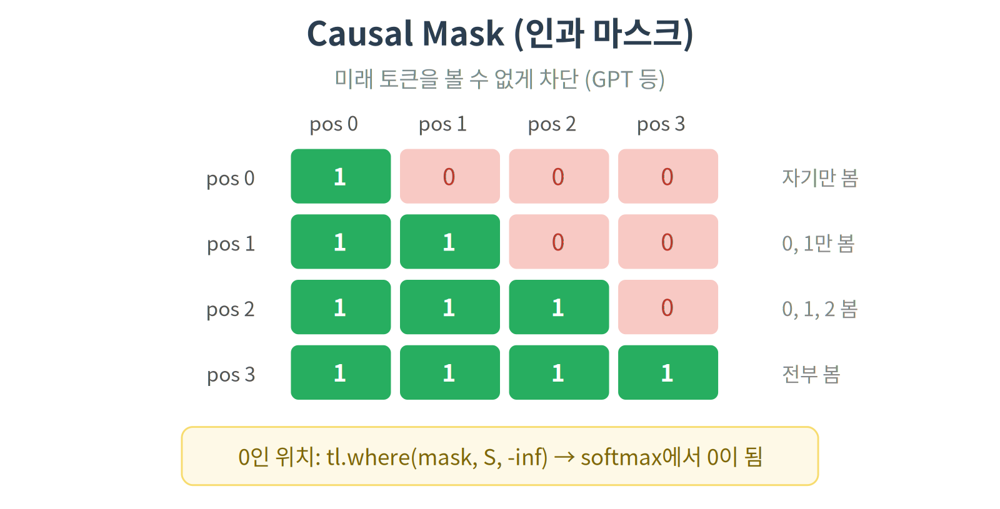

# 05. Flash Attention — 종합 프로젝트

## 개요

지금까지 배운 모든 기법을 종합하여 Flash Attention을 구현합니다.
LLM 추론/학습에서 가장 중요한 최적화 기법 중 하나입니다.

## 핵심 개념

### Attention 수식

$$O = \text{softmax}\!\left(\frac{Q \cdot K^T}{\sqrt{d}}\right) \cdot V$$

- $Q, K, V$: Query, Key, Value 행렬 (각각 $N \times d$)
- $\sqrt{d}$: head dimension의 제곱근으로 나눠서 스케일링
- $\text{softmax}$: 행(row) 단위로 적용 → 확률 분포로 변환
- $O$: 출력 ($N \times d$)

### Standard Attention의 문제

위 수식을 그대로 구현하면:

```python
# Standard Attention
S = Q @ K.T / sqrt(d)   # (N, N) — 시퀀스 길이 N에 대해 O(N²) 메모리!
P = softmax(S)           # (N, N)
O = P @ V               # (N, d)
```

시퀀스 길이 N=4096, float16이면:

- S 행렬 크기: 4096 × 4096 × 2 bytes = **32MB**
- N=16384이면: **512MB** — 시퀀스가 길어질수록 VRAM 폭발

### Flash Attention의 핵심 아이디어

**S 행렬을 전체 생성하지 않는다!**

타일 단위로 Q, K, V를 처리하면서 결과를 점진적으로 누적합니다.
이를 위해 **Online Softmax** 알고리즘이 필요합니다.

### Online Softmax

#### 원래 Softmax 수식

전체 데이터가 있어야 계산할 수 있습니다:

$$\text{softmax}(x_i) = \frac{e^{x_i - m}}{\sum_{j=1}^{N} e^{x_j - m}}, \quad m = \max(x_1, x_2, \ldots, x_N)$$

여기서 $m$을 빼는 이유는 수치 안정성입니다 ($e^{1000}$은 오버플로우).
문제는 $m$과 $\sum$을 구하려면 **전체 N개 데이터**가 필요하다는 점입니다.

#### Online Softmax 변형 수식

데이터를 청크(블록) 단위로 받으면서 **점진적으로 업데이트**합니다.

**청크 1 처리 후** ($S_1$ = 첫 번째 K 블록과의 attention score):

$$m^{(1)} = \max(S_1)$$

$$l^{(1)} = \sum_j e^{S_{1,j} - m^{(1)}}$$

$$O^{(1)} = \text{diag}(l^{(1)})^{-1} \cdot e^{S_1 - m^{(1)}} \cdot V_1$$

**청크 2 처리 후** ($S_2$ = 두 번째 K 블록과의 attention score):

새로운 max 업데이트:

$$m^{(2)} = \max(m^{(1)},\ \max(S_2))$$

보정 계수 (핵심!):

$$\alpha = e^{m^{(1)} - m^{(2)}}$$

이전 결과를 새로운 max 기준으로 보정:

$$l^{(2)} = l^{(1)} \cdot \alpha + \sum_j e^{S_{2,j} - m^{(2)}}$$

$$O^{(2)} = O^{(1)} \cdot \alpha + e^{S_2 - m^{(2)}} \cdot V_2$$

최종 정규화:

$$O = \text{diag}(l^{(T)})^{-1} \cdot O^{(T)}$$

#### 왜 보정 계수 $\alpha$가 필요한가?

max가 바뀌면 이전에 계산한 `exp` 값들이 틀어집니다:

```
청크 1: max=5,  exp(3-5) = exp(-2) = 0.135
청크 2: max=10, exp(3-5)는 틀림! exp(3-10) = exp(-7) = 0.0009여야 함

보정: 0.135 × exp(5-10) = 0.135 × exp(-5) ≈ 0.0009  ✓
                ^^^^^^^^
                α = exp(m_old - m_new)
```

이전 결과에 $\alpha$를 곱하면 **새로운 max 기준으로 정확하게 보정**됩니다.

### 메모리 복잡도

| 방식     | 메모리 | RTX 4080 (16GB)에서 최대 seq_len |
| -------- | ------ | -------------------------------- |
| Standard | O(N²)  | ~8K (float16)                    |
| Flash    | O(N)   | 수십만+                          |

## 커널 동작 원리



### 단계별 의사코드

```python
for q_block in Q_blocks:          # 각 프로그램
    m = -inf, l = 0, O = 0

    for k_block, v_block in zip(K_blocks, V_blocks):  # 내부 루프
        S = q_block @ k_block.T * scale

        # Online softmax 업데이트
        m_new = max(m, rowmax(S))
        correction = exp(m - m_new)
        P = exp(S - m_new)

        l = l * correction + rowsum(P)
        O = O * correction + P @ v_block
        m = m_new

    O = O / l  # 최종 정규화
```

## Causal Masking

Autoregressive 모델(GPT 등)에서는 미래 토큰을 볼 수 없습니다:



```python
# 마스크 적용
S = tl.where(causal_mask, S, float('-inf'))
```

## 사용된 Triton 기능 (종합)

| 튜토리얼 | 기능                         | Flash Attention에서의 역할   |
| -------- | ---------------------------- | ---------------------------- |
| 01       | `tl.load`, `tl.store`, mask  | Q, K, V 블록 로드/저장       |
| 02       | `tl.max`, `tl.sum`, `tl.exp` | Online Softmax               |
| 03       | stride 기반 접근             | batch, head 차원 처리        |
| 04       | `tl.dot`, 2D 타일링          | S = Q @ K^T, O += P @ V      |
| **신규** | 중첩 루프                    | K, V 블록 순회               |
| **신규** | 다차원 포인터                | (batch, head, seq, dim) 접근 |

## 코드 라인별 설명

### PyTorch 참조 구현 (Standard Attention)

```python
def pytorch_attention(q, k, v, causal=False):
    scale = q.shape[-1] ** -0.5             # 1/sqrt(d) — 스케일링 팩터
    s = torch.matmul(q, k.transpose(-2, -1)) * scale  # S = Q @ K^T / sqrt(d)
    # s.shape = (batch_heads, N, N) — O(N²) 메모리! 이게 문제

    if causal:
        mask = torch.triu(torch.ones(N, N), diagonal=1).bool()  # 상삼각 = True
        s = s.masked_fill(mask, float("-inf"))    # 미래 토큰 → -inf

    p = torch.softmax(s, dim=-1)            # softmax → (N, N) 전체를 메모리에 유지
    o = torch.matmul(p, v)                  # O = P @ V
    return o
```

- 이 구현의 문제: N×N 행렬 `s`와 `p`를 **통째로 만들어야** 함 → O(N²) 메모리
- Flash Attention은 이걸 **타일 단위로 처리**해서 O(N)으로 줄임

### 커널 함수 인자

```python
@triton.jit
def flash_attention_kernel(
    q_ptr, k_ptr, v_ptr, o_ptr,         # Q, K, V, Output 포인터
    stride_qb, stride_qh, stride_qm, stride_qk,  # Q의 4D stride (batch, head, seq, dim)
    stride_kb, stride_kh, stride_kn, stride_kk,  # K의 4D stride
    stride_vb, stride_vh, stride_vn, stride_vk,  # V의 4D stride
    stride_ob, stride_oh, stride_om, stride_ok,  # O의 4D stride
    seq_len, head_dim, scale,            # 시퀀스 길이, 헤드 차원, 1/sqrt(d)
    IS_CAUSAL: tl.constexpr,             # causal 여부 (컴파일 타임 분기)
    BLOCK_M: tl.constexpr,               # Q 블록 크기 (64)
    BLOCK_N: tl.constexpr,               # K/V 블록 크기 (64)
    BLOCK_D: tl.constexpr,               # head_dim (2의 거듭제곱)
):
```

- stride가 4종류×4개 = 16개: (batch, head, seq, dim) 4차원을 다뤄야 하므로
- `IS_CAUSAL`: `tl.constexpr`이라 **컴파일 시점에** causal/non-causal 두 버전이 따로 만들어짐

### 2D 그리드와 Q 블록 로드

```python
    pid_m = tl.program_id(0)     # 몇 번째 Q 블록? (0 ~ ceil(seq_len/BLOCK_M)-1)
    pid_bh = tl.program_id(1)   # 몇 번째 batch×head? (0 ~ batch*heads-1)

    # 현재 batch*head에 해당하는 base 포인터
    q_base = q_ptr + pid_bh * stride_qh
    k_base = k_ptr + pid_bh * stride_kh
    v_base = v_ptr + pid_bh * stride_vh
    o_base = o_ptr + pid_bh * stride_oh
```

- 04 MatMul은 1D 그리드였지만, Flash Attention은 **2D 그리드**
  - axis=0: Q 블록 인덱스 (시퀀스를 BLOCK_M씩 분할)
  - axis=1: batch × head (각 head를 독립 처리)

```python
    offs_m = pid_m * BLOCK_M + tl.arange(0, BLOCK_M)   # Q 행 인덱스
    offs_d = tl.arange(0, BLOCK_D)                       # head_dim 인덱스

    # Q 블록 로드 (BLOCK_M × BLOCK_D)
    q_mask = (offs_m[:, None] < seq_len) & (offs_d[None, :] < head_dim)
    q = tl.load(q_base + offs_m[:, None] * stride_qm + offs_d[None, :] * stride_qk,
                mask=q_mask, other=0.0)
```

- `offs_m[:, None]` × `offs_d[None, :]`: 04 MatMul과 같은 2D 포인터 패턴
- Q 블록은 **외부 루프에서 고정** — 내부 루프는 K/V만 순회

### Online Softmax 변수 초기화

```python
    m_i = tl.full([BLOCK_M], float("-inf"), dtype=tl.float32)  # 각 행의 running max
    l_i = tl.full([BLOCK_M], 0.0, dtype=tl.float32)           # 각 행의 running sum
    acc = tl.zeros([BLOCK_M, BLOCK_D], dtype=tl.float32)       # 출력 누적기
```

- `m_i`: 행별 최대값 추적 (처음엔 -inf → 점점 커짐)
- `l_i`: 행별 softmax 분모 추적 (처음엔 0 → 점점 커짐)
- `acc`: 최종 출력 (처음엔 0 → P@V 결과가 점점 누적)
- 이 세 변수가 **Online Softmax의 핵심** — 전체 S 행렬 없이 softmax 계산

### 내부 루프 (K/V 블록 순회)

```python
    for start_n in range(0, k_range, BLOCK_N):
        offs_n = start_n + tl.arange(0, BLOCK_N)

        # K 블록 로드 (BLOCK_N × BLOCK_D)
        k = tl.load(k_base + offs_n[:, None] * stride_kn + offs_d[None, :] * stride_kk,
                     mask=k_mask, other=0.0)

        # S = Q @ K^T * scale — attention score (BLOCK_M × BLOCK_N)
        s = tl.dot(q, tl.trans(k)) * scale
```

- `k_range`: causal이면 현재 Q 위치까지만, non-causal이면 전체 시퀀스
- `tl.trans(k)`: K를 전치 → Q(M×D) @ K^T(D×N) = S(M×N)
- `s`는 S 행렬의 **작은 타일 (BLOCK_M × BLOCK_N)** — 전체를 만들지 않음!

```python
        # Causal mask: 미래 토큰 차단
        if IS_CAUSAL:
            causal_mask = offs_m[:, None] >= offs_n[None, :]
            s = tl.where(causal_mask, s, float("-inf"))
```

- `offs_m >= offs_n`: Q위치 >= K위치인 것만 True (과거+현재만 볼 수 있음)
- `float("-inf")` → softmax 후 0이 됨 → 미래 정보 차단

### Online Softmax 업데이트 (핵심!)

```python
        m_ij = tl.max(s, axis=1)              # 현재 블록의 행별 최대값
        m_new = tl.maximum(m_i, m_ij)          # 전체 최대값 업데이트

        alpha = tl.exp(m_i - m_new)            # 이전 결과 보정 계수
        p = tl.exp(s - m_new[:, None])         # softmax 분자 (새 max 기준)

        l_i = l_i * alpha + tl.sum(p, axis=1)  # 분모 업데이트
        acc = acc * alpha[:, None]              # 이전 출력 보정
```

- `alpha = exp(m_old - m_new)`: **max가 바뀌면 이전 결과를 보정**해야 함
  - 예: 이전 max=5, 새 max=10 → alpha = exp(5-10) = exp(-5) ≈ 0.007
  - 이전 결과에 0.007을 곱해 새 max 기준으로 스케일 조정
- 이게 Online Softmax의 핵심 트릭 — 전체 데이터 없이도 정확한 softmax 가능

```python
        # V 블록 로드 후 P @ V 누적
        v = tl.load(v_base + ..., mask=v_mask, other=0.0)
        acc += tl.dot(p.to(v.dtype), v)        # P(M×N) @ V(N×D) → (M×D)

        m_i = m_new                             # max 업데이트
```

- `p.to(v.dtype)`: FP32 → FP16 변환 (tl.dot은 같은 타입 필요)
- 매 반복마다 `acc`에 결과가 누적 → S 전체를 저장할 필요 없음

### 최종 정규화 및 저장

```python
    acc = acc / l_i[:, None]                    # softmax 분모로 나누기
    tl.store(o_base + ..., acc.to(tl.float16), mask=o_mask)
```

- `l_i`: 각 행의 softmax 분모 (Σ exp) → 마지막에 한 번만 나눔
- FP32 → FP16 변환 후 저장

### 래퍼 함수

```python
def flash_attention(q, k, v, causal=False):
    bh, seq_len, head_dim = q.shape
    o = torch.empty_like(q)

    BLOCK_M = 64           # Q 타일 크기
    BLOCK_N = 64           # K/V 타일 크기
    BLOCK_D = triton.next_power_of_2(head_dim)

    grid = (triton.cdiv(seq_len, BLOCK_M), bh)
    # axis 0: 시퀀스를 BLOCK_M씩 분할 → seq_len/64개 프로그램
    # axis 1: batch×head 수 → 각 head 독립 처리
```

- 2D 그리드: (Q블록 수, batch×head 수)
- 예: seq_len=1024, BLOCK_M=64, heads=16 → grid=(16, 16) → 256개 프로그램

### 전체 튜토리얼과의 연결

| 개념                | 어디서 배웠나 | Flash Attention에서의 역할      |
| ------------------- | ------------- | ------------------------------- |
| `tl.load`, mask     | 01 Vector Add | Q, K, V 블록 로드               |
| reduction, `tl.exp` | 02 Softmax    | Online Softmax의 max, sum, exp  |
| stride, 다중 포인터 | 03 RMSNorm    | batch, head, seq, dim 차원 접근 |
| `tl.dot`, 2D 타일링 | 04 MatMul     | S = Q@K^T, O += P@V             |
| K 차원 루프         | 04 MatMul     | K/V 블록 순회 (내부 루프)       |
| **Online Softmax**  | **신규**      | SRAM 제한 극복의 핵심           |

## 실행 방법

```bash
python 05_flash_attention/flash_attention.py
```

## 기대 결과

- **정확도**: PyTorch standard attention과 거의 동일한 결과
- **속도**: 시퀀스 길이가 길수록 (1024+) 큰 속도 향상
- **메모리**: O(N²) → O(N)으로 극적인 메모리 절약
