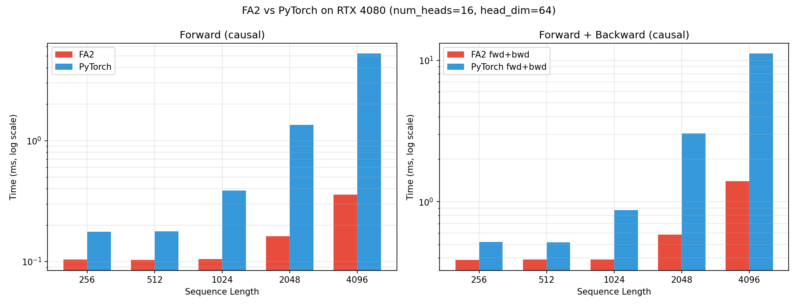

# 09. Flash Attention 2

## 개요

[Flash Attention 1 (05)](../05_flash_attention/)을 논문 [FlashAttention-2: Faster Attention with Better Parallelism and Work Partitioning (Tri Dao, 2023)](https://arxiv.org/abs/2307.08691)에 따라 재설계한 버전입니다.

핵심 목표: **non-matmul FLOPs를 줄여 matmul 시간 비율을 높이고, 시퀀스 차원 병렬화로 SM 점유율을 끌어올린다.**

---

## 왜 FA1만으로는 부족한가?

A100 기준:

- matmul 처리량: **312 TFLOPs/s** (FP16, Tensor Core)
- non-matmul 처리량: **19.5 TFLOPs/s** (FP32 vector)
- **non-matmul 1번 ≈ matmul 16번 비용**

FA1은 매 inner loop마다 다음 비-matmul 연산을 수행합니다:

- `1/ℓ` 곱셈 (output rescaling)
- `exp` 계산
- `max` 비교, `alpha = exp(m_old - m_new)` 등

이 누적된 비-matmul 시간 때문에 FA1은 이론치의 25-40%밖에 못 씁니다.
FA2는 이 비-matmul 연산들을 줄여 50-73%까지 끌어올렸습니다.

---

# Forward Pass

## Algorithm 1 (논문 의사코드)

```
Require: Q, K, V ∈ R^(N×d) in HBM, block sizes Bc, Br
1: Q를 Tr=⌈N/Br⌉개 블록으로, K,V를 Tc=⌈N/Bc⌉개 블록으로 분할
2: O를 Tr 블록으로, logsumexp L도 Tr 블록으로 분할
3: for 1 ≤ i ≤ Tr do                    ← 외부 루프 (Q, embarrassingly parallel)
4:   Q_i를 HBM → SRAM 로드
5:   On chip 초기화: Õ_i=0, ℓ_i=0, m_i=-∞
6:   for 1 ≤ j ≤ Tc do                   ← 내부 루프 (K, V)
7:     K_j, V_j 로드
8:     S_i^(j) = Q_i K_j^T               ← matmul (시간을 여기 쓰자)
9:     m_i^(j) = max(m_i^(j-1), rowmax(S_i^(j)))
       P̃_i^(j) = exp(S_i^(j) - m_i^(j))
       ℓ_i^(j) = e^(m^(j-1)-m^(j))·ℓ^(j-1) + rowsum(P̃_i^(j))
10:    Õ_i^(j) = diag(e^(m^(j-1)-m^(j)))·Õ^(j-1) + P̃_i^(j) V_j  ← matmul + 보정
11:  end for
12:  O_i = diag(ℓ_i^(Tc))^-1 · Õ_i^(Tc)  ← FA2: 마지막 1회만 정규화
13:  L_i = m_i^(Tc) + log(ℓ_i^(Tc))      ← logsumexp 저장
14:  Write O_i, L_i to HBM
15: end for
16: Return O, L
```

핵심은 **외부 루프 = Q (각 프로그램이 독립)**, **내부 루프 = K/V**.
외부 루프가 시퀀스 차원이라 시퀀스가 길수록 SM 점유율이 올라갑니다.

## Forward의 4가지 핵심 개선

### ① Algorithm 1: Output rescaling을 마지막에 한 번만

**FA1 누적 식 (논문 §2.3.1 변형 후)**:
$$O^{(j)} = \text{diag}(\ell^{(j)})^{-1} \cdot (\text{diag}(e^{m^{(j-1)} - m^{(j)}}) \cdot O^{(j-1)} \cdot \ell^{(j-1)} + e^{S^{(j)} - m^{(j)}} V^{(j)})$$

매 step마다 `1/ℓ`을 곱함.

**FA2 누적 식 (논문 §3.1.1)**:
$$\tilde{O}^{(j)} = \text{diag}(e^{m^{(j-1)} - m^{(j)}}) \cdot \tilde{O}^{(j-1)} + e^{S^{(j)} - m^{(j)}} V^{(j)}$$

`Õ`를 "un-scaled" 상태로 유지. **마지막에만** 한 번:
$$O = \text{diag}(\ell^{(\text{last})})^{-1} \cdot \tilde{O}^{(\text{last})}$$

→ 매 iteration 나눗셈(`BLOCK_M × BLOCK_D` 크기) 1번씩 절약.

> 참고: 본 프로젝트의 [05/flash_attention.py](../05_flash_attention/flash_attention.py)도 이미 마지막에만 나누는 형태로 구현되어 있어, 이 항목은 코드상 큰 변화는 아닙니다. FA2의 가장 분명한 개선은 ②~④번입니다.

### ② exp → exp2 (HW 직접 지원 활용)

GPU 하드웨어는 `exp2(x) = 2^x`를 직접 계산하고, `exp(x)`는 내부적으로 `exp2(x · log2(e))`로 구현됩니다. 그래서:

```python
# FA1 스타일
qk_scaled = qk * sm_scale     # 곱셈 1
p = tl.exp(qk_scaled - m_ij)  # exp = exp2 + log2(e) 곱셈

# FA2 스타일 — sm_scale에 log2(e)를 미리 곱해두기
qk_scale = sm_scale * 1.4426950408889634  # 호스트에서 한 번
qk_scaled = qk * qk_scale     # 곱셈 1 (동일)
p = tl.math.exp2(qk_scaled - m_ij)  # exp2만 직접 호출
```

→ exp 1번당 곱셈 1회 + 함수 호출 오버헤드 절약.

### ③ Causal Masking을 두 단계로 분할

**FA1**: 매 K/V 블록마다 `if causal: apply_mask` 분기 → 분기·마스크 연산 매번 발생.

**FA2 (논문 §3.1.1, 6쪽)**:

```
Q 블록 i에 대해 K/V 블록 j를 순회할 때:
  - j*BLOCK_N < i*BLOCK_M               → STAGE 1 (행 > 열, 마스크 불필요)
  - i*BLOCK_M ≤ j*BLOCK_N < (i+1)*BLOCK_M → STAGE 2 (대각선 블록, 마스크 적용)
  - j*BLOCK_N ≥ (i+1)*BLOCK_M           → 전체가 -∞, 루프 자체 SKIP
```

대형 시퀀스에서 약 **절반의 블록을 스킵** → 1.7-1.8× 속도 향상.

본 구현에서는 `_fa2_inner` 함수를 STAGE constexpr 인자로 두 번 호출:

```python
if IS_CAUSAL:
    # STAGE 1: 마스크 분기 자체가 없는 빠른 루프
    acc, l_i, m_i = _fa2_inner(..., STAGE=1)
    # STAGE 2: 대각선 1개 블록만 마스크 적용
    acc, l_i, m_i = _fa2_inner(..., STAGE=2)
else:
    acc, l_i, m_i = _fa2_inner(..., STAGE=3)
```

`STAGE`는 `tl.constexpr`이라 컴파일 타임에 분기 → STAGE 1 코드에는 마스크 명령 자체가 없음.

### ④ Sequence 차원 병렬화 + tl.dot accumulator

**병렬화 (논문 §3.2)**:

- FA1 원본 (논문): `grid = (batch, num_heads)` — 시퀀스가 길고 batch가 작으면 SM 점유율 ↓
- FA2 (Phil Tillet의 Triton 구현 채택): `grid = (seq_len/BLOCK_M, batch*num_heads)` — Q 블록을 시퀀스 차원으로도 병렬화

본 프로젝트의 [05/flash_attention.py](../05_flash_attention/flash_attention.py)도 이미 Q-outer 그리드라 동일.

**Warp partitioning (논문 §3.3)**:

- FA1 split-K: K, V를 4 warp에 분할 → 각 warp이 부분합 후 SRAM 통신 → sync → 합산
- FA2 split-Q: Q를 4 warp에 분할 → 자기 V와 곱하면 끝, **warp간 통신 없음**

Triton에서는 `num_warps`로 자동 처리되지만, **Q-outer / KV-inner 루프 구조**가 split-Q를 자연스럽게 유도.

**accumulator API**:

```python
# FA1
acc += tl.dot(p, v)
# FA2 — 한 명령으로 누적
acc = tl.dot(p.to(v.dtype), v, acc)
```

### ⑤ (보너스) autotune

논문 §3.3 마지막 단락: "we manually tune for each head dimension ... could benefit from auto-tuning. We leave this to future work."

본 구현에서는 `triton.autotune`으로 `BLOCK_M`/`BLOCK_N`/`num_warps`/`num_stages` 자동 탐색.

### ⑥ (옵션) Logsumexp 저장

backward용으로 FA1은 `m`과 `ℓ`을 둘 다 저장해야 했으나, FA2는 통합:

$$L = m + \log(\ell)$$

→ 메모리 절반. 본 구현에서 `return_lse=True`로 옵션 활성화.
본 코드는 **base-2 형태로 저장** ($L_i = m_i + \log_2 \ell_i$) — backward에서도 `exp2`와 직접 결합되어 일관됨. 외부 노출 시 wrapper에서 `× ln(2)`로 자연로그 변환.

## Forward 코드 구조

```python
flash_attention_v2_kernel             # 외부 루프 (Q 블록) — autotune 적용
  ├── Q 블록 로드 + online softmax 통계 초기화
  ├── if IS_CAUSAL:
  │     _fa2_inner(STAGE=1)           # 마스크 불필요한 K/V 블록
  │     _fa2_inner(STAGE=2)           # 대각선 블록 (마스크 적용)
  │   else:
  │     _fa2_inner(STAGE=3)           # 전체 K/V 블록
  ├── acc /= l_i                       # 마지막 1회 정규화 (Algorithm 1, line 12)
  └── (옵션) lse = m + log2(ℓ) 저장   # Algorithm 1, line 13
```

`_fa2_inner`는 STAGE constexpr로 컴파일 타임 분기 → STAGE 1 코드에는 마스크 명령 자체가 없음.

---

# Backward Pass

Forward만 빠르고 메모리를 아껴봐야, 학습 시 backward에서 N×N 중간행렬을 다시 만들면 의미가 없습니다. FA2 backward는 다음 두 트릭으로 O(N) 메모리 학습을 달성합니다:

1. **재계산 (recomputation)**: 저장한 LSE로 `P`를 backward에서 즉석 재구성
2. **D_i 사전계산**: softmax chain rule의 row-reduction 항을 한 번만 구해 재사용

> 같은 backward 알고리즘을 [05_flash_attention/README.md](../05_flash_attention/README.md)에서도 다룹니다 (자연로그 LSE 버전).
> 본 README는 FA2 특화 사항 (base-2 LSE, 코드와의 매핑)에 집중합니다.

## Algorithm 2 (논문 의사코드)

```
Require: Q, K, V, O, dO ∈ R^(N×d), L ∈ R^N (forward에서 저장한 LSE)
1: dQ = 0, dK = 0, dV = 0
2: D_i = rowsum(dO_i ∘ O_i)                    ← preprocess 커널
3: for 1 ≤ j ≤ Tc do                            ← outer = K/V 블록
4:   K_j, V_j 로드
5:   dK_j = 0, dV_j = 0
6:   for 1 ≤ i ≤ Tr do                          ← inner = Q 블록
7:     Q_i, dO_i, L_i, D_i 로드
8:     S_ij = Q_i K_j^T                          ← matmul 1
9:     P_ij = exp(α·S_ij - L_i)                  ← P 재계산 (α = 1/√d)
10:    dV_j += P_ij^T · dO_i                     ← matmul 2
11:    dP_ij = dO_i · V_j^T                      ← matmul 3
12:    dS_ij = α · P_ij ∘ (dP_ij - D_i)
13:    dK_j += dS_ij^T · Q_i                     ← matmul 5
14:  end for
15:  Write dK_j, dV_j
16: end for
17: for 1 ≤ i ≤ Tr do                            ← Q 블록 (별도 패스)
18:   Q_i, dO_i, L_i, D_i 로드
19:   dQ_i = 0
20:   for 1 ≤ j ≤ Tc do                          ← inner = K/V 블록
21:     K_j, V_j 로드
22:     S_ij = Q_i K_j^T
23:     P_ij = exp(α·S_ij - L_i)
24:     dP_ij = dO_i · V_j^T
25:     dS_ij = α · P_ij ∘ (dP_ij - D_i)
26:     dQ_i += dS_ij · K_j                      ← matmul 4
27:  end for
28:  Write dQ_i
29: end for
```

총 **5 matmul** (S 재계산 1 + dV/dP/dQ/dK 4). 표준 backward(4 matmul) 대비 25% 더 많지만 N×N 메모리를 안 씁니다.

## 알고리즘 도출

### 트릭 1: P 재계산

Forward에서 P를 통째로 저장하면 O(N²) → 의미 없음. 대신 **logsumexp `L = m + log(ℓ)`**(N짜리 벡터)만 저장:

$$P_{ij} = \exp(S_{ij}/\sqrt{d} - L_i)$$

본 구현은 base-2:

$$P_{ij} = \text{exp2}(\alpha \cdot \log_2 e \cdot S_{ij} - L_i^{(\log_2)})$$

여기서 $L^{(\log_2)} = m + \log_2 \ell$이 forward에서 저장된 값.

### 트릭 2: D_i = rowsum(dO ∘ O)

Softmax chain rule:

$$dS_{ij} = P_{ij} \cdot \left(dP_{ij} - \sum_k P_{ik} \cdot dP_{ik}\right)$$

뒤쪽 합은 행 전체 reduction이라 블록 단위 계산이 어렵지만, 다음 항등식이 성립:

$$\sum_k P_{ik} dP_{ik} = \sum_k dO_{ik} \cdot O_{ik} = D_i$$

증명: $O = PV$이므로 $dP = dO V^T$ → $\sum_k P_{ik} (dO V^T)_{ik} = (P V \cdot dO^T)$의 대각 = $O_i \cdot dO_i$ (논문 §2.2).

$D_i$는 $dO, O$만으로 (둘 다 N×d) **단 한 번** 계산해 모든 (i, j)에서 재사용 → 별도 preprocess 커널.

따라서 backward의 핵심 식:

$$dS_{ij} = \frac{1}{\sqrt{d}} \cdot P_{ij} \cdot (dP_{ij} - D_i)$$

$D_i$가 미리 있으면 위 식은 **블록 단위로 완벽히 분해**됩니다.

## 3-커널 구조 (atomic 없음)

| 커널                         | grid                 | 역할                                                  |
| ---------------------------- | -------------------- | ----------------------------------------------------- |
| `_fa2_bwd_preprocess_kernel` | (Q블록, batch×head)  | $D_i = \text{rowsum}(dO_i \circ O_i)$                 |
| `_fa2_bwd_dkdv_kernel`       | (KV블록, batch×head) | outer=$K_j,V_j$ 고정, inner=$Q_i$ 순회 → $dK_j, dV_j$ |
| `_fa2_bwd_dq_kernel`         | (Q블록, batch×head)  | outer=$Q_i$ 고정, inner=$K_j,V_j$ 순회 → $dQ_i$       |

**왜 두 커널로 분리했나?** 한 커널에서 $dQ, dK, dV$를 동시에 누적하면 $dK_j$가 여러 $i$ 블록에서 동시에 쓰여 **race condition** 발생. atomic add로 막을 수 있지만 느림. **outer 루프 변수를 바꿔 두 번 traverse**하면 각 블록이 자기 출력만 갖게 되어 atomic 불필요.

forward는 1 traverse, backward는 2 traverse — forward의 메모리 절약(LSE만 저장)을 얻은 대가입니다.

## Causal masking (backward)

- **dKV 커널** ($K_j$ 고정): `lo = (start_n * BLOCK_N // BLOCK_M) * BLOCK_M`부터 시작 — $K_j$와 attention 가능한 가장 빠른 $Q_i$ 행부터
- **dQ 커널** ($Q_i$ 고정): `hi = (start_m + 1) * BLOCK_M`까지만 — 미래 $K_j$는 기여 0이므로 SKIP

블록 내부에선 forward와 동일하게 `offs_m >= offs_n` 마스크 적용.

## Backward 코드 구조

```python
_fa2_backward(do, q, k, v, o, lse_log2, causal, sm_scale)
  ├── _fa2_bwd_preprocess_kernel       # D_i 계산
  ├── _fa2_bwd_dkdv_kernel             # outer=K/V, inner=Q
  └── _fa2_bwd_dq_kernel               # outer=Q, inner=K/V

# autograd 통합
class FlashAttentionV2Function(torch.autograd.Function):
    forward: 커널 호출, ctx에 (q, k, v, o, lse) 저장
    backward: ctx에서 텐서 꺼내 _fa2_backward 호출
```

`flash_attention_v2_autograd(q, k, v, causal)`로 호출 시 `torch.autograd`와 호환 — 학습 가능한 attention layer로 동작.

---

## 측정 결과 (RTX 4080, num_heads=16, head_dim=64)

### 정확도

모든 케이스 통과 (3D/4D 입력, head_dim=64/128, causal/non-causal, forward/backward).

- forward max diff ≤ 2e-3 (fp16 기준)
- backward dQ/dK/dV max diff ≤ 4e-3
- LSE max diff: 9.5e-7

### Forward 성능: non-causal

| Seq  | FA1 (ms) | FA2 (ms) | PyTorch (ms) | FA2/FA1 | FA2/PyTorch |
| ---- | -------: | -------: | -----------: | ------: | ----------: |
| 256  |   0.0109 |   0.0105 |       0.0277 |   1.04× |       2.65× |
| 512  |   0.0216 |   0.0209 |       0.0749 |   1.03× |       3.58× |
| 1024 |   0.0640 |   0.0619 |       0.2703 |   1.03× |       4.37× |
| 2048 |   0.2005 |   0.1933 |       1.6453 |   1.04× |       8.51× |
| 4096 |   0.7645 |   0.7211 |       5.3694 |   1.06× |   **7.45×** |

### Forward 성능: causal (FA2의 STAGE 분할 효과가 두드러짐)

| Seq  | FA1 (ms) | FA2 (ms) | PyTorch (ms) |   FA2/FA1 | FA2/PyTorch |
| ---- | -------: | -------: | -----------: | --------: | ----------: |
| 256  |   0.0117 |   0.0118 |       0.0382 |     0.99× |       3.24× |
| 512  |   0.0201 |   0.0190 |       0.0887 |     1.06× |       4.68× |
| 1024 |   0.0514 |   0.0460 |       0.3563 |     1.12× |       7.75× |
| 2048 |   0.1451 |   0.1232 |       2.7907 | **1.18×** |      22.65× |
| 4096 |   0.4833 |   0.4088 |       9.2923 | **1.18×** |  **22.73×** |

→ **causal에서 FA2 효과가 더 큼**. STAGE 1(마스크 X) 블록의 분기 제거 + 위쪽 절반 블록 SKIP 덕분.

### Forward + Backward 성능: causal (학습 시나리오)

| Seq  | FA2 fwd+bwd (ms) | PyTorch fwd+bwd (ms) |    Speedup |
| ---- | ---------------: | -------------------: | ---------: |
| 256  |           0.0696 |               0.0723 |      1.04× |
| 512  |           0.0667 |               0.1735 |      2.60× |
| 1024 |           0.1814 |               0.9230 |      5.09× |
| 2048 |           0.5337 |               6.3340 |     11.87× |
| 4096 |           1.8010 |              23.2206 | **12.89×** |

#### 분석: 왜 forward 22.7× → fwd+bwd 12.9×로 격차가 줄어드는가?

**Forward → fwd+bwd 시간 증가 비율 (실측, seq=4096 기준)**:

- FA2: 0.41 → 1.80 ms = **4.4×**
- PyTorch: 9.29 → 23.22 ms = **2.5×**

→ FA2가 backward 추가 비용을 _상대적으로_ 더 많이 부담. 격차 좁힘 비율: 4.4 / 2.5 = **1.76×**.
실제로 forward 격차 22.7× ÷ 1.76 = **12.9×** ← 실측과 정확히 일치.

**왜 FA2가 backward에 상대적으로 더 비싼가?**

1. **5 matmul vs 4 matmul (논문 §4.1)**
   - PyTorch standard backward: forward에서 N×N 행렬 `S`, `P`를 HBM에 남겨두고 backward에서 그대로 재사용 → `dV = P^T·dO`, `dP = dO·V^T`, `dQ = dS·K`, `dK = dS^T·Q` = **4 matmul**
   - FA2 backward: forward에서 N×N 안 남김 → backward에서 `S = Q·K^T` **재계산(recomputation)** + 위 4개 = **5 matmul**
   - → FA2 backward는 standard 대비 **25% 더 많은 FLOPs** (메모리 절약과의 trade-off)

2. **두 커널 분리로 K, V를 두 번 읽음**
   - `_fa2_bwd_dkdv_kernel`과 `_fa2_bwd_dq_kernel`이 분리되어 atomic add 경합 회피
   - 각 커널이 K, V를 HBM에서 다시 로드 → IO 추가
   - atomic 방식 대비 정확도/안정성을 얻은 대신 IO 비용 지불

3. **Kernel launch overhead 누적**
   - FA2 backward는 3 커널 launch (preprocess + dKV + dQ)
   - PyTorch backward는 cuBLAS matmul들 + softmax_backward 커널
   - 짧은 seq에서 overhead 비율 ↑

**seq별 fwd+bwd 격차 (seq=256은 1.04× 거의 동등)**:

- seq=256: PyTorch도 짧은 시퀀스에선 어차피 빠름 → FA2의 3-kernel overhead가 누적되어 격차 사라짐
- seq≥1024: 메모리 IO 절약 효과가 본격화되어 5×~13×로 벌어짐
- → **FA2의 진가는 긴 시퀀스에서 메모리 절약과 함께 발휘됨**

> **Hopper의 H100에서는 FA3가 backward까지 1.5-1.75× FA2 → standard 대비 격차 더 벌어짐.**
> RTX 4080(Ada)에서는 FA3 적용 불가하므로 본 결과가 현실적 상한.

### 메모리

| Seq  |  Standard |      FA2 |      절약 |
| ---- | --------: | -------: | --------: |
| 1024 |   99.3 MB |  37.3 MB |      2.7× |
| 2048 |  301.3 MB |  47.3 MB |      6.4× |
| 4096 | 1087.3 MB |  67.3 MB | **16.2×** |
| 8192 | 4195.3 MB | 363.3 MB |     11.5× |

표준 attention의 O(N²) 중간 행렬 `S`, `P`가 사라짐. backward에서도 LSE 한 줄(O(N))만 저장.

### 그래프



좌: forward only, 우: forward + backward (둘 다 causal, log scale).

---

## FA1 → FA2 코드 차이 한눈에

| 항목        | FA1 ([05](../05_flash_attention/flash_attention.py)) | FA2 (현재)                              |
| ----------- | ---------------------------------------------------- | --------------------------------------- |
| Output 누적 | `acc * alpha + p @ v`                                | `tl.dot(p, v, acc * alpha)` (3-arg dot) |
| 정규화 시점 | 루프 종료 후 (이미 FA2 식)                           | 동일                                    |
| `exp` 함수  | `tl.exp`                                             | `tl.math.exp2` + `qk_scale *= log2(e)`  |
| Causal 분기 | 매 iteration `if IS_CAUSAL: where(...)`              | STAGE 1/2로 함수 분리, STAGE 1은 분기 X |
| 위쪽 블록   | `k_range = pid_m * BLOCK_M + BLOCK_M`로 일부 cut     | 동일하게 SKIP                           |
| 블록 크기   | 고정 `BLOCK_M=BLOCK_N=64`                            | `triton.autotune`으로 자동              |
| LSE 저장    | X                                                    | `return_lse=True`로 옵션                |
| 4D 입력     | reshape                                              | reshape (동일)                          |
| 입력 dtype  | fp16만                                               | fp16/bf16 모두                          |

---

## FA1 backward와의 차이

[05_flash_attention/flash_attention.py](../05_flash_attention/flash_attention.py)에 같은 알고리즘으로 backward를 구현해 두었습니다 (자연로그 LSE 버전). 차이점:

| 항목           | FA1 backward                  | FA2 backward (본 구현)              |
| -------------- | ----------------------------- | ----------------------------------- |
| LSE 형식       | 자연로그 `m + log(ℓ)`         | base-2 `m + log2(ℓ)`                |
| Softmax 재계산 | `tl.exp(qk * sm_scale - L_i)` | `tl.math.exp2(qk * qk_scale - L_i)` |
| 알고리즘 구조  | 동일 (Algorithm 2)            | 동일                                |

forward와의 일관성 (FA1=exp, FA2=exp2) 유지를 위해 LSE 형식을 분리. **두 코드를 비교하면 base-2 트릭이 backward에서도 그대로 쓰임을 확인할 수 있음**.

---

## 추가로 고려할 만한 것 (현 구현 범위 밖)

- **MQA / GQA**: K, V의 head 수가 Q보다 적은 경우. 본 구현은 Q/K/V가 같은 shape 가정.
- **Variable-length (cu_seqlens)**: padding 없이 packed sequence 처리.
- **Backward autotune**: 현재 backward 커널은 고정 BLOCK 크기(64, 64). forward처럼 autotune 가능.
- **FlashAttention-3 (Hopper)**: WGMMA 비동기, FP8 등 — RTX 4080 (Ada Lovelace)에서는 적용 어려움.

---

## 실행

```bash
conda activate triton
python 06_flash_attention_v2/flash_attention_v2.py
```

## 참고 자료

- [FlashAttention-2 논문 (arXiv:2307.08691)](https://arxiv.org/abs/2307.08691)
- [Stanford CRFM 블로그](https://crfm.stanford.edu/2023/07/17/flash2.html)
- [Triton 공식 fused-attention 튜토리얼 (Phil Tillet)](https://github.com/triton-lang/triton/blob/main/python/tutorials/06-fused-attention.py)
- [Dao-AILab/flash-attention 공식 구현](https://github.com/Dao-AILab/flash-attention)
