> 이 글은 agent 평가 벤치마크 시리즈([AgentBench](/blog/2026/agentbench/), [GAIA](/blog/2026/gaia/), [SWE-bench](/blog/2026/swe-bench/), [TravelPlanner](/blog/2026/travelplanner/), [MedAgentBench](/blog/2026/medagentbench/), [OSWorld](/blog/2026/osworld/))의 도입부다. 논문 리뷰로 들어가기 전에 **"에이전트란 무엇인가", "지능형 에이전트란 무엇인가"**라는 일반론을 먼저 정리한다.

# Introduction

요즘 "AI 에이전트"라는 말은 너무 흔해져서 오히려 정의가 흐릿해졌다. 챗봇도 에이전트라 부르고, 코드를 짜주는 도구도 에이전트라 부르고, 자율주행차도 에이전트라 부른다. 도대체 무엇이 에이전트이고 무엇이 아닌가?

다행히 이 질문에는 30년 가까이 다듬어진 **표준 답안**이 있다. 1995년 Russell과 Norvig의 교과서 _Artificial Intelligence: A Modern Approach_(AIMA)가 제시한 **지능형 에이전트(intelligent agent)** 프레임워크다. 흥미로운 점은, 이 고전적 정의가 2023년 이후의 **LLM 에이전트**에도 거의 그대로 적용된다는 것이다. 바뀐 것은 "두뇌"가 명시적 알고리즘에서 LLM으로 교체되었을 뿐이다.

이 글의 구성은 다음과 같다.

1. 에이전트의 고전적 정의 (perceive → act, PEAS)
2. 지능형 에이전트의 5가지 유형
3. 환경의 속성 — 무엇이 task를 어렵게 만드는가
4. 고전에서 LLM으로 — 두뇌의 교체
5. LLM 에이전트의 해부 (Planning · Memory · Tool use)
6. Workflow vs Agent — 어디까지가 에이전트인가
7. 그래서 우리는 무엇을 측정하는가 (→ 벤치마크 시리즈로 연결)

# 1. 에이전트의 고전적 정의

AIMA의 정의는 한 문장으로 요약된다.

> "An agent is **anything that perceives its environment** (through sensors) **and acts upon that environment** (through actuators)."

즉 에이전트의 본질은 **지각(perceive) → 행동(act)의 순환 루프**다. 인간(눈·귀 → 손·발), 로봇(카메라 → 모터), 소프트웨어(파일·패킷 입력 → 화면·네트워크 출력) 모두 같은 틀로 설명된다.

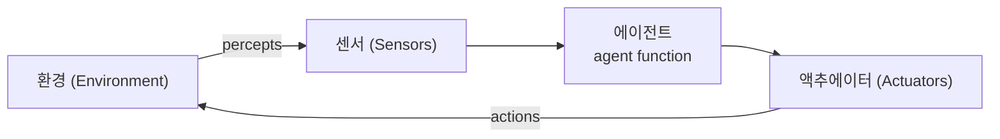

## 에이전트 함수 vs 에이전트 프로그램

에이전트의 행동은 추상적으로 **에이전트 함수(agent function)**로 표현된다. 지금까지 받은 지각의 전체 이력(percept sequence)을 행동으로 매핑하는 사상이다.

$$f: P^{*} \to A$$

여기서 $$P^{*}$$는 가능한 모든 지각 이력의 집합, $$A$$는 행동 집합이다. 이 함수는 "에이전트가 **무엇을** 해야 하는가"를 정의하는 이상(理想)이고, 이를 실제로 구현한 코드가 **에이전트 프로그램(agent program)**이다. 즉 함수는 명세, 프로그램은 구현이다.

## 합리적 에이전트 — "지능형"의 핵심

단순히 행동하는 것만으로는 "지능형"이 아니다. AIMA는 **합리적 에이전트(rational agent)**를 이렇게 정의한다.

> "For each possible percept sequence, a rational agent selects an action **expected to maximize its performance measure**, given the evidence provided by the percept sequence and whatever built-in knowledge the agent has."

핵심은 **성과 척도(performance measure)의 기대값 최대화**다. 즉 지능 = 똑똑해 _보이는_ 것이 아니라, 주어진 목표를 기대값 기준으로 가장 잘 달성하는 것이다. 불확실성이 있을 때는 best _expected_ outcome을 추구한다.

$$a^{*} = \arg\max_{a \in A} \; \mathbb{E}\big[\, U(s') \mid a \,\big] = \arg\max_{a} \sum_{s'} P(s' \mid a)\, U(s')$$

이 한 줄이 뒤에서 다룰 utility-based agent와 LLM 에이전트의 벤치마크 success rate까지 관통하는 개념이다. **"무엇이 좋은 행동인가"를 수치로 정의**하는 것이 합리성의 출발점이다.

## PEAS — 에이전트를 설계하는 4요소

에이전트를 설계하려면 먼저 그가 놓인 task를 규정해야 한다. AIMA는 이를 **PEAS**로 정리한다.

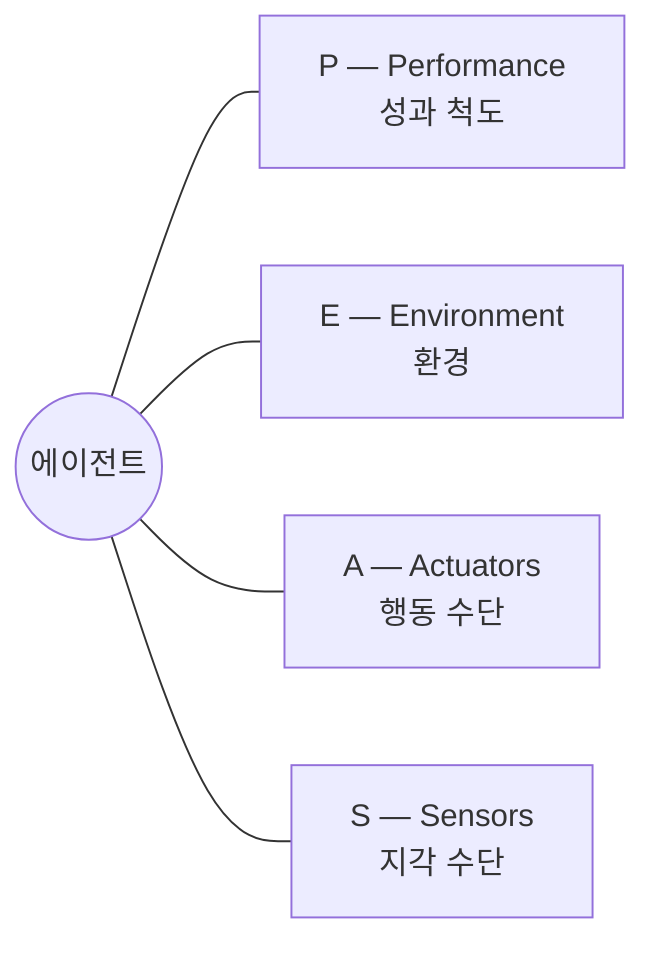

자율주행차를 예로 들면 다음과 같다.

| 요소            | 자율주행차 예시                     |
| --------------- | ----------------------------------- |
| **Performance** | 안전, 속도, 법규 준수, 승차감, 연비 |
| **Environment** | 도로, 다른 차량·보행자, 신호, 날씨  |
| **Actuators**   | 핸들, 가속·제동 페달, 방향지시등    |
| **Sensors**     | 카메라, LiDAR, GPS, 속도계          |

# 2. 지능형 에이전트의 5가지 유형

AIMA는 에이전트를 지능 수준에 따라 5가지로 분류한다. 뒤로 갈수록 더 많은 내부 구조를 갖는다.

## (1) Simple Reflex Agent

**현재 지각만** 보고 `if 조건 then 행동` 규칙으로 반응한다. 과거 이력을 무시한다. 환경이 **완전관측(fully observable)**일 때만 제대로 동작한다.

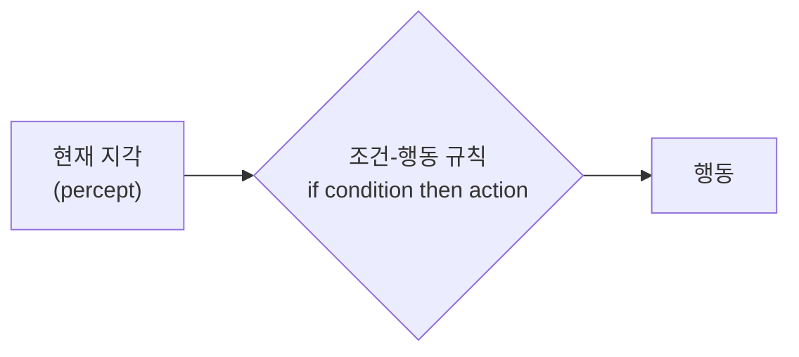

예: "장애물이 앞에 있으면 멈춘다." 단순하지만 부분관측 환경에서는 쉽게 실패한다.

## (2) Model-based Reflex Agent

세계가 어떻게 돌아가는지에 대한 **내부 모델(world model)**을 유지해, 지금 직접 보이지 않는 상태까지 추론한다. **부분관측(partially observable)** 환경에 대응한다.

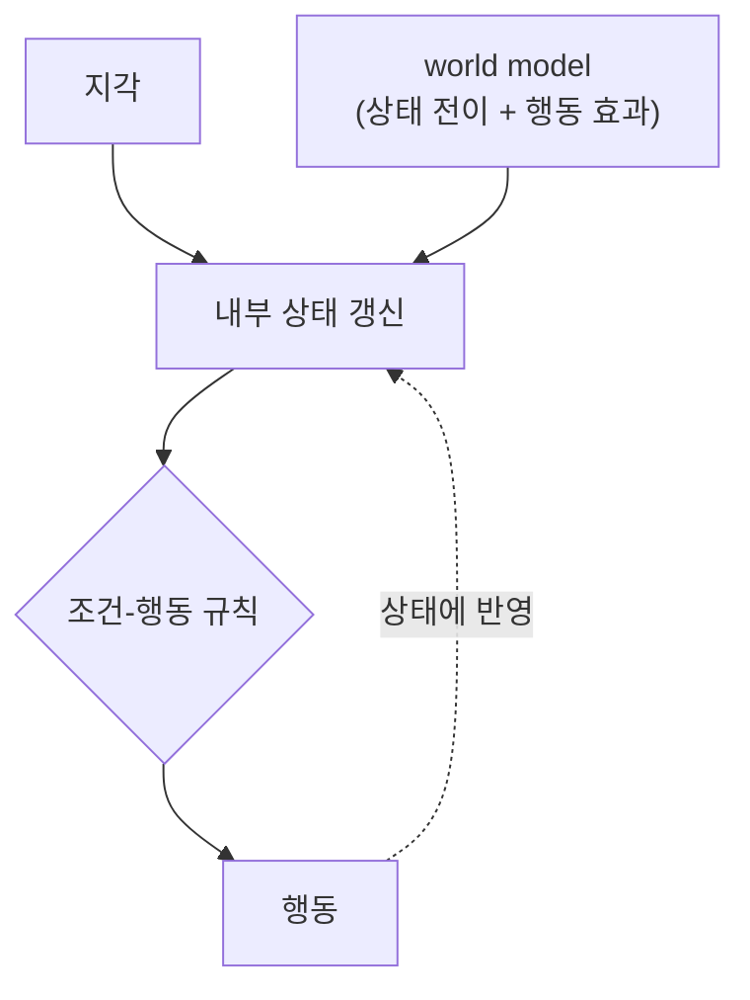

## (3) Goal-based Agent

조건-행동 규칙을 넘어, **목표(goal)**를 명시적으로 두고 그 목표에 도달하는 행동을 **탐색·계획(search & planning)**으로 찾는다.

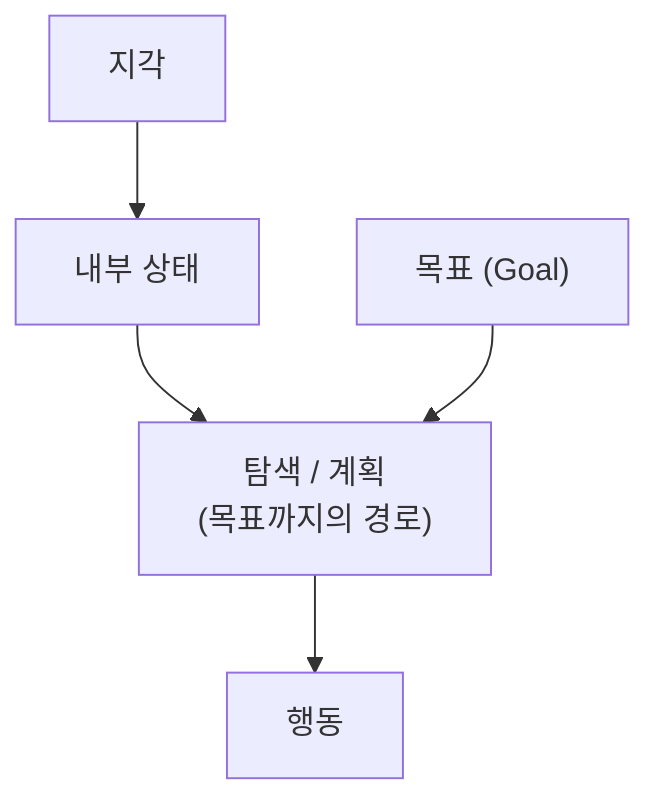

예: "공항에 가야 한다"는 목표를 두고 여러 경로를 시뮬레이션해 최선을 고른다.

## (4) Utility-based Agent

목표 달성/미달성의 이분법을 넘어, 상태마다 **효용(utility)**을 매겨 **기대 효용을 최대화**한다. "도착하기만 하면 된다"가 아니라 "더 빠르고 안전하고 싸게 도착한다"를 구분한다. 1장의 합리성 수식 $$a^{*} = \arg\max_a \mathbb{E}[U(s') \mid a]$$이 바로 여기서 작동한다.

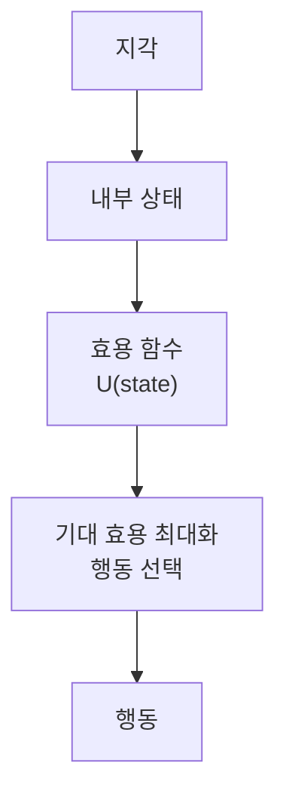

## (5) Learning Agent

위 어느 유형이든 **학습 능력**을 더할 수 있다. AIMA의 학습 에이전트는 4개 부품으로 구성된다.

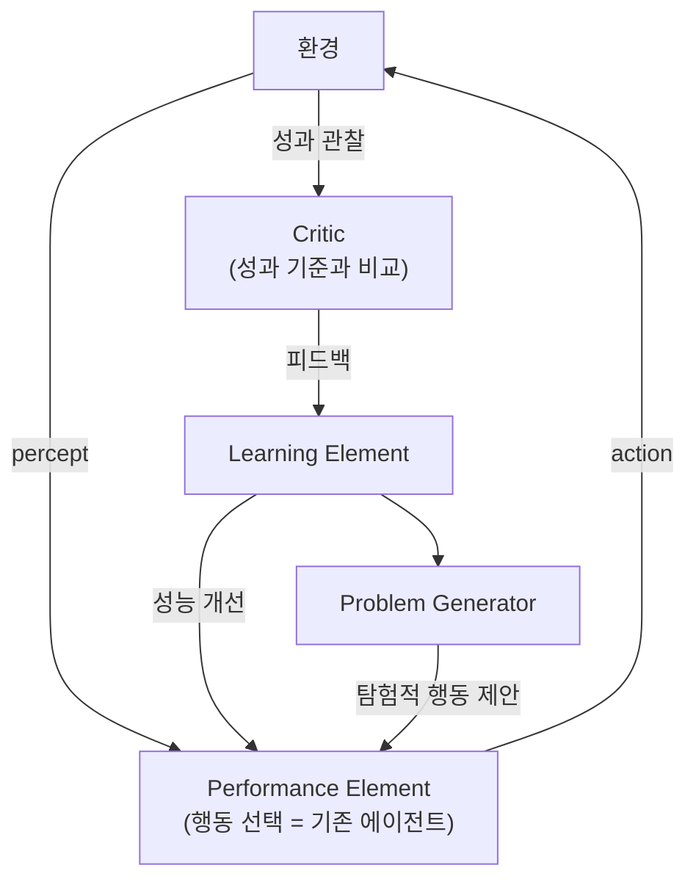

- **Performance element**: 실제 행동을 고르는 부분 (앞의 1~4유형이 여기에 해당)
- **Critic**: 외부 성과 기준에 비추어 잘했는지 평가
- **Learning element**: critic의 피드백으로 performance element를 개선
- **Problem generator**: 새로운 경험을 위해 탐험적 행동을 제안 (exploration)

이 구조는 강화학습의 actor–critic, 그리고 [Reflexion](/blog/2026/travelplanner/) 같은 LLM self-reflection 기법의 조상 격이다.

# 3. 환경의 속성 — 무엇이 task를 어렵게 만드는가

같은 에이전트라도 환경이 어떤 성격이냐에 따라 난이도가 천차만별이다. AIMA는 task environment를 7가지 축으로 분류한다.

| 축              | 쉬운 쪽  | 어려운 쪽  | 직관                                |
| --------------- | -------- | ---------- | ----------------------------------- |
| **관측성**      | 완전관측 | 부분관측   | 상태가 다 보이는가, 추론해야 하는가 |
| **에이전트 수** | 단일     | 다중       | 다른 에이전트와 경쟁/협력하는가     |
| **결정성**      | 결정론적 | 확률론적   | 같은 행동이 같은 결과를 내는가      |
| **에피소드성**  | episodic | sequential | 행동이 미래에 영향을 주는가         |
| **동역학**      | 정적     | 동적       | 생각하는 동안 환경이 변하는가       |
| **상태/시간**   | 이산     | 연속       | 상태·행동·시간이 셀 수 있는가       |
| **사전 지식**   | known    | unknown    | 환경의 규칙을 미리 아는가           |

이 표가 중요한 이유는, **agent 벤치마크들이 정확히 "어려운 쪽" 끝을 측정**하기 때문이다.

- [OSWorld](/blog/2026/osworld/): 부분관측(스크린샷) · sequential · 동적 · unknown
- [SWE-bench](/blog/2026/swe-bench/): 거대한 unknown 코드베이스 · sequential
- [TravelPlanner](/blog/2026/travelplanner/): 다중 제약의 sequential planning

즉 "지능형 에이전트가 얼마나 합리적인가"를 묻는 일은, 곧 **이 어려운 환경에서 performance measure를 얼마나 높이는가**를 재는 일이다.

# 4. 고전에서 LLM으로 — 두뇌의 교체

LLM 에이전트는 새로운 패러다임처럼 보이지만, 골격은 AIMA 그대로다. 달라진 것은 **에이전트 함수 $$f$$를 구현하는 "두뇌"가 LLM이 되었다**는 점이다.

| 고전 AI 에이전트           | LLM 에이전트                       |
| -------------------------- | ---------------------------------- |
| 두뇌 = 탐색·계획 알고리즘  | 두뇌 = LLM (controller)            |
| sensors = 카메라·센서      | 관찰 = 텍스트·이미지·스크린샷      |
| actuators = 모터·신호      | 행동 = tool call / API / 코드 실행 |
| world model = 명시적 상태  | 기억 = context + 외부 memory       |
| performance measure 최대화 | 벤치마크 success rate 최대화       |

핵심은 **"perceive → act 루프"라는 본질이 1995년부터 변하지 않았다**는 것이다. LLM은 이 루프의 의사결정자를 맡았을 뿐이다.

# 5. LLM 에이전트의 해부

LLM 에이전트의 구성요소에 대한 가장 널리 인용되는 정리는 Lilian Weng의 2023년 글 *"LLM Powered Autonomous Agents"*이다. 그는 에이전트를 다음과 같이 분해한다.

> **Agent = LLM (brain) + Planning + Memory + Tool use**

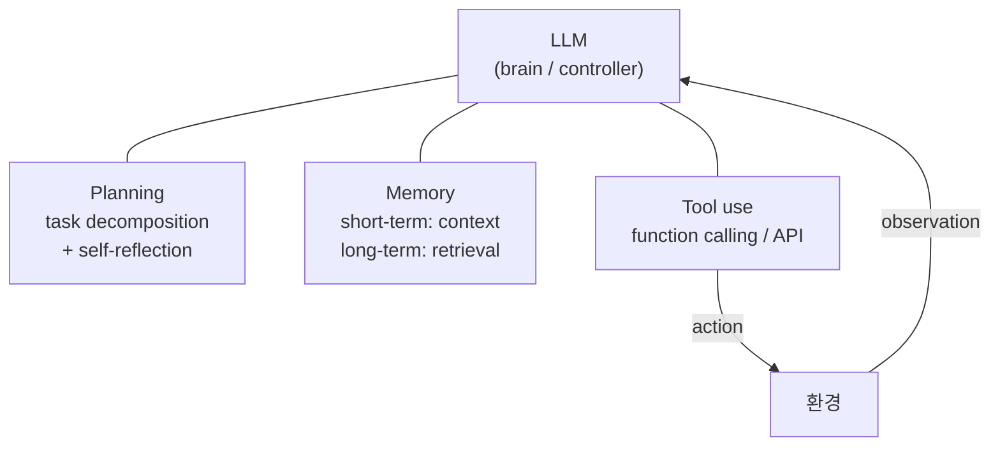

## Planning

복잡한 작업을 **작은 sub-goal로 분해(task decomposition)**하고, 과거 행동을 **자기비판·반성(self-reflection)**해 다음 스텝을 개선한다. 대표 기법:

- **Chain-of-Thought / Tree-of-Thoughts**: 추론을 단계적으로 펼치기
- **ReAct**: 추론(Reasoning)과 행동(Acting)을 한 루프에서 결합
- **Reflexion**: 실패를 언어적 피드백으로 기억해 다음 시도에 반영 (3장의 learning agent · critic 구조와 동형)

## Memory

- **단기 기억(short-term)**: 프롬프트 컨텍스트 안의 in-context 정보
- **장기 기억(long-term)**: 외부 vector store에 저장하고 검색(retrieval)으로 불러오는 정보

## Tool use

LLM의 행동 공간을 **외부 도구로 확장**한다. 검색, 코드 실행, 계산기, API 호출 등. Chip Huyen은 이를 두고 *"도구가 base 모델을 유능한 에이전트로 바꾸는 force multiplier"*라고 표현한다. 그의 정의 역시 AIMA와 같다.

> "An agent is anything that can perceive its environment and act upon that environment." — 에이전트는 **환경**과 **행동(도구)** 두 축으로 규정되며, **planning이 모델을 agentic하게 만든다.**

## ReAct 루프 — 실제 LLM 에이전트의 한 스텝

대부분의 LLM 에이전트는 다음과 같은 **Thought → Action → Observation** 루프를 반복한다.

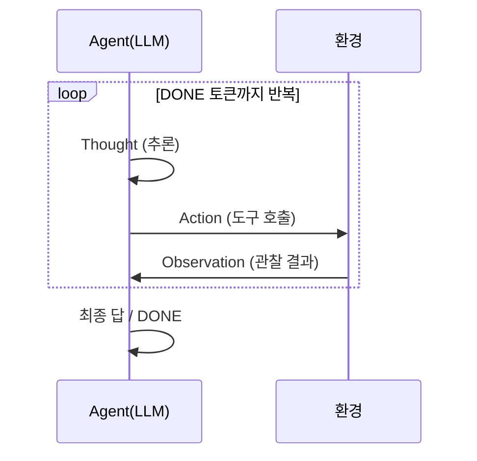

[AgentBench](/blog/2026/agentbench/)의 `Thought:` + `Action:` 포맷, [OSWorld](/blog/2026/osworld/)의 pyautogui 액션 + 스크린샷 관찰이 모두 이 루프의 구체화다.

# 6. Workflow vs Agent — 어디까지가 에이전트인가

Anthropic은 2024년 *"Building Effective Agents"*에서 중요한 구분을 제시했다. 모든 LLM 시스템이 "에이전트"는 아니라는 것이다.

먼저 기본 빌딩블록은 **augmented LLM** — 검색·도구·메모리로 증강된 LLM이다.

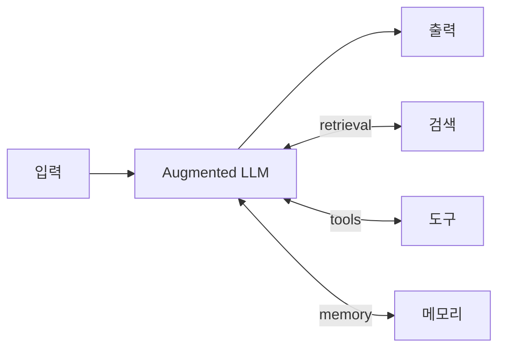

이 블록을 어떻게 엮느냐에 따라 두 갈래로 나뉜다.

**Workflow** — LLM과 도구가 **사전 정의된 코드 경로**로 오케스트레이션된다. 흐름이 고정되어 예측 가능하다.

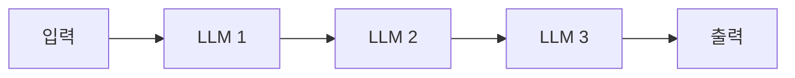

**Agent** — LLM이 **스스로 프로세스와 도구 사용을 동적으로 결정**한다. 매 스텝 환경에서 "ground truth" 피드백을 받아 진행을 평가하고, 종료 시점도 스스로 판단한다.

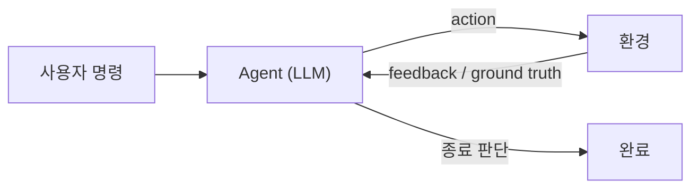

| 구분        | Workflow              | Agent                         |
| ----------- | --------------------- | ----------------------------- |
| 제어 흐름   | 사전 정의된 코드 경로 | LLM이 동적으로 결정           |
| 예측 가능성 | 높음                  | 낮음 (유연함)                 |
| 적합한 경우 | well-defined task     | open-ended, 스텝 수 예측 불가 |
| trade-off   | 빠르고 저렴·일관      | 느리고 비싸지만 유연          |

Anthropic의 권고는 명확하다.

> "Find the **simplest solution possible**, and only increase complexity when needed."

즉 에이전트가 필요 없을 수도 있다. autonomy는 공짜가 아니라 **latency·cost와의 trade-off**다. 이 스펙트럼(고정 workflow ↔ 완전 자율 agent)에서 "어디에 위치시킬 것인가"가 실무의 핵심 질문이다.

# 7. 그래서 우리는 무엇을 측정하는가

지금까지의 논의를 한 줄로 요약하면 이렇다.

> 에이전트는 **환경을 지각하고 행동하는 무엇**이며, 지능형 에이전트는 그 행동이 **performance measure를 기대값 기준으로 최대화**할 때 합리적이다.

그렇다면 자연스러운 다음 질문은 **"우리의 LLM 에이전트는 얼마나 합리적인가?"**이다. 이것을 정량적으로 재는 도구가 바로 **agent 벤치마크**다.

- **종합 능력**: [AgentBench](/blog/2026/agentbench/) — 8개 환경 multi-turn 종합 평가
- **범용 어시스턴트**: [GAIA](/blog/2026/gaia/) — 인간에겐 쉽지만 AI에겐 어려운 task
- **코딩**: [SWE-bench](/blog/2026/swe-bench/) — 실 GitHub 이슈를 execution으로 채점
- **계획**: [TravelPlanner](/blog/2026/travelplanner/) — 다중 제약 planning
- **도메인 특화**: [MedAgentBench](/blog/2026/medagentbench/) — 의료 EHR 상호작용
- **컴퓨터 조작**: [OSWorld](/blog/2026/osworld/) — 실제 OS를 GUI로 직접 다루기

이 벤치마크들은 모두 3장의 "어려운 환경"에서, 4~6장의 LLM 에이전트가 5장의 루프를 돌며 얼마나 합리적으로 행동하는지를 측정한다. 다음 글부터는 이들을 하나씩 깊이 들여다본다.

> 이어서 읽기: [AgentBench: LLM as Agent 평가의 종합 paradigm](/blog/2026/agentbench/), [GAIA](/blog/2026/gaia/), [SWE-bench](/blog/2026/swe-bench/), [TravelPlanner](/blog/2026/travelplanner/), [MedAgentBench](/blog/2026/medagentbench/), [OSWorld](/blog/2026/osworld/), [TelAgentBench: 통신 도메인 LLM 에이전트 평가](/blog/2026/telagentbench/)

# 참고 문헌

- [Russell & Norvig, _Artificial Intelligence: A Modern Approach_ — Chapter 2: Intelligent Agents](http://aima.cs.berkeley.edu/4th-ed/pdfs/newchap02.pdf)
- [Intelligent agent — Wikipedia](https://en.wikipedia.org/wiki/Intelligent_agent)
- [Lilian Weng — LLM Powered Autonomous Agents (Lil'Log, 2023)](https://lilianweng.github.io/posts/2023-06-23-agent/)
- [Chip Huyen — Agents (2025)](https://huyenchip.com/2025/01/07/agents.html)
- [Anthropic — Building Effective Agents (2024)](https://www.anthropic.com/research/building-effective-agents)
- [ReAct: Synergizing Reasoning and Acting in Language Models (Yao et al., 2023)](https://arxiv.org/abs/2210.03629)
- [Reflexion: Language Agents with Verbal Reinforcement Learning (Shinn et al., 2023)](https://arxiv.org/abs/2303.11366)
