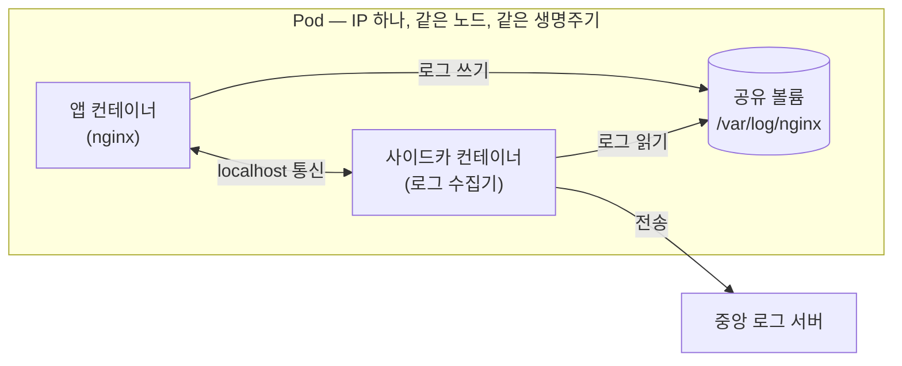
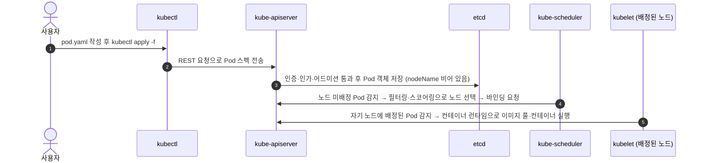

> 이 글은 **K8s 입문 시리즈**의 네 번째 글이다.
>
> - [01: Kubernetes의 탄생 — Google Borg에서 CNCF까지](/blog/2026/k8s-01-history/)
> - [02: 내 노트북에 클러스터 만들기 — kind와 kubectl](/blog/2026/k8s-02-local-setup/)
> - [03: Kubernetes 아키텍처 — Control Plane과 Node](/blog/2026/k8s-03-architecture/)
> - **04: Pod의 모든 것 — 생성부터 스케줄링까지** ← 현재 글
> - [05: 워크로드 — ReplicaSet, Deployment, StatefulSet, DaemonSet](/blog/2026/k8s-05-workloads/)
> - [06: 네트워킹 — Service와 Ingress](/blog/2026/k8s-06-networking/)
> - [07: 스토리지와 설정 — PV/PVC, ConfigMap, Secret](/blog/2026/k8s-07-storage-config/)
> - [08: 권한 관리 — ServiceAccount와 RBAC](/blog/2026/k8s-08-rbac/)
> - [09: 확장과 생태계 — Operator와 CNCF Projects](/blog/2026/k8s-09-operator-cncf/)
>
> 이 시리즈의 커리큘럼은 SK Devocean의 [Kubernetes(쿠버네티스)를 처음 공부하려면 무엇을 공부해야 할까?](https://devocean.sk.com/blog/techBoardDetail.do?ID=165905&boardType=techBlog) (seungkyua) 글의 학습 로드맵을 바탕으로 구성했다.

[03편](/blog/2026/k8s-03-architecture/)에서 클러스터를 해부해 Control Plane과 Node의 컴포넌트를 하나씩 살펴봤다. 이제 그 무대 위에 올라가는 주인공, **Pod**를 다룰 차례다.

Docker에서는 `docker run`으로 컨테이너를 직접 띄웠다. 그런데 Kubernetes에는 "컨테이너를 만들어라"라는 명령이 없다. Kubernetes가 만들고, 지우고, 옮기는 최소 단위는 컨테이너가 아니라 **Pod**이기 때문이다. 앞으로 배울 Deployment, StatefulSet, DaemonSet 같은 워크로드 리소스도 결국 전부 Pod를 찍어내는 틀이다. Pod를 정확히 이해하지 못하면 그 위의 모든 개념이 흔들린다.

이번 글에서는 Pod가 무엇인지, 왜 컨테이너가 아니라 Pod인지 이해하고, 직접 nginx Pod를 띄워본 다음, `kubectl apply` 한 줄 뒤에서 03편의 컴포넌트들이 어떻게 협업해 Pod를 띄우는지 5단계로 추적한다. 후반부에서는 kubelet의 헬스체크인 **probe**, 스케줄링과 직결되는 **리소스 requests/limits**, 그리고 Pod가 이상할 때 원인을 찾는 **디버깅 루틴**까지 다진다.

---

# 1. Pod란 무엇인가

공식 문서의 정의는 이렇다.

> Pod는 Kubernetes에서 생성하고 관리할 수 있는 **가장 작은 배포 단위**다. Pod는 하나 이상의 컨테이너 그룹이며, 스토리지와 네트워크를 공유하고, 컨테이너를 어떻게 실행할지에 대한 명세를 담는다.

핵심은 세 가지다.

| 특징               | 의미                                                                               |
| ------------------ | ---------------------------------------------------------------------------------- |
| **최소 배포 단위** | Kubernetes는 컨테이너를 개별로 다루지 않는다. 스케줄링·생성·삭제 모두 Pod 단위다   |
| **컨테이너 그룹**  | 하나의 Pod에 여러 컨테이너를 담을 수 있다 (대부분은 1개)                           |
| **자원 공유**      | 같은 Pod의 컨테이너들은 **하나의 IP(네트워크 네임스페이스)**와 **볼륨**을 공유한다 |

비유하면 Pod는 **셰어하우스 한 집**이다.

- **주소(IP)는 집마다 하나**다. 방(컨테이너)마다 주소가 따로 있지 않다.
- 룸메이트(컨테이너)끼리는 집 안에서 바로 대화한다 — **localhost 통신**.
- 거실(공유 볼륨)에 물건을 두면 모든 룸메이트가 쓸 수 있다.
- 이사(스케줄링)를 가면 **집 전체가 같이 움직인다**. 룸메이트 한 명만 다른 동네(노드)로 갈 수 없다.

같은 Pod 안의 컨테이너와 다른 Pod의 컨테이너는 이렇게 다르다.

| 항목       | 같은 Pod 안의 컨테이너    | 다른 Pod의 컨테이너            |
| ---------- | ------------------------- | ------------------------------ |
| IP 주소    | 하나를 공유               | 각자 다름                      |
| 통신 방법  | localhost + 포트          | Pod IP 또는 Service(06편) 경유 |
| 볼륨 공유  | 가능                      | 기본적으로 불가                |
| 배치(노드) | 항상 같은 노드            | 서로 다른 노드일 수 있음       |
| 생명주기   | 함께 생성되고 함께 삭제됨 | 독립적                         |

---

# 2. 왜 컨테이너가 아니라 Pod인가

"어차피 Pod 하나에 컨테이너 하나가 대부분이라면, 그냥 컨테이너를 최소 단위로 하면 되지 않나?"라는 의문이 든다. Pod라는 한 겹의 추상화가 존재하는 이유는 **강하게 결합된 컨테이너 묶음**을 표현하기 위해서다.

대표적인 예가 **사이드카(sidecar) 패턴**이다. 공식 문서는 사이드카를 이렇게 설명한다 — 주 애플리케이션 컨테이너의 코드를 고치지 않고, **로깅·모니터링·보안·데이터 동기화** 같은 부가 기능을 옆에 붙은 보조 컨테이너로 확장하는 패턴이다.

로그 수집을 예로 들어보자. nginx는 로그를 파일로 남길 뿐, 중앙 로그 서버로 보내는 기능은 없다. 이때 nginx 이미지를 뜯어고치는 대신, **로그 수집기 컨테이너를 같은 Pod에 태우면** 된다.



- 앱과 사이드카는 **공유 볼륨**으로 파일을 주고받는다. 네트워크 설정이 전혀 필요 없다.
- 두 컨테이너는 **항상 같은 노드에 함께 스케줄링**된다. 로그 수집기만 다른 노드에 떨어지는 일이 없다.
- 앱 컨테이너는 자기 일(웹 서빙)만 하고, 로그 전송은 사이드카가 맡는다 — **관심사의 분리**.
- 필요하면 localhost로도 통신할 수 있다. 같은 네트워크 네임스페이스라 IP가 같고 포트만 나눠 쓴다.

참고로 Kubernetes v1.29부터는 사이드카 컨테이너가 정식 기능으로 기본 활성화됐다. `initContainers`에 `restartPolicy: Always`를 지정하면, Pod가 살아 있는 동안 계속 실행되는 사이드카가 된다. 지금은 "같은 Pod에 보조 컨테이너를 태우는 패턴"이라는 개념만 기억하면 충분하다.

정리하면 — **Pod는 "반드시 함께 배포되고, 함께 스케일링되어야 하는 컨테이너들"의 경계선**이다. 이 경계선이 있어야 스케줄러는 "이 묶음은 쪼갤 수 없다"는 것을 알고 통째로 배치할 수 있다.

---

# 3. 실습 1: nginx Pod 띄워보기

[02편](/blog/2026/k8s-02-local-setup/)에서 만든 kind 클러스터에 nginx Pod를 직접 띄워보자. 아래 YAML은 공식 문서의 예제 그대로다. `nginx-pod.yaml`로 저장한다.

```yaml
apiVersion: v1
kind: Pod
metadata:
  name: nginx
spec:
  containers:
    - name: nginx
      image: nginx:1.14.2
      ports:
        - containerPort: 80
```

- `apiVersion: v1`, `kind: Pod` — "Pod라는 종류의 리소스를 core API 그룹 v1 스펙으로 만든다"는 선언.
- `metadata.name` — 이 Pod의 이름. 같은 네임스페이스 안에서 유일해야 한다.
- `spec.containers` — 이 Pod에 담을 컨테이너 목록. 지금은 nginx 하나뿐이다.

## 3.1 생성 — kubectl apply

```bash
kubectl apply -f nginx-pod.yaml
```

```
pod/nginx created
```

## 3.2 확인 — get pods -o wide

```bash
kubectl get pods -o wide
```

```
NAME    READY   STATUS    RESTARTS   AGE   IP           NODE                 NOMINATED NODE   READINESS GATES
nginx   1/1     Running   0          30s   10.244.0.5   kind-control-plane   <none>           <none>
```

(IP·노드 이름·시간은 환경마다 다르다.)

- `READY 1/1` — 컨테이너 1개 중 1개가 준비됨.
- `STATUS Running` — Pod가 노드에 배치됐고 컨테이너가 실행 중이다 (뒤의 생명주기 절에서 자세히).
- `-o wide`를 붙이면 **Pod의 IP**와 **어느 노드에 배치됐는지**까지 보인다. 이 IP가 바로 셰어하우스의 "집 주소"다.

## 3.3 상세 조회 — describe

```bash
kubectl describe pod nginx
```

출력이 길어서 마지막의 `Events` 부분만 보면 이렇다.

```
Events:
  Type    Reason     Age   From               Message
  ----    ------     ----  ----               -------
  Normal  Scheduled  50s   default-scheduler  Successfully assigned default/nginx to kind-control-plane
  Normal  Pulling    49s   kubelet            Pulling image "nginx:1.14.2"
  Normal  Pulled     40s   kubelet            Successfully pulled image "nginx:1.14.2"
  Normal  Created    40s   kubelet            Created container nginx
  Normal  Started    40s   kubelet            Started container nginx
```

`From` 열을 보면 **누가 무슨 일을 했는지**가 그대로 드러난다. `default-scheduler`가 노드를 배정했고, 그 뒤는 전부 `kubelet`의 작업이다. 이 순서가 바로 다음 절에서 다룰 "Pod가 뜨는 5단계"의 흔적이다.

## 3.4 접속 — port-forward

Pod IP는 클러스터 내부 주소라서 노트북 브라우저로는 바로 접근할 수 없다. `kubectl port-forward`로 로컬 포트를 Pod 포트에 연결한다.

```bash
kubectl port-forward pod/nginx 8080:80
```

```
Forwarding from 127.0.0.1:8080 -> 80
Forwarding from [::1]:8080 -> 80
```

이 명령은 종료되지 않고 계속 떠 있는다. **다른 터미널**에서 접속해 보자.

```bash
curl -s localhost:8080 | head -n 4
```

```
<!DOCTYPE html>
<html>
<head>
<title>Welcome to nginx!</title>
```

nginx 환영 페이지가 나오면 성공이다. 확인이 끝나면 port-forward 터미널에서 Ctrl+C로 끊는다.

## 3.5 삭제 — delete

```bash
kubectl delete pod nginx
```

```
pod "nginx" deleted
```

여기서 중요한 사실 하나 — **Pod는 스스로 부활하지 않는다.** 지금처럼 직접 만든 Pod는 지우면 그걸로 끝이다. "죽으면 다시 살려라"는 [05편](/blog/2026/k8s-05-workloads/)의 워크로드 리소스가 하는 일이다.

---

# 4. Pod가 뜨는 5단계

`kubectl apply`를 치고 `Running`이 되기까지, 뒤에서는 무슨 일이 벌어질까? [03편](/blog/2026/k8s-03-architecture/)에서 배운 컴포넌트들이 릴레이처럼 일을 넘겨받는다.



각 단계를 03편의 컴포넌트와 연결해 뜯어보자.

**1단계 — 사용자가 YAML을 작성한다.** YAML은 "이런 Pod가 존재해야 한다"는 **desired state의 선언**이다. 명령("실행해!")이 아니라 상태("존재해야 한다")를 적는다는 점이 Kubernetes 철학의 핵심이다.

**2단계 — kubectl이 kube-apiserver로 보낸다.** kubectl은 kubeconfig(02편)에 적힌 api-server 주소로 REST 요청을 날리는 클라이언트일 뿐이다. 마법은 전부 서버 쪽에서 일어난다.

**3단계 — kube-apiserver가 etcd에 저장한다.** api-server는 인증·인가·어드미션 검증을 통과한 Pod 객체를 etcd에 기록한다(03편에서 봤듯 etcd에 접근하는 유일한 컴포넌트다). 이 시점의 Pod는 **아직 어느 노드에서 돌지 정해지지 않은 레코드**일 뿐이다. `kubectl apply`가 성공했다는 것은 "컨테이너가 떴다"가 아니라 **"희망 상태가 저장됐다"**는 뜻이다.

**4단계 — kube-scheduler가 노드를 고른다.** 스케줄러는 api-server를 watch하다가 **노드가 배정되지 않은 새 Pod**를 발견하면, 두 단계로 최적의 노드를 고른다(03편에서 예고한 그 2단계다).

| 단계                  | 하는 일                                                                    | 비유                       |
| --------------------- | -------------------------------------------------------------------------- | -------------------------- |
| **필터링(Filtering)** | 이 Pod를 돌릴 수 **있는** 노드만 남긴다 (예: 요청한 CPU/메모리가 충분한가) | 서류 전형 — 자격 미달 탈락 |
| **스코어링(Scoring)** | 남은 노드에 점수를 매겨 **가장 적합한** 노드를 고른다                      | 면접 — 최고 득점자 선발    |

최고 점수 노드가 여럿이면 그중 하나를 무작위로 고른다. 결정이 끝나면 스케줄러는 api-server에 "이 Pod는 이 노드로"라고 알리는데, 이를 **바인딩(binding)**이라 한다. 스케줄러가 직접 노드에 명령하는 것이 아니라는 점에 주목하자.

**5단계 — kubelet이 컨테이너를 실행한다.** 배정된 노드의 kubelet은 api-server를 통해 자기 노드 몫의 Pod를 발견하고, CRI를 통해 컨테이너 런타임에 실행을 위임한다. 이미지를 당겨오고(Pulling), 컨테이너를 만들고(Created), 시작한다(Started). kubelet은 이후에도 PodSpec대로 컨테이너가 건강하게 돌고 있는지 계속 책임진다.

이 흐름에서 관찰할 점:

- **컴포넌트끼리 직접 명령하지 않는다.** 모든 상호작용은 api-server를 거치고, 각 컴포넌트는 etcd에 저장된 상태를 watch하다가 **자기 몫의 일**을 알아서 한다. 덕분에 컴포넌트 하나가 잠시 죽어도 재시작 후 상태를 보고 이어서 일할 수 있다.
- **비동기다.** apply 성공(3단계)과 컨테이너 실행(5단계) 사이에는 시간차가 있다. `STATUS`가 `Pending`에서 `Running`으로 바뀌는 데 시간이 걸리는 이유다.
- 03편의 "desired state vs current state" 구도가 그대로 재현된다. YAML(희망 상태)을 저장하면, 나머지 컴포넌트들이 현실을 그 상태에 맞춘다.

---

# 5. 실습 2: 이벤트로 5단계 추적하기

방금 설명한 5단계는 이론이 아니라 **이벤트(Event)**로 직접 확인할 수 있다. Pod를 다시 만들고 이벤트를 시간순으로 정렬해 보자.

```bash
kubectl apply -f nginx-pod.yaml
kubectl get events --sort-by=.metadata.creationTimestamp
```

```
LAST SEEN   TYPE     REASON      OBJECT      MESSAGE
20s         Normal   Scheduled   pod/nginx   Successfully assigned default/nginx to kind-control-plane
19s         Normal   Pulling     pod/nginx   Pulling image "nginx:1.14.2"
12s         Normal   Pulled      pod/nginx   Successfully pulled image "nginx:1.14.2"
12s         Normal   Created     pod/nginx   Created container nginx
12s         Normal   Started     pod/nginx   Started container nginx
```

(메시지 형식과 소요 시간은 버전·환경에 따라 조금 다르다. 이미지가 이미 캐시되어 있으면 Pulling 없이 바로 Pulled가 나오기도 한다.)

이벤트와 5단계를 매핑하면 이렇다.

| 이벤트 Reason | 발행 주체         | 5단계 중       | 의미                          |
| ------------- | ----------------- | -------------- | ----------------------------- |
| `Scheduled`   | default-scheduler | 4단계 (바인딩) | 노드 배정 완료                |
| `Pulling`     | kubelet           | 5단계          | 컨테이너 이미지 다운로드 시작 |
| `Pulled`      | kubelet           | 5단계          | 이미지 다운로드 완료          |
| `Created`     | kubelet           | 5단계          | 컨테이너 생성                 |
| `Started`     | kubelet           | 5단계          | 컨테이너 시작                 |

1~3단계(작성→전송→저장)는 이벤트로 남지 않는다. 이벤트는 "저장된 희망 상태를 현실로 만드는 과정"에서 발생하기 때문이다. 문제가 생겼을 때 `kubectl describe pod <이름>`의 Events 섹션을 가장 먼저 보라는 조언이 나오는 이유가 여기에 있다 — **어느 단계에서 멈췄는지**가 그대로 보인다.

확인이 끝났으면 정리하자.

```bash
kubectl delete pod nginx
```

---

# 6. Pod 생명주기 — 5가지 phase

`kubectl get pods`의 STATUS 열 뒤에는 공식적으로 정의된 **phase**가 있다. Pod는 생애 동안 다음 다섯 phase 중 하나에 속한다.

| Phase         | 의미                                                                              | 언제 보이나                                              |
| ------------- | --------------------------------------------------------------------------------- | -------------------------------------------------------- |
| **Pending**   | 클러스터가 Pod를 수락했지만, 컨테이너가 아직 하나도 준비되지 않음                 | 스케줄링 대기 중이거나 이미지 다운로드 중 (4~5단계 사이) |
| **Running**   | 노드에 바인딩됐고 모든 컨테이너가 생성됨. 최소 1개가 실행 중이거나 시작·재시작 중 | 정상 동작 중인 대부분의 서비스 Pod                       |
| **Succeeded** | 모든 컨테이너가 **성공적으로 종료**됐고 재시작되지 않음                           | 배치 작업처럼 끝이 있는 Pod가 정상 완료됐을 때           |
| **Failed**    | 모든 컨테이너가 종료됐고, 최소 1개가 **실패**로 종료됨(0이 아닌 종료 코드 등)     | 작업이 비정상 종료됐을 때                                |
| **Unknown**   | Pod 상태를 알 수 없음                                                             | 주로 Pod가 있는 노드와의 통신 장애                       |

phase와 별개로, Pod 안의 **컨테이너**는 `Waiting`(시작 준비 중 — 이미지 풀 등), `Running`(실행 중), `Terminated`(종료됨)의 세 가지 상태를 가진다.

한 가지 주의 — `kubectl get pods`의 STATUS 열에는 `CrashLoopBackOff`, `Terminating` 같은 값도 보이는데, 이것들은 **phase가 아니다**. STATUS는 사용자가 상황을 직관적으로 파악하도록 kubectl이 가공해 보여주는 필드이고, phase는 Pod API에 정의된 공식 값 5가지뿐이다.

---

# 7. Probes — kubelet의 헬스체크

`STATUS`가 `Running`이라는 것은 "컨테이너 프로세스가 떠 있다"는 뜻이지, "서비스할 준비가 됐다"는 뜻이 아니다. 프로세스는 살아 있는데 데드락에 걸려 응답을 못 할 수도 있고, 이제 막 떠서 초기화가 안 끝났을 수도 있다. 그래서 kubelet은 **probe**라는 헬스체크로 컨테이너에게 주기적으로 질문을 던진다. probe를 정의하지 않으면 kubelet은 결과를 성공으로 간주한다 — "프로세스만 떠 있으면 건강하다"는 가장 느슨한 기준이 적용되는 셈이다.

probe는 세 종류가 있고, 핵심은 **실패했을 때 벌어지는 일이 서로 다르다**는 점이다.

- **livenessProbe — "살아 있나?"** 실패가 누적되면 kubelet이 컨테이너를 죽이고 restartPolicy에 따라 **재시작**한다. 프로세스는 떠 있지만 응답하지 못하는 데드락 같은 상황을 재시작으로 복구하는 용도다.
- **readinessProbe — "지금 트래픽 받을 수 있나?"** 실패하면 Pod가 unready로 표시되고 Service(06편)의 엔드포인트 목록(EndpointSlice)에서 Pod IP가 **제외**된다. 트래픽만 끊길 뿐 **컨테이너는 재시작되지 않으며**, 다시 성공하면 트래픽도 돌아온다. 워밍업·일시적 과부하·외부 의존성 대기처럼 "죽진 않았지만 지금은 곤란한" 상황에 쓴다.
- **startupProbe — "시작이 끝났나?"** 이 probe가 성공할 때까지 Kubernetes는 **liveness·readiness probe를 실행하지 않는다**. 기동이 느린 앱이 초기화를 마치기도 전에 liveness에게 "죽었다"고 오판받아 재시작당하는 것을 막는다. 실패 한도를 넘기면 컨테이너는 죽고 restartPolicy를 따른다. 시작할 때만 동작하고, 한 번 성공하면 다시 실행되지 않는다.

식당에 비유하면 이렇다.

- **liveness** = "주방장 쓰러졌어?" — 쓰러졌으면 새 주방장으로 교체한다(재시작).
- **readiness** = "지금 주문 받을 수 있어?" — 재료 준비가 안 됐으면 '준비중' 팻말만 건다(트래픽 차단). 주방장을 자르진 않는다.
- **startup** = 개업 준비 기간 — 준비가 끝나기 전까지는 위의 두 질문 자체를 하지 않는다.

질문하는 방식은 probe마다 하나를 골라 지정한다.

| 방식        | 하는 일                          | 성공 기준                   |
| ----------- | -------------------------------- | --------------------------- |
| `httpGet`   | 지정한 경로·포트로 HTTP GET 요청 | 상태 코드 200 이상 400 미만 |
| `tcpSocket` | 지정한 포트로 TCP 연결 시도      | 연결 성공(포트 열림)        |
| `exec`      | 컨테이너 안에서 명령 실행        | 종료 코드 0                 |

(gRPC 서버라면 `grpc` 방식도 쓸 수 있다.)

공식 문서의 예제를 컨테이너 spec 하나에 모으면 이런 모양이다.

```yaml
containers:
  - name: web
    image: my-web:1.0
    ports:
      - containerPort: 8080
    startupProbe:
      httpGet:
        path: /healthz
        port: 8080
      failureThreshold: 30
      periodSeconds: 10
    livenessProbe:
      httpGet:
        path: /healthz
        port: 8080
      initialDelaySeconds: 10
      periodSeconds: 5
    readinessProbe:
      httpGet:
        path: /ready
        port: 8080
      periodSeconds: 5
```

- **startupProbe** — 10초 간격(`periodSeconds`)으로 최대 30번(`failureThreshold`)까지 실패를 허용한다. 즉 최대 **30 × 10 = 300초**의 기동 시간을 벌어준다. 그 안에 `/healthz`가 한 번이라도 응답하면 그 즉시 liveness·readiness가 가동을 시작한다.
- **livenessProbe** — 이후 5초마다 `/healthz`를 확인하고, 실패가 누적되면 컨테이너를 재시작한다. `kubectl get pods`의 `RESTARTS`가 올라가는 흔한 원인 중 하나다.
- **readinessProbe** — 5초마다 `/ready`를 확인한다. liveness와 **다른 경로**를 보는 것에 주목하자. "살아 있는가"와 "서비스 가능한가"는 다른 질문이므로 엔드포인트도 나누는 것이 보통이다.

세 probe를 한 표로 비교하면 다음과 같다.

|             | livenessProbe                   | readinessProbe                  | startupProbe                |
| ----------- | ------------------------------- | ------------------------------- | --------------------------- |
| 질문        | 살아 있나?                      | 트래픽 받을 준비 됐나?          | 시작이 끝났나?              |
| 실패하면    | 컨테이너 kill 후 재시작         | Service 엔드포인트에서 제외     | 한도 초과 시 kill 후 재시작 |
| 재시작 유발 | O                               | X                               | O                           |
| 실행 시점   | startup 성공 후 계속 주기적으로 | startup 성공 후 계속 주기적으로 | 시작할 때만                 |
| 주 용도     | 데드락 복구                     | 트래픽 제어                     | 느린 기동 보호              |

---

# 8. 리소스 requests와 limits

4절의 필터링 표에 "요청한 CPU/메모리가 충분한가"라고 썼다. 그 "요청"의 정체가 바로 컨테이너 spec의 `resources.requests`다. 공식 문서의 예제 수치를 그대로 옮기면 이렇다.

```yaml
containers:
  - name: app
    image: my-app:1.0
    resources:
      requests:
        memory: "64Mi"
        cpu: "250m"
      limits:
        memory: "128Mi"
        cpu: "500m"
```

- `cpu: "250m"` — CPU는 밀리코어(m) 단위다. 1000m이 코어 1개이므로 250m은 0.25코어.
- `memory: "64Mi"` — 메모리는 바이트 단위이고, 보통 Mi·Gi 같은 이진 접두어로 적는다.

requests와 limits의 역할은 명확히 다르다.

|               | requests                              | limits                            |
| ------------- | ------------------------------------- | --------------------------------- |
| 의미          | 컨테이너에 보장해야 할 최소량         | 컨테이너가 쓸 수 있는 최대량      |
| 누가 사용하나 | **kube-scheduler** — 노드 선택의 기준 | **kubelet·커널** — 초과 시 제재   |
| 그 이상 쓰면  | 노드에 여유가 있으면 더 쓸 수 있음    | CPU는 스로틀링, 메모리는 OOM kill |

**requests는 스케줄링의 기준이다.** 4단계에서 스케줄러는 노드의 **실제 사용량이 아니라, 그 노드에 이미 배정된 Pod들의 requests 합계**를 보고 자리가 있는지 판단한다. 그래서 노드가 실제로는 한가해도 requests 장부가 꽉 차 있으면 새 Pod는 못 들어가고, 반대로 requests를 만족하는 노드가 하나도 없으면 필터링에서 전부 탈락해 Pod는 `Pending`에 머문다 — 다음 절에서 볼 `FailedScheduling`의 단골 원인이다.

**limits를 초과했을 때의 운명은 CPU와 메모리가 다르다.**

| 자원   | limit 초과 시                         | 결과                            |
| ------ | ------------------------------------- | ------------------------------- |
| CPU    | 커널이 **스로틀링**으로 사용량을 깎음 | 죽지 않는다. 대신 느려진다      |
| 메모리 | 커널이 **OOM kill**로 컨테이너를 종료 | 컨테이너가 죽는다 (`OOMKilled`) |

CPU는 시간을 쪼개 나눠 쓰는 자원이라 초과분을 깎아서 줄 수 있지만, 이미 내준 메모리는 뺏을 방법이 없어서 프로세스를 죽이는 것 외에는 도리가 없기 때문이다.

비유하면 requests는 **계약 전력**, limits는 **차단기 용량**이다. 전력 회사(스케줄러)는 실제 사용량이 아니라 계약 전력의 합계를 보고 이 건물(노드)에 새 계약을 받을지 정한다. CPU limit 초과는 전력 제한이 걸려 기기가 느려지는 것이고, 메모리 limit 초과는 차단기가 내려가 통째로 꺼지는 것이다.

마지막으로, requests·limits를 어떻게 적었는지에 따라 Kubernetes는 Pod에 **QoS(Quality of Service) 클래스**를 자동으로 부여한다. 노드 자원이 부족해질 때 **누구를 먼저 쫓아낼지(eviction)**를 정하는 우선순위 기준이다.

| QoS 클래스     | 조건                                                                             | 자원 부족 시     |
| -------------- | -------------------------------------------------------------------------------- | ---------------- |
| **Guaranteed** | 모든 컨테이너의 CPU·메모리에 requests와 limits가 있고, 둘의 값이 같음            | 가장 나중에 축출 |
| **Burstable**  | Guaranteed는 아니지만, 최소 한 컨테이너에 CPU 또는 메모리 requests/limits가 있음 | 중간             |
| **BestEffort** | 어느 컨테이너에도 CPU·메모리 requests/limits가 전혀 없음                         | 가장 먼저 축출   |

축출당하면 곤란한 핵심 서비스의 requests와 limits를 같은 값으로 맞춰 Guaranteed로 만드는 이유가 이것이다.

---

# 9. 흔한 에러와 디버깅 루틴

Pod를 띄우다 보면 반드시 만나게 될 상태 세 가지를 미리 맛보고, 원인을 찾아 들어가는 순서를 루틴으로 정리하자. 원인 진단의 시작은 언제나 `kubectl describe pod <이름>`의 Events다.

| 증상                      | 대표 원인                                                                                                                                                | 확인 포인트                                      |
| ------------------------- | -------------------------------------------------------------------------------------------------------------------------------------------------------- | ------------------------------------------------ |
| **ImagePullBackOff**      | 이미지 이름·태그 오타, 존재하지 않는 이미지, 프라이빗 레지스트리 인증 실패 — kubelet이 이미지 풀에 실패해 재시도 간격을 늘려가며(back-off) 대기 중       | Events의 이미지 풀 실패 메시지, 이미지 이름 철자 |
| **Pending에서 안 넘어감** | 스케줄 불가 — 요청한 CPU/메모리를 만족하는 노드가 없거나, 조건에 맞는 노드가 없음                                                                        | Events의 `FailedScheduling` 경고와 그 사유       |
| **CrashLoopBackOff**      | 컨테이너가 뜨자마자 반복해서 죽는 중 — 앱 크래시, 잘못된 실행 명령, 성급한 livenessProbe 등. kubelet이 재시작 간격을 늘려가며(back-off) 다시 띄우는 상태 | 직전 컨테이너의 로그 — `kubectl logs -p`         |

- **ImagePullBackOff**는 5단계 중 **5단계(kubelet의 이미지 풀)**에서 막힌 것이다. 컨테이너는 `Waiting` 상태로 남는다.
- **Pending 지속**은 **4단계(스케줄러의 노드 선택)**에서 막힌 것이다. 필터링을 통과한 노드가 하나도 없으면 Pod는 배정되지 못하고 Pending에 머문다.
- **CrashLoopBackOff**는 5단계를 모두 통과해 컨테이너가 뜨긴 했는데, 뜨자마자 죽기를 반복하는 상태다. Kubernetes는 할 일을 다 한 것이므로 원인은 대개 컨테이너 안(앱)에 있다.

에러가 어느 단계에서 났는지 알면 원인의 절반은 찾은 셈이다. 5단계 그림을 머릿속에 넣어두자.

## 9.1 디버깅 루틴 — 보는 순서는 언제나 같다

증상이 무엇이든, 원인을 찾아 들어가는 순서는 같다. 네 단계를 루틴으로 몸에 익혀두자.

| 순서 | 명령                                         | 보는 곳                         | 답하는 질문                        |
| ---- | -------------------------------------------- | ------------------------------- | ---------------------------------- |
| 1    | `kubectl get pods`                           | STATUS·READY·RESTARTS           | 무엇이 어떤 상태로 이상한가        |
| 2    | `kubectl describe pod <이름>`                | Events, 컨테이너 State와 Reason | 5단계 중 어디서 막혔나             |
| 3    | `kubectl logs <이름>` (직전 컨테이너는 `-p`) | 앱 로그                         | 앱이 무슨 말을 남기고 죽었나       |
| 4    | `kubectl exec -it <이름> -- /bin/sh`         | 컨테이너 내부                   | 설정·파일·네트워크가 기대와 같은가 |

- **describe의 Events는 Kubernetes 쪽 사정**(스케줄링·이미지 풀·재시작)을, **logs는 앱 쪽 사정**을 말해준다. 둘은 보는 층이 다르다.
- `kubectl logs -p`(`--previous`)는 **직전에 죽은 컨테이너**의 로그를 보여준다. CrashLoopBackOff처럼 재시작이 반복되는 상황에서는 방금 새로 뜬 컨테이너의 로그가 비어 있기 일쑤라서, 죽기 직전의 마지막 메시지는 `-p`로 봐야 한다.
- `kubectl exec -it <이름> -- /bin/sh`의 `--`는 kubectl의 옵션과 컨테이너 안에서 실행할 명령을 구분한다. 쉘조차 없는 초경량 이미지라면 `kubectl debug`로 디버깅용 임시 컨테이너(ephemeral container)를 붙이는 방법도 있다.

이번 글의 에러들을 루틴에 매핑하면 이렇다.

| 증상             | 막힌 단계            | 원인이 보이는 곳                           |
| ---------------- | -------------------- | ------------------------------------------ |
| Pending 지속     | 4단계 — 스케줄링     | 2번 describe → Events의 `FailedScheduling` |
| ImagePullBackOff | 5단계 — 이미지 풀    | 2번 describe → Events의 풀 실패 메시지     |
| CrashLoopBackOff | 5단계 이후 — 앱 실행 | 3번 `logs -p` → 죽기 직전 앱 로그          |

컨테이너가 아예 못 뜬 상태(Pending, ImagePullBackOff)에서는 읽을 로그 자체가 없다 — describe가 답이다. 반대로 컨테이너가 떴다가 죽는 상태(CrashLoopBackOff)는 Events에 "재시작했다"는 사실만 반복될 뿐 이유는 없다 — 앱 로그가 답이다.

---

# 10. 마무리

이번 글의 핵심을 표 하나로 요약한다.

| 질문                      | 답                                                                                             |
| ------------------------- | ---------------------------------------------------------------------------------------------- |
| Pod란?                    | Kubernetes의 최소 배포 단위. 하나의 IP와 볼륨을 공유하는 컨테이너 그룹                         |
| 왜 컨테이너가 아니라 Pod? | 사이드카처럼 "반드시 함께 움직여야 하는 컨테이너 묶음"의 경계를 표현하기 위해                  |
| Pod는 어떻게 뜨나?        | YAML 작성 → kubectl 전송 → api-server가 etcd에 저장 → scheduler가 노드 선택 → kubelet이 실행   |
| 상태는 어떻게 확인하나?   | `get pods -o wide` → `describe pod`(Events) → `get events --sort-by=...`                       |
| phase는?                  | Pending / Running / Succeeded / Failed / Unknown 다섯 가지                                     |
| Running이면 끝인가?       | 아니다. liveness(재시작)·readiness(트래픽 제외)·startup(기동 보호) 3종 probe가 건강을 판정한다 |
| requests vs limits?       | requests는 스케줄러의 배치 기준, limits는 상한 — 초과 시 CPU는 스로틀링, 메모리는 OOMKilled    |
| Pod가 이상하면?           | `get pods` → `describe`(Events) → `logs -p` → `exec` 순서로 본다                               |

직접 만든 Pod는 지우면 끝이고, 죽어도 되살아나지 않는다는 것도 확인했다. 실제 서비스에서 Pod를 날것으로 쓰지 않는 이유다.

> 이전 글 [03: Kubernetes 아키텍처 — Control Plane과 Node](/blog/2026/k8s-03-architecture/)에서 소개한 컴포넌트들이 이번 글의 5단계에서 어떻게 협업하는지 확인했다. 다음 글 [05: 워크로드 — ReplicaSet, Deployment, StatefulSet, DaemonSet](/blog/2026/k8s-05-workloads/)에서는 Pod가 죽어도 자동으로 되살리고, 스케일링과 롤링 업데이트까지 해주는 워크로드 리소스를 다룬다.

---

# 참고 문헌

- [Kubernetes(쿠버네티스)를 처음 공부하려면 무엇을 공부해야 할까?](https://devocean.sk.com/blog/techBoardDetail.do?ID=165905&boardType=techBlog) (seungkyua, SK Devocean, 2024) — 시리즈 로드맵 출처
- [Pods](https://kubernetes.io/docs/concepts/workloads/pods/) — Kubernetes 공식 문서
- [Pod Lifecycle](https://kubernetes.io/docs/concepts/workloads/pods/pod-lifecycle/) — Kubernetes 공식 문서
- [Sidecar Containers](https://kubernetes.io/docs/concepts/workloads/pods/sidecar-containers/) — Kubernetes 공식 문서
- [Liveness, Readiness, and Startup Probes](https://kubernetes.io/docs/concepts/configuration/liveness-readiness-startup-probes/) — Kubernetes 공식 문서
- [Configure Liveness, Readiness and Startup Probes](https://kubernetes.io/docs/tasks/configure-pod-container/configure-liveness-readiness-startup-probes/) — Kubernetes 공식 문서
- [Resource Management for Pods and Containers](https://kubernetes.io/docs/concepts/configuration/manage-resources-containers/) — Kubernetes 공식 문서
- [Pod Quality of Service Classes](https://kubernetes.io/docs/concepts/workloads/pods/pod-qos/) — Kubernetes 공식 문서
- [Kubernetes Scheduler](https://kubernetes.io/docs/concepts/scheduling-eviction/kube-scheduler/) — Kubernetes 공식 문서
- [Cluster Architecture](https://kubernetes.io/docs/concepts/architecture/) — Kubernetes 공식 문서
- [kubectl Quick Reference](https://kubernetes.io/docs/reference/kubectl/quick-reference/) — Kubernetes 공식 문서
- [Use Port Forwarding to Access Applications in a Cluster](https://kubernetes.io/docs/tasks/access-application-cluster/port-forward-access-application-cluster/) — Kubernetes 공식 문서
- [Debug Running Pods](https://kubernetes.io/docs/tasks/debug/debug-application/debug-running-pod/) — Kubernetes 공식 문서
