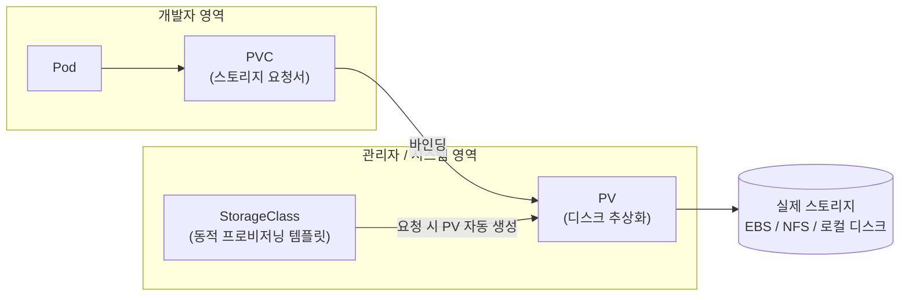
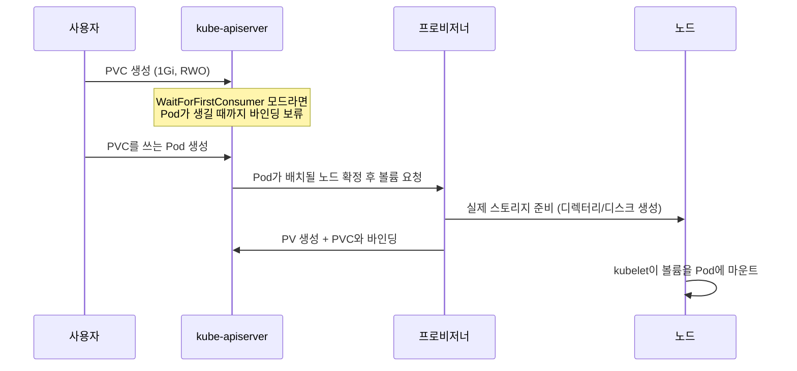

> 이 글은 **K8s 입문 시리즈**의 일곱 번째 글이다.
>
> - [01: Kubernetes의 탄생 — Google Borg에서 CNCF까지](/blog/2026/k8s-01-history/)
> - [02: 내 노트북에 클러스터 만들기 — kind와 kubectl](/blog/2026/k8s-02-local-setup/)
> - [03: Kubernetes 아키텍처 — Control Plane과 Node](/blog/2026/k8s-03-architecture/)
> - [04: Pod의 모든 것 — 생성부터 스케줄링까지](/blog/2026/k8s-04-pod/)
> - [05: 워크로드 — ReplicaSet, Deployment, StatefulSet, DaemonSet](/blog/2026/k8s-05-workloads/)
> - [06: 네트워킹 — Service와 Ingress](/blog/2026/k8s-06-networking/)
> - **07: 스토리지와 설정 — PV/PVC, ConfigMap, Secret** ← 현재 글
> - [08: 권한 관리 — ServiceAccount와 RBAC](/blog/2026/k8s-08-rbac/)
> - [09: 확장과 생태계 — Operator와 CNCF Projects](/blog/2026/k8s-09-operator-cncf/)
>
> 이 시리즈의 커리큘럼은 SK Devocean의 [Kubernetes(쿠버네티스)를 처음 공부하려면 무엇을 공부해야 할까?](https://devocean.sk.com/blog/techBoardDetail.do?ID=165905&boardType=techBlog) (seungkyua) 글의 학습 로드맵을 바탕으로 구성했다.

# 1. 왜 스토리지와 설정을 따로 다뤄야 할까

[06편](/blog/2026/k8s-06-networking/)까지 왔으면 앱을 띄우고(Deployment) 트래픽을 연결하는 것(Service, Ingress)까지 할 수 있다. 하지만 실제 서비스를 올리려면 두 가지 문제가 남아 있다.

**문제 1: 컨테이너 파일시스템은 휘발성이다.** 컨테이너 안에서 쓴 파일은 컨테이너의 쓰기 계층에만 존재한다. [04편](/blog/2026/k8s-04-pod/)에서 봤듯 Pod는 언제든 죽고 다시 만들어진다 — 노드 장애로, 롤링 업데이트로, 스케일 다운으로. 새 Pod는 이미지 그대로의 깨끗한 상태에서 시작하므로, 이전 Pod가 쓴 파일은 전부 사라진다. 호텔 방과 같다. 체크아웃하면 다음 손님을 위해 방이 초기화되고, 두고 나온 짐은 돌아오지 않는다. 데이터베이스를 아무 대책 없이 Pod에 띄우면 재배포 한 번에 데이터가 증발한다는 뜻이다.

**문제 2: 설정을 이미지에 구우면 안 된다.** DB 주소, 로그 레벨 같은 설정을 코드나 이미지에 하드코딩하면, dev/staging/prod 환경마다 이미지를 다시 빌드해야 한다. 같은 옷인데 상표만 바꾸려고 옷을 통째로 새로 만드는 격이다. 비밀번호는 더 심각하다. 이미지 레이어에 박힌 비밀번호는 그 이미지를 받을 수 있는 모든 사람에게 노출된다. "하나의 이미지를 빌드해서 모든 환경에 배포하고, 환경별 차이는 밖에서 주입한다"가 컨테이너 시대의 원칙이다.

Kubernetes는 이 두 문제를 각각 다른 리소스로 푼다.

| 문제                   | 해결 리소스             | 핵심 아이디어                          |
| ---------------------- | ----------------------- | -------------------------------------- |
| 데이터가 사라진다      | PV / PVC / StorageClass | 스토리지를 Pod 밖의 독립 리소스로 분리 |
| 설정이 이미지에 박힌다 | ConfigMap               | 설정을 별도 오브젝트로 만들어 주입     |
| 비밀값이 노출된다      | Secret                  | 민감 정보를 전용 오브젝트로 분리 관리  |

---

# 2. PV, PVC, StorageClass — 스토리지 3계층 추상화

Kubernetes는 "디스크"를 세 개의 오브젝트로 쪼개서 추상화한다. 처음엔 과해 보이지만, 각 층이 서로 다른 사람의 관심사를 담당한다는 걸 알면 자연스럽다.

- **PV(PersistentVolume)**: 클러스터에 준비된 실제 스토리지 한 조각. AWS EBS든 NFS든 노드의 로컬 디스크든, "여기 쓸 수 있는 디스크가 있다"를 표현하는 클러스터 수준 리소스다. 보통 관리자의 영역이다.
- **PVC(PersistentVolumeClaim)**: 사용자가 내는 요청서. "ReadWriteOnce로 1Gi"처럼 원하는 스펙만 적는다. 그 디스크가 EBS인지 NFS인지는 몰라도 된다.
- **StorageClass**: PVC가 들어오면 조건에 맞는 PV를 **자동으로 만들어주는** 템플릿. 프로비저너(provisioner)가 실제 생성을 담당한다.

회사 비품에 비유하면 이렇다. PV는 총무팀이 창고에 쌓아둔 노트북, PVC는 직원이 내는 비품 신청서다. 직원은 "메모리 16GB 이상 노트북 1대"라고만 쓰면 되고, 그게 어느 브랜드인지는 총무팀이 알아서 매칭한다. StorageClass는 여기에 자판기를 더한 것이다. 신청서를 넣으면 창고 재고를 뒤지는 대신 그 자리에서 새 노트북을 주문해서 준다.



- 개발자는 PVC만 만들고, Pod는 PVC 이름만 참조한다. 실제 디스크 종류는 개발자에게 보이지 않는다.
- PV와 PVC는 1:1로 **바인딩**된다. 요청서 하나에 디스크 하나.
- StorageClass가 있으면 관리자가 PV를 미리 만들어 둘 필요가 없다. 이것이 **동적 프로비저닝**이다.

## 정적 프로비저닝 vs 동적 프로비저닝

| 구분      | 정적(Static)                                 | 동적(Dynamic)                          |
| --------- | -------------------------------------------- | -------------------------------------- |
| PV 생성   | 관리자가 미리 수동으로 생성                  | StorageClass가 PVC 요청 시 자동 생성   |
| 매칭 방식 | 기존 PV 중 조건(크기, 모드)에 맞는 것 바인딩 | 요청 스펙 그대로 새 PV를 만들어 바인딩 |
| 관리 부담 | 요청량 예측 실패 시 PV 부족/낭비             | 프로비저너만 세팅하면 이후 자동        |
| 주 사용처 | 기존 스토리지(NFS 서버 등) 연결              | 클라우드, 로컬 개발 환경 대부분        |

요즘은 대부분 동적 프로비저닝을 쓴다. 사용자가 PVC를 내는 순간 StorageClass에 지정된 프로비저너가 실제 스토리지와 PV를 만들어 바인딩까지 끝내는 흐름이다.



- `volumeBindingMode: WaitForFirstConsumer`는 "누가 쓸지 정해질 때까지 디스크를 만들지 않는다"는 옵션이다. 노드에 붙는 로컬 스토리지라면 Pod가 어느 노드에 뜰지 먼저 알아야 그 노드에 디스크를 만들 수 있기 때문이다. 잠시 뒤 실습에서 이 동작을 직접 보게 된다.

---

# 3. accessModes와 reclaimPolicy — 요청서에 적는 두 가지 조건

PVC 요청서에서 가장 중요한 항목이 접근 모드(accessModes)다. 공식 문서 기준으로 네 가지가 있다.

| 모드             | 약어 | 의미                                                            |
| ---------------- | ---- | --------------------------------------------------------------- |
| ReadWriteOnce    | RWO  | **하나의 노드**에서 읽기/쓰기로 마운트                          |
| ReadOnlyMany     | ROX  | **여러 노드**에서 읽기 전용으로 마운트                          |
| ReadWriteMany    | RWX  | **여러 노드**에서 읽기/쓰기로 마운트                            |
| ReadWriteOncePod | RWOP | **단 하나의 Pod**에서만 읽기/쓰기 (CSI 볼륨 전용, v1.29에서 GA) |

여기서 가장 많이 하는 오해가 하나 있다. **RWO는 "Pod 하나"가 아니라 "노드 하나" 제한이다.** 같은 노드에 뜬 여러 Pod는 하나의 RWO 볼륨을 동시에 쓸 수 있다. "정확히 Pod 하나"를 강제하고 싶을 때 쓰라고 나온 것이 ReadWriteOncePod다. 또 하나, 어떤 모드를 실제로 지원하는지는 스토리지 종류에 달려 있다. 예를 들어 블록 스토리지(EBS 등)는 보통 RWX가 안 되고, NFS 같은 공유 파일시스템이 RWX의 대표 주자다.

두 번째 조건은 **reclaimPolicy** — "요청서(PVC)가 반납되면 디스크를 어떻게 할까"이다.

| 정책    | PVC 삭제 시 동작                                             | 비고                     |
| ------- | ------------------------------------------------------------ | ------------------------ |
| Retain  | PV와 데이터를 남긴다. 관리자가 수동으로 정리해야 재사용 가능 | 소중한 데이터에 안전     |
| Delete  | PV와 실제 스토리지까지 삭제                                  | 동적 프로비저닝의 기본값 |
| Recycle | (사용 중단됨)                                                | 동적 프로비저닝으로 대체 |

동적 프로비저닝의 기본값이 Delete라는 점은 꼭 기억해야 한다. **PVC를 지우면 데이터도 같이 사라진다.** 운영 DB의 볼륨이라면 StorageClass나 PV의 정책을 Retain으로 바꿔두는 것이 안전하다.

참고로 PV는 자기 상태를 단계(phase)로 보여준다. 아직 주인 없는 `Available`, PVC와 연결된 `Bound`, PVC가 삭제됐지만 아직 정리 전인 `Released`, 회수에 실패한 `Failed`. `kubectl get pv` 출력의 STATUS 컬럼이 바로 이것이다.

---

# 4. 실습: kind에서 PVC로 데이터 살려보기

[02편](/blog/2026/k8s-02-local-setup/)에서 만든 kind 클러스터로 직접 확인해보자. 먼저 kind에 기본으로 깔려 있는 StorageClass를 본다.

```bash
kubectl get sc
```

```
NAME                 PROVISIONER             RECLAIMPOLICY   VOLUMEBINDINGMODE      ALLOWVOLUMEEXPANSION   AGE
standard (default)   rancher.io/local-path   Delete          WaitForFirstConsumer   false                  15m
```

출력을 뜯어보면 이 장의 개념이 전부 들어 있다.

- 이름은 `standard`, 뒤에 `(default)`가 붙어 있다. PVC에서 storageClassName을 생략하면 이걸 쓴다는 뜻이다.
- 프로비저너는 `rancher.io/local-path` — [local-path-provisioner](https://github.com/rancher/local-path-provisioner)로, 노드의 로컬 디렉터리에 볼륨을 만들어주는 프로비저너다. 클라우드 디스크가 없는 로컬 환경에서 동적 프로비저닝을 흉내 내기에 딱 좋다. 단, 기본 설정에서는 ReadWriteOnce만 지원한다.
- RECLAIMPOLICY는 `Delete`, VOLUMEBINDINGMODE는 `WaitForFirstConsumer`다. 위에서 배운 그대로다.

이제 PVC를 만든다.

```yaml
# pvc.yaml
apiVersion: v1
kind: PersistentVolumeClaim
metadata:
  name: data-pvc
spec:
  accessModes:
    - ReadWriteOnce
  resources:
    requests:
      storage: 1Gi
```

```bash
kubectl apply -f pvc.yaml
kubectl get pvc
```

```
NAME       STATUS    VOLUME   CAPACITY   ACCESS MODES   STORAGECLASS   AGE
data-pvc   Pending                                      standard       5s
```

STATUS가 `Pending`이다. 고장이 아니다. `WaitForFirstConsumer` 때문에 **이 PVC를 쓰는 Pod가 나타날 때까지** 볼륨 생성을 미루고 있는 것이다. `kubectl describe pvc data-pvc`를 보면 "waiting for first consumer to be created before binding"이라는 이벤트를 확인할 수 있다. 그럼 소비자를 만들어주자.

```yaml
# storage-test.yaml
apiVersion: v1
kind: Pod
metadata:
  name: storage-test
spec:
  containers:
    - name: app
      image: busybox:1.36
      command: ["sh", "-c", "sleep 3600"]
      volumeMounts:
        - name: data
          mountPath: /data
  volumes:
    - name: data
      persistentVolumeClaim:
        claimName: data-pvc
```

```bash
kubectl apply -f storage-test.yaml
kubectl get pvc,pv
```

```
NAME                             STATUS   VOLUME                                     CAPACITY   ACCESS MODES   STORAGECLASS   AGE
persistentvolumeclaim/data-pvc   Bound    pvc-c1f0a2...                              1Gi        RWO            standard       2m

NAME                             CAPACITY   ACCESS MODES   RECLAIM POLICY   STATUS   CLAIM              STORAGECLASS   AGE
persistentvolume/pvc-c1f0a2...   1Gi        RWO            Delete           Bound    default/data-pvc   standard       10s
```

Pod가 생기자 프로비저너가 PV를 자동 생성했고(동적 프로비저닝), PVC와 PV가 서로 `Bound` 상태가 됐다. 이제 핵심 실험이다. 파일을 쓰고, **Pod를 완전히 삭제한 뒤 다시 만들어서** 파일이 살아있는지 본다.

```bash
kubectl exec storage-test -- sh -c 'echo "hello from pod 1" > /data/hello.txt'
kubectl delete pod storage-test
kubectl apply -f storage-test.yaml   # 같은 스펙으로 새 Pod 생성
kubectl exec storage-test -- cat /data/hello.txt
```

```
hello from pod 1
```

Pod는 죽었다 살아났지만 데이터는 그대로다. 데이터의 생명주기가 Pod가 아니라 **PVC에 묶여 있기 때문**이다. 반대로 `kubectl delete pvc data-pvc`를 실행하면 reclaimPolicy가 Delete이므로 PV와 데이터까지 함께 사라진다. [05편](/blog/2026/k8s-05-workloads/)의 StatefulSet이 Pod마다 PVC를 하나씩 만들어주던 것도 정확히 이 성질을 이용한 것이다.

---

# 5. ConfigMap — 설정을 이미지 밖으로

이제 두 번째 문제, 설정이다. **ConfigMap**은 키-값 쌍으로 된 설정 덩어리를 담는 오브젝트다. 짧은 값(환경 변수용)도, 파일 통째(설정 파일용)도 담을 수 있다. 단, 민감하지 않은 데이터 전용이고 크기는 1MiB를 넘을 수 없다(공식 문서 기준 — 더 크면 볼륨이나 별도 저장소를 쓰라고 안내한다).

```yaml
# app-config.yaml
apiVersion: v1
kind: ConfigMap
metadata:
  name: app-config
data:
  APP_MODE: "production"
  LOG_LEVEL: "info"
  config.yaml: |
    server:
      port: 8080
      timeout: 30s
```

`APP_MODE`처럼 짧은 키-값과 `config.yaml`처럼 파일 하나가 통째로 들어간 키가 공존한다. 이걸 Pod에 주입하는 대표적인 방법이 두 가지다.

```yaml
# config-test.yaml
apiVersion: v1
kind: Pod
metadata:
  name: config-test
spec:
  containers:
    - name: app
      image: busybox:1.36
      command: ["sh", "-c", "sleep 3600"]
      env: # 방법 1: 환경 변수로 주입
        - name: APP_MODE
          valueFrom:
            configMapKeyRef:
              name: app-config
              key: APP_MODE
      volumeMounts: # 방법 2: 파일로 마운트
        - name: config
          mountPath: /etc/config
          readOnly: true
  volumes:
    - name: config
      configMap:
        name: app-config
```

```bash
kubectl apply -f app-config.yaml -f config-test.yaml
kubectl exec config-test -- sh -c 'echo $APP_MODE'
kubectl exec config-test -- ls /etc/config
kubectl exec config-test -- cat /etc/config/config.yaml
```

```
production
APP_MODE
LOG_LEVEL
config.yaml
server:
  port: 8080
  timeout: 30s
```

환경 변수로는 `APP_MODE=production`이 들어갔고, 볼륨으로는 ConfigMap의 **키 하나가 파일 하나**가 되어 `/etc/config` 아래에 깔렸다. 여러 키를 한 번에 환경 변수로 넣고 싶으면 `envFrom.configMapRef`를 쓰면 된다. 두 방식의 차이는 설정이 바뀌었을 때 드러난다.

| 구분              | env 주입                         | volume 마운트                                               |
| ----------------- | -------------------------------- | ----------------------------------------------------------- |
| 형태              | 환경 변수                        | 디렉터리 안의 파일                                          |
| ConfigMap 수정 시 | 반영 안 됨 — **Pod 재시작 필요** | kubelet 주기 동기화로 **자동 갱신** (subPath 마운트는 예외) |
| 어울리는 용도     | 플래그, 짧은 값                  | 설정 파일 전체, 자동 리로드가 필요한 앱                     |

실무에서는 "설정이 바뀌면 어차피 재배포한다"는 팀도 많아서 env 방식도 널리 쓰인다. 반대로 설정 변경을 감지해 스스로 리로드하는 앱이라면 volume 방식이 맞다. 참고로 v1.19부터는 `immutable: true`를 붙여 수정 자체를 막는 ConfigMap도 만들 수 있다. 실수 방지와 대규모 클러스터 성능에 유리하다.

---

# 6. Secret — base64는 암호화가 아니다

비밀번호, API 키, 인증서는 **Secret**에 담는다. 사용법은 ConfigMap과 거의 같다(env 주입, volume 마운트 모두 가능). 그런데 Secret에 대해 반드시 짚어야 할 사실이 하나 있다.

**Secret의 값은 base64로 인코딩되어 있을 뿐, 암호화된 것이 아니다.** base64는 누구나 한 줄로 되돌릴 수 있는 표현 방식일 뿐이다. 자물쇠가 아니라 반투명 봉투에 가깝다. 직접 확인해보자.

```bash
kubectl create secret generic db-secret \
  --from-literal=username=admin \
  --from-literal=password=supersecret

kubectl get secret db-secret -o jsonpath='{.data.password}'
```

```
c3VwZXJzZWNyZXQ=
```

읽을 수 없는 문자열처럼 보이지만, 디코딩은 한 줄이면 끝난다.

```bash
kubectl get secret db-secret -o jsonpath='{.data.password}' | base64 -d
```

```
supersecret
```

즉 **Secret을 읽을 권한이 있는 사람은 비밀값을 그대로 읽을 수 있다.** 공식 문서도 Secret이 기본적으로 etcd에 **암호화되지 않은 채** 저장되며, API 접근 권한이 있거나 etcd에 접근할 수 있는 누구든 값을 가져올 수 있다고 명시한다. 그래서 다음 대책을 권장한다.

- **etcd 저장 데이터 암호화(Encryption at Rest)** 활성화 — 저장소 수준에서 암호화한다.
- **RBAC로 최소 권한 부여** — Secret을 읽을 수 있는 주체를 최소화한다. 이게 바로 다음 편(08)의 주제다.
- **특정 컨테이너만 Secret에 접근하도록 제한**하고, 필요하면 **외부 Secret 저장소**(Vault 등과 연동하는 Secrets Store CSI Driver)를 검토한다.

그럼에도 ConfigMap 대신 Secret을 쓰는 이유는, 민감 데이터를 **별도 리소스 타입으로 격리**해두면 RBAC로 권한을 따로 조일 수 있고 위 같은 보호 장치를 걸 대상이 명확해지기 때문이다.

## Secret 타입

Secret에는 용도를 나타내는 타입이 있다. 공식 문서의 내장 타입 목록은 다음과 같다.

| 타입                                  | 용도                                                        |
| ------------------------------------- | ----------------------------------------------------------- |
| `Opaque`                              | 임의의 사용자 정의 데이터 (기본값)                          |
| `kubernetes.io/service-account-token` | ServiceAccount 토큰                                         |
| `kubernetes.io/dockercfg`             | 직렬화된 `~/.dockercfg` 파일                                |
| `kubernetes.io/dockerconfigjson`      | 직렬화된 `~/.docker/config.json` (프라이빗 레지스트리 인증) |
| `kubernetes.io/basic-auth`            | Basic 인증 자격 증명 (username/password)                    |
| `kubernetes.io/ssh-auth`              | SSH 인증 자격 증명                                          |
| `kubernetes.io/tls`                   | TLS 클라이언트/서버용 인증서와 키                           |
| `bootstrap.kubernetes.io/token`       | 노드 부트스트랩 토큰                                        |

일상적으로 가장 자주 만나는 것은 세 가지다. 일반 비밀값은 `Opaque`, 프라이빗 레지스트리에서 이미지를 당길 때는 `kubernetes.io/dockerconfigjson`(imagePullSecrets로 연결), [06편](/blog/2026/k8s-06-networking/)의 Ingress에 HTTPS를 붙일 때는 `kubernetes.io/tls`다. 타입을 지정하면 필수 키가 있는지 Kubernetes가 검증해준다는 부수 효과도 있다. YAML로 Secret을 만들 때는 `data`(base64 인코딩 필요) 대신 `stringData` 필드에 평문을 적으면 인코딩을 대신 해준다.

## ConfigMap vs Secret

| 항목      | ConfigMap                          | Secret                                        |
| --------- | ---------------------------------- | --------------------------------------------- |
| 담는 것   | 일반 설정 (URL, 플래그, 설정 파일) | 민감 정보 (비밀번호, 토큰, 인증서)            |
| 값 저장   | 평문                               | base64 인코딩 (암호화 아님)                   |
| 타입 구분 | 없음                               | Opaque, tls, dockerconfigjson 등 내장 타입    |
| 추가 보호 | 해당 없음                          | etcd 암호화, RBAC 최소 권한, 외부 저장소 연동 |
| 주입 방식 | env, volume                        | env, volume (동일)                            |

판단 기준은 단순하다. **"이 값이 유출되면 사고인가?"** — 그렇다면 Secret, 아니라면 ConfigMap이다.

---

# 7. 마무리

이번 편의 핵심을 요약한다.

| 개념          | 한 줄 요약                                                      |
| ------------- | --------------------------------------------------------------- |
| PV            | 클러스터에 준비된 실제 스토리지 한 조각 (관리자/시스템 영역)    |
| PVC           | "이런 스토리지가 필요하다"는 사용자의 요청서, Pod는 이것만 참조 |
| StorageClass  | PVC 요청 시 PV를 자동으로 만들어주는 동적 프로비저닝 템플릿     |
| accessModes   | RWO(노드 1개)/ROX/RWX/RWOP(Pod 1개) — "노드" 기준임에 주의      |
| reclaimPolicy | 동적 프로비저닝 기본값은 Delete — PVC 삭제 시 데이터도 삭제     |
| ConfigMap     | 일반 설정을 이미지 밖으로 — env 주입 또는 파일 마운트           |
| Secret        | 민감 정보 전용 — base64는 인코딩일 뿐, RBAC·etcd 암호화로 보호  |

데이터는 PVC로 Pod보다 오래 살게 만들었고, 설정과 비밀값은 이미지 밖으로 꺼냈다. 그런데 마지막 실습에서 찜찜한 대목이 있었다. `kubectl get secret` 한 줄이면 누구든 비밀번호를 읽을 수 있다면, **"누가 무엇을 할 수 있는지"는 어떻게 통제할까?**

> 다음 글 [08: 권한 관리 — ServiceAccount와 RBAC](/blog/2026/k8s-08-rbac/)에서는 Pod의 신원인 ServiceAccount와, Role/RoleBinding으로 권한을 최소화하는 RBAC를 다룬다. Secret을 지키는 첫 번째 방어선이다.

---

# 참고 문헌

- [Kubernetes(쿠버네티스)를 처음 공부하려면 무엇을 공부해야 할까?](https://devocean.sk.com/blog/techBoardDetail.do?ID=165905&boardType=techBlog) (seungkyua, SK Devocean, 2024) — 시리즈 로드맵 출처
- [Kubernetes 공식 문서 — Persistent Volumes](https://kubernetes.io/docs/concepts/storage/persistent-volumes/) (accessModes, reclaimPolicy, PV 단계)
- [Kubernetes 공식 문서 — Storage Classes](https://kubernetes.io/docs/concepts/storage/storage-classes/)
- [Kubernetes 공식 문서 — ConfigMaps](https://kubernetes.io/docs/concepts/configuration/configmap/)
- [Kubernetes 공식 문서 — Secrets](https://kubernetes.io/docs/concepts/configuration/secret/) (Secret 타입 목록, 보안 권장 사항)
- [kind 소스 코드 — 기본 StorageClass 정의 (const_storage.go)](https://github.com/kubernetes-sigs/kind/blob/main/pkg/build/nodeimage/const_storage.go)
- [rancher/local-path-provisioner](https://github.com/rancher/local-path-provisioner)
